Appendix 1 SAGIS User Manual

Contents

[Chapter 1 Introduction [3](#introduction)](#introduction)

[1.1 Format of the manual
[3](#format-of-the-manual)](#format-of-the-manual)

[1.2 System specification
[3](#system-specification)](#system-specification)

[1.3 Database updates [4](#database-updates)](#database-updates)

[1.4 SAGIS databases [4](#sagis-databases)](#sagis-databases)

[1.5 Installing the Add-In
[7](#installing-the-add-in)](#installing-the-add-in)

[1.6 SAGIS interface [8](#sagis-interface)](#sagis-interface)

[1.7 Activating geoprocessing log files and viewing history
[8](#activating-geoprocessing-log-files-and-viewing-history)](#activating-geoprocessing-log-files-and-viewing-history)

[1.8 Managing SAGIS projects
[10](#managing-sagis-projects)](#managing-sagis-projects)

[1.9 Using SAGIS (high level overview of simple functions)
[10](#using-sagis-high-level-overview-of-simple-functions)](#using-sagis-high-level-overview-of-simple-functions)

[1.10 Inputting improved data based on local information
[10](#inputting-improved-data-based-on-local-information)](#inputting-improved-data-based-on-local-information)

[Chapter 2 Configuring a Project
[12](#configuring-a-project)](#configuring-a-project)

[Chapter 3 Building Regional Databases
[13](#building-regional-databases)](#building-regional-databases)

[3.1 Populate regional diffuse export database
[13](#populate-regional-diffuse-export-database)](#populate-regional-diffuse-export-database)

[3.2 Create lakes and estuaries export database
[13](#create-lakes-and-estuaries-export-database)](#create-lakes-and-estuaries-export-database)

[Chapter 4 Loading Regional Data
[15](#loading-regional-data)](#loading-regional-data)

[4.1 Open and Update [15](#open-and-update)](#open-and-update)

[4.2 Refresh Databases [17](#refresh-databases)](#refresh-databases)

[Chapter 5 Global Controls [18](#global-controls)](#global-controls)

[Chapter 6 General Settings [21](#general-settings)](#general-settings)

[Chapter 7 Data Editing [25](#data-editing)](#data-editing)

[7.1 Editing Reach data [25](#editing-reach-data)](#editing-reach-data)

[7.2 Editing Feature data
[27](#editing-feature-data)](#editing-feature-data)

[7.3 Editing Water Body data
[33](#editing-water-body-data)](#editing-water-body-data)

[7.4 Editing Lakes data [34](#editing-lakes-data)](#editing-lakes-data)

[7.5 Editing Estuaries data
[39](#editing-estuaries-data)](#editing-estuaries-data)

[Chapter 8 Setting Up Scenarios
[41](#setting-up-scenarios)](#setting-up-scenarios)

[Chapter 9 Running SIMCAT and Viewing the Outputs
[42](#running-simcat-and-viewing-the-outputs)](#running-simcat-and-viewing-the-outputs)

[9.1 General Settings and Create SIMCAT form
[42](#general-settings-and-create-simcat-form)](#general-settings-and-create-simcat-form)

[9.2 Creating a sub-regional model
[43](#creating-a-sub-regional-model)](#creating-a-sub-regional-model)

[9.3 Variations to basic model run
[45](#variations-to-basic-model-run)](#variations-to-basic-model-run)

[9.4 Visualisation of SIMCAT outputs
[48](#visualisation-of-simcat-outputs)](#visualisation-of-simcat-outputs)

[Chapter 10 Calibration Adjustments and Calibration Tables
[68](#calibration-adjustments-and-calibration-tables)](#calibration-adjustments-and-calibration-tables)

[10.1 Import Calibration Data
[70](#import-calibration-data)](#import-calibration-data)

[Chapter 11 Running the SAGIS Lake Model and Viewing Outputs
[71](#running-the-sagis-lake-model-and-viewing-outputs)](#running-the-sagis-lake-model-and-viewing-outputs)

[11.1 SAGIS Lake Model [71](#sagis-lake-model)](#sagis-lake-model)

[11.2 Running the lake model
[71](#running-the-lake-model)](#running-the-lake-model)

[11.3 Viewing the Lake Model outputs
[74](#viewing-the-lake-model-outputs)](#viewing-the-lake-model-outputs)

[Chapter 12 Running the Estuary and Coastal Waters Calculations and
Viewing Outputs
[87](#running-the-estuary-and-coastal-waters-calculations-and-viewing-outputs)](#running-the-estuary-and-coastal-waters-calculations-and-viewing-outputs)

[12.1 SIMCAT [87](#simcat-1)](#simcat-1)

[12.2 Setting up estuary and coastal waters input table
[87](#setting-up-estuary-and-coastal-waters-input-table)](#setting-up-estuary-and-coastal-waters-input-table)

[12.3 Estuary calculations
[88](#estuary-calculations)](#estuary-calculations)

[12.4 Estuary and Coastal Waters Plot charts
[88](#estuary-and-coastal-waters-plot-charts)](#estuary-and-coastal-waters-plot-charts)

[12.5 Estuary Plots (Excel)
[90](#estuary-plots-excel)](#estuary-plots-excel)

[12.6 Upstream contribution charts
[93](#upstream-contribution-charts-2)](#upstream-contribution-charts-2)

[Chapter 13 Bioavailability Model and MPER
[94](#bioavailability-model-and-mper)](#bioavailability-model-and-mper)

[13.1 Running MPER [94](#running-mper)](#running-mper)

[Chapter 14 SAGIS Tools [98](#sagis-tools)](#sagis-tools)

[14.1 New Reach [98](#new-reach)](#new-reach)

[14.2 Split Reach [99](#split-reach)](#split-reach)

[14.3 New Feature [99](#new-feature)](#new-feature)

[14.4 Convert SAGIS Load
[100](#convert-sagis-load)](#convert-sagis-load)

[14.5 Delete Feature [100](#delete-feature)](#delete-feature)

[14.6 Reverse Reach Direction
[101](#reverse-reach-direction)](#reverse-reach-direction)

[14.7 Allocate Feature to Waterbody
[101](#allocate-feature-to-waterbody)](#allocate-feature-to-waterbody)

[14.8 Headwater Area [101](#headwater-area)](#headwater-area)

[14.9 Allocate WB Reference
[101](#allocate-wb-reference)](#allocate-wb-reference)

[14.10 Split Waterbody [101](#split-waterbody)](#split-waterbody)

[14.11 Make Transparent [102](#make-transparent)](#make-transparent)

[14.12 Repair [102](#repair)](#repair)

[14.13 Mark Waterbodies [103](#mark-waterbodies)](#mark-waterbodies)

[14.14 Clear Waterbodies [103](#clear-waterbodies)](#clear-waterbodies)

[14.15 Migrate Databases [103](#migrate-databases)](#migrate-databases)

[14.16 Delete, Copy/Paste and Edit File Geodatabase Tables using ArcGIS
Pro Interface
[104](#delete-copypaste-and-edit-file-geodatabase-tables-using-arcgis-pro-interface)](#delete-copypaste-and-edit-file-geodatabase-tables-using-arcgis-pro-interface)

[Chapter 15 Converting Database Formats
[105](#converting-database-formats)](#converting-database-formats)

[15.2 Common Issues and Troubleshooting
[106](#common-issues-and-troubleshooting)](#common-issues-and-troubleshooting)

[Chapter 16 SAGIS Databases
[128](#sagis-databases-1)](#sagis-databases-1)

[16.1 Data sources [128](#data-sources)](#data-sources)

[16.2 Export loads databases
[128](#export-loads-databases)](#export-loads-databases)

[16.3 Common database [133](#common-database)](#common-database)

[16.4 Regional databases - Inputs
[136](#regional-databases---inputs)](#regional-databases---inputs)

[16.5 Model Outputs [147](#model-outputs)](#model-outputs)

[16.6 Flow Calibration Tables
[175](#flow-calibration-tables)](#flow-calibration-tables)

[16.7 Water Quality Calibration Tables
[176](#water-quality-calibration-tables)](#water-quality-calibration-tables)

[Chapter 17 SAGIS Non-parametric files
[178](#sagis-non-parametric-files)](#sagis-non-parametric-files)

# Introduction

SAGIS consists of a collection of processing tools that collate a wide
range of spatial data and transform it into a form that can be input to
the river water quality planning models, SIMCAT and MPER (this manual
assumes the user is familiar with the basic principles and mode of
operation of SIMCAT and MPER). This document describes the set-up
requirements and functions available within SAGIS. Manuals for SIMCAT
and MPER are available from the Environment Agency.

It is recommended that modellers become familiar with ArcGIS Pro. There
are free introductory online courses available from Esri (information
available at the following link;
<https://www.esri.com/training/catalog/57630435851d31e02a43f007/getting-started-with-arcgis-pro/>).

## Format of the manual

This user manual aims to provide a step-by-step guide to operation of
SAGIS in ArcGIS Pro. This information is provided by a series of grey
boxes (each with a number) as listed in the Contents. SAGIS provides
opportunities to vary the basic operation by changing the settings on
the various forms, details of which are provided in the main text, along
with information on how SAGIS works (further details of how SAGIS was
created and underlying theory are reported in UKWIR reports and
scientific papers[^1]).

## System specification

- Windows 10 operating system. The software will NOT operate reliably in
  other versions of Windows.

- ArcGIS Pro 2.3. Note that this is not the latest version but is the
  version in which the software has been developed. Performance in later
  versions of ArcGIS pro is untested. Esri’s hardware specification for
  ArcGIS Pro 2.3 is available via the following link;
  <https://pro.arcgis.com/en/pro-app/get-started/arcgis-pro-system-requirements-2-3-0.htm>.
  Testers have, however, found that a dedicated graphics card hasn’t
  been required for SAGIS related tasks although the speed of processing
  has been found to be sensitive to the hardware specification and if
  operated from a local or network drive location.

- Microsoft Office 365. Many of the reporting functions have been
  migrated to Excel workbook templates which are embedded within the
  SAGIS add-in. The workbooks use macros which require the Visual Basic
  for Applications (VBA) references shown in the screenshot (Figure 1)
  below to be activated.

**Figure 1 VBA references**

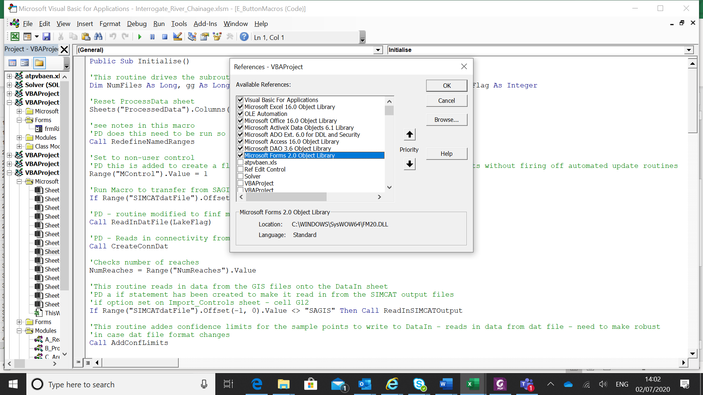

## Database updates 

The model database structure has been modified to improve user
experience. A schematic of the updated model components is given in
[Figure 2](#_Ref48244469). The changes include:

- The consolidation of Export Coefficient databases to a ‘Land National
  Database’ and a ‘LTRac National Database’ (consolidated
  LakeExportCoefficientDB and TransWatersExportCoefficientDB).

- The database formerly known as SAGISObsData is now defunct, with
  relevant tables moved to the ‘Common Database’.

- The ‘layer files’ are now embedded within the SAGIS add-in and NPD
  template files have been relocated to the common tables database.

## SAGIS databases

The required data to run SAGIS is held in a series of databases which
must, with one exception, be available in advance of creating a SAGIS
project, namely:

1.  **Land National Database** **–** This contains national data for
    diffuse and point source inputs. Diffuse inputs are specified on a 1
    km2 grid, whilst the point sources are defined as points
    with Easting and Northing references. Land National databases have
    been created for England/Wales and Scotland (previously referred to
    as ‘Export Coefficient databases’). The national databases are used
    to build the regional SAGIS models and are not typically used in
    ‘day to day’ operation of SAGIS. Note that it isn’t required to
    specify a ‘Land National Database’ (these are not usually
    distributed with other model components since the embedded PSYCHIC
    and NEAP-N data are only available under licence or where the data
    are required to fulfil a statuary responsibility – contact your
    relevant regulatory agency for further information) but modellers
    should be aware that upon running the ‘Open and Update’ process, the
    system will produce an alert which, in this instance, can be
    ignored.

2.  **Regional Database** **–** This contains the spatial information
    related to regions that the UK has been divided into for the
    purposes of modelling (19 regions for England and Wales and over 100
    for Scotland). The Regional Database contains region-specific data
    that appears in SIMCAT dat files.

3.  **SIMCAT Common Database –** This contains data and settings that
    are common to different regional SAGIS models, including default
    settings (e.g. effluent water quality) and observed water quality
    data (environmental and discharge). In Scotland there is a separate
    common database for each model region.

4.  **LTrac National Database –** this contains sector data relating to
    Lakes and Estuaries included in the SAGIS model. The LTrac national
    database is used to build the regional SAGIS models and are not
    typically used in the ‘day to day’ operation of SAGIS.

5.  **Outputs Database** – Modellers may optionally create an outputs
    database to which model outputs are written to directly rather than
    the regional database as in the legacy version.

**It is recommended that modellers create back-up copies of all project
databases in advance of any modelling project.**

> **Figure 2 Components of
> the SAGIS modelling system**

## Installing the Add-In

The ArcGIS Pro version of SAGIS is distributed as an **Add-In** that
users must install within ArcGIS Pro. In advance of installing an
**Add-In** any previous versions must be removed. To do this:

| ***1*** | ***Remove Previous Versions of Add-In*** |
|----|----|
| *1* | *Open ArcGIS Pro.* |
| *2* | *Select **Settings** then **Project**, and then the **Add-In Manager** option ([Figure 3](#_Ref41387133)) which will list the installed Add-Ins.* |
| *3* | *Choose the **Add-In** to delete and select **Delete this Add-In**.* |

**Figure 3 Add-In Manager**

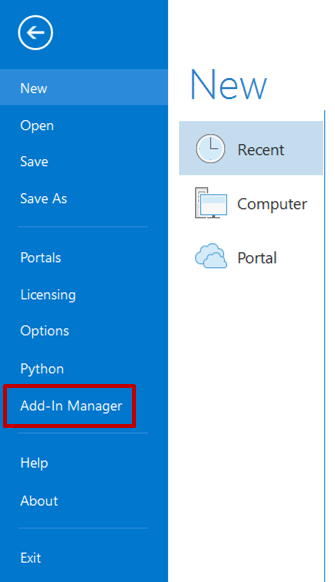

The installation process is straightforward:

| ***2*** | ***Install Add-In*** |
|----|----|
| *1* | *Ensure ArcGIS Pro is closed.* |
| *2* | *Double click the provided **Add-In.*** |
| *3* | *Select **Yes** to the digital certification pop-up and then **OK**.* |

## SAGIS interface

All SAGIS processing tools are contained in the **SAGIS** tab on the
toolbar in the ArcGIS Pro project, as shown below ([Figure
4](#_Ref41378849)). Standard ArcGIS pro tools are fully functional and
can be used to manipulate the data and modify visualisation of outputs.

<figure>
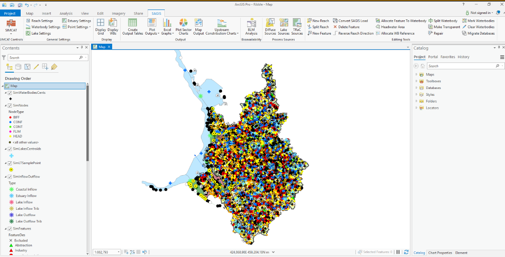
<figcaption>
Figure 4
SAGIS GIS interface tab
</figcaption>
</figure>

## Activating geoprocessing log files and viewing history

Before commencing modelling, users should ensure that ArcGIS Pro is
configured to save geoprocessing log files. This can be done by:

<table style="width:91%;">
<colgroup>
<col style="width: 7%" />
<col style="width: 84%" />
</colgroup>
<thead>
<tr>
<th><em><strong>3</strong></em></th>
<th><em><strong>Activating Geoprocessing Log Files and Viewing
History</strong></em></th>
</tr>
</thead>
<tbody>
<tr>
<td><em>1</em></td>
<td>
<em>Select <strong>Project</strong> then <strong>Options</strong>
and <strong>Geoprocessing</strong> to open the form shown in</em>

<a href="#_Ref41377019"><em>Figure</em> 5</a><em>.</em>
</td>
</tr>
<tr>
<td><em>2</em></td>
<td><em>Check the <strong>Write geoprocessing operations to XML log
file</strong> box (highlighted in yellow in <a
href="#_Ref41387133">Figure 3</a>), then select
<strong>OK</strong>.</em></td>
</tr>
</tbody>
</table>

This is necessary because if a geoprocessing task fails at any stage, or
if a user identifies a problem with the outputs of a particular process,
these files will be required to diagnose the underlying causes. Note
that when using SAGIS a pop-up window showing geoprocessing history
([Figure 6](#_Ref41377669)) will appear on the righthand side of the
screen which provides feedback to the user on progress. The progress
notifier may be pinned to the screen and the system messages reviewed,
although these outputs are written to a log file which also reports time
elapsed for discrete processing functions. The log files can be located
by pasting the following location into Windows Explorer which will open
a folder containing a series of xml files as in Figure 7.

%APPDATA%\Esri\ArcGISPro\ArcToolbox\History

**Figure 5 Geoprocessing options form**

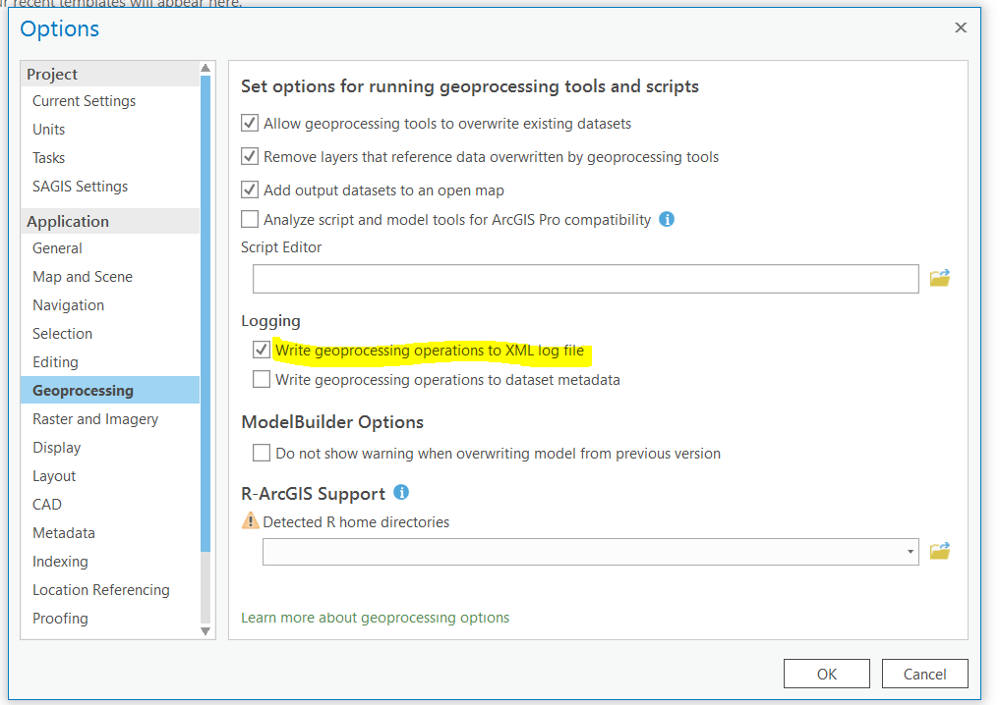

**Figure 6 Geoprocessing
history Figure 7 Geoprocessing log files**

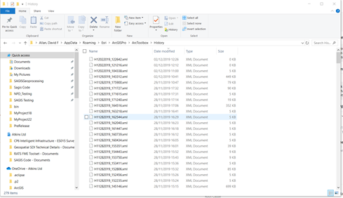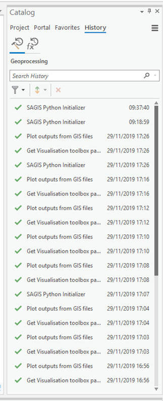

## Managing SAGIS projects

SAGIS model files can be located on any accessible drive or folder
including OneDrive although modellers should be aware that the periodic
OneDrive backup process might ‘lock’ databases which can interfere with
modelling actions. The SAGIS processing tools are embedded within the
SAGIS aprx (equivalent to the ArcMap mxd). To begin a SAGIS project, an
existing or blank project is opened in ArcGIS Pro. Once an ArcGIS Pro
project has been created, it can be saved and re-opened as required.

If multiple copies of the aprx are created for a model region, these
will all access the same databases so changes made in different aprx’s
will affect the same source data. Multiple aprx’s of the same model
region accessing the same databases should be avoided. Making copies of
the regional databases, each related to a different suite of substances
is one option to simplify data management and avoid the need to rebuild
databases when switching between different groups of substances.

## Using SAGIS (high level overview of simple functions)

A modeller will perform the following actions to create a SAGIS project:

- **Connect SAGIS to the model databases.** Done by performing
  **Configuring a Project**, **Open and Update** or **Refresh Layers**
  actions. This writes data to attributes tables that are used in
  subsequent steps. The **Refresh Layers** option is typically used
  where databases are transferred from one modeller to another where
  there is the intention to retain the database settings (that is, an
  Open and Update is not required – refer to Chapter 4 for further
  information on **Refresh Layers**).

- **Specify the General Settings for the determinands to be modelled.**
  Choose **General Settings**, selectable through the SIMCAT button.
  Name the dat file.

- **Customise the dat file to be created.** Choose **Create SIMCAT
  File**, selectable through the SIMCAT button. Customise the dat file
  (usually unnecessary) and apply calibration settings. Select **Run**
  to create the dat file.

- **Run SIMCAT.**

- **Plot the outputs.** A range of visualisation options are available
  to present the results of the SIMCAT simulation.

These are described in further detail later.

## Inputting improved data based on local information

SAGIS has been set up using national datasets with the aim of providing
a consistent approach to national and regional water quality planning.
These national datasets may, however, not include all of the key
influences on water quality in a catchment because:

- Some influences including landfills, quarries, contaminated land, coal
  mines, are not represented by these national datasets.

- Better information may be available; for example, output from sewer
  network modelling by water companies in relation to impacts of
  intermittent discharges.

- Some errors may exist in national datasets with regard to the location
  and influence of features.

It will, therefore, be important that the models are checked by
scientists with local knowledge of catchments and that better data is
used where available.

# Configuring a Project

This chapter describes how to connect SAGIS to model databases by
‘configuring’ a project. The process is as follows:

| ***4*** | ***Configuring a Project*** |
|----|----|
| *1* | *Click on **Project** then **Options** and **SAGIS Settings** to open the form shown in ([Figure 8](#_Ref41047346)).* |
| *2* | *Select the required file geodatabases (including the **Regional Database**) and the location of the **Simcat Folder** using the Windows Explorer browsers.* |
| *3* | *An **Output Database** must be selected (i.e. the location to which model outputs are written). A blank database is created when a Project is created in ArcGIS Pro which could be used (refer to the Esri website given in the introduction for training on using ArcGIS Pro). This could also be the **Regional Database** although this is discouraged to avoid cluttering these databases with model output files.* |
| *4* | *Select **OK**.* |

The geodatabase structure includes the **Land National Database**
(consolidated export coefficient database) and **LTRac National
Database** (consolidated export coefficient database for lakes and
transitional waters). It isn’t required to specify a **Land National
Database** (these are not usually distributed with other model
components) but modellers should be aware that upon running the **Open
and Update** process, the system will produce an alert which, in this
instance, can be ignored. 

**Figure 8 SAGIS Settings Options form**

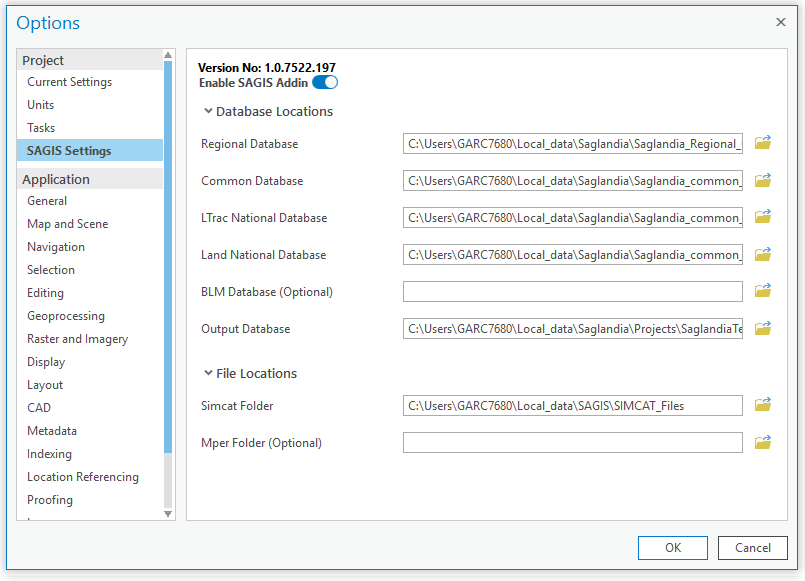

# Building Regional Databases

This chapter describes how the information in the national sector
databases (**Land National Database** and **LTRac National Database)**
is processed to create the tables in the **Regional Database** that
SAGIS ultimately uses to create the inputs to SIMCAT (i.e the sector
data). These tools only need to be used when building the models; they
are not required by the regular user of the tool.

## Populate regional diffuse export database

The **Diffuse Sources** tool ([Figure 9](#_Hlk40886272)) takes the data
on diffuse chemical loads or concentrations, standard deviation and
correlation coefficient from the national sector databases (for each
km2 grid cell) and either adds these up (loads), or
calculates an average value (concentration, standard deviation and
correlation coefficient) for each water body, which is then stored in
the relevant **Regional Database** (i.e. the current selected **Regional
Database**; [**Figure 8**](#_Ref41047346)).

**Figure 9 Diffuse Sources
button**

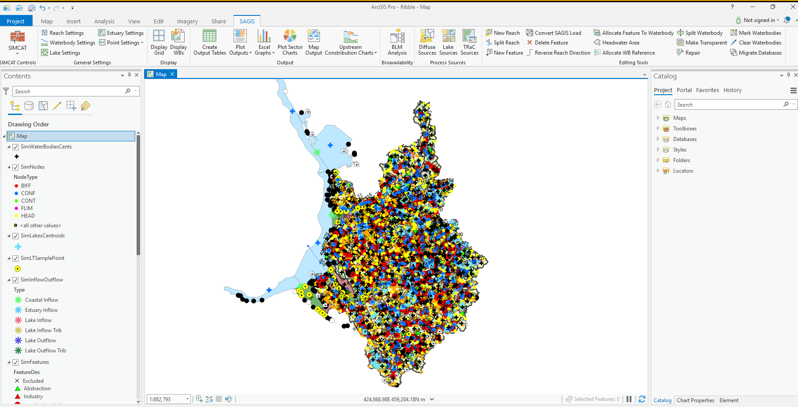

This processing set up only needs to be repeated if the sector data or
water body shapes change.

The **Diffuse Sources** tool operation is only applied to the tables
with the **Use** field ticked (or set to ‘yes’) in the
**MasterTableNames** table within the national sector databases. These
can be unticked if changes are only required for some sectors. There are
four types of table in the **Land National Database**; load (LOAD),
concentration (CONC), coefficient of variation (STDDEV) and correlation
coefficient (CORCOEFF), which are all translated to waterbody-based
values when populating the regional model databases.

| ***5*** | ***Building Regional Tables for Diffuse Source Inputs*** |
|----|----|
| *1* | *Specify the **Land National Database** containing the data in the **SAGIS Settings** ([Figure 8](#_Ref41047346)), then select **OK**.* |
| *2* | *Click on the **Diffuse Sources** button ([Figure 9](#_Hlk40886272) - which is available in the **SAGIS** tab on the ArcPro toolbar, [Figure 4](#_Ref41378849)).* |

## Create lakes and estuaries export database

The **Lakes Sources** ([Figure 10](#_Ref41048164)) and **TRaC Sources**
([Figure 11](#_Ref41048193)) buttons are clicked to extract the diffuse
data from the **LTRac National Database** to populate the **Regional
Database**.

<figure>

<figcaption>
Figure 10
Lake Sources button
</figcaption>
</figure>

<figure>

<figcaption>
Figure 11
TRaC Sources button
</figcaption>
</figure>

This step will only need to be repeated if the **LTRac National
Database** or water body shapes change.

| ***6*** | ***Building Regional Lake and Estuary Input Tables*** |
|:---|----|
| *1* | *Specify the **LTrac Database** containing the data in the **SAGIS Settings** ([Figure 8](#_Ref41047346)), then select OK.* |
| *2* | *Click on **Lake Sources** or **TRaC Sources** button ([Figure 10](#_Ref41048164) or [Figure 11](#_Ref41048193) - which are available in the **SAGIS** tab on the ArcPro toolbar, [Figure 4](#_Ref41378849)).* |

# 

# Loading Regional Data

When SAGIS operates it can model up to ten chemicals at one time (i.e.
the maximum number that SIMCAT can simulate using a single dat file). If
a different set of chemicals need to be modelled, it is necessary to
load the data related to the new set of chemicals. The user might also
need to set up SAGIS for a different region. Two approaches can be
applied by SAGIS to set up, and switch between models: 1) **Open and
Update** and 2) R**efresh**. The key differences between these are
explained below:

1.  **Open and Update** transfers the data from several tables in the
    selected **Common Database** and **Regional Database** ([Figure
    8](#_Ref41047346)) for the selected chemicals into the attributes
    table of the ArcGIS geodatabase layers on the SAGIS map. This
    overwrites any temporary changes that have been made to the data in
    the attributes table data, for example when running scenarios. This
    prevents the SAGIS data being ‘destroyed’ by the user.

2.  **Refresh Layers** switches the SAGIS interface to the geodatabases
    and tables associated with a different model region. In contrast to
    **Open and Update** this does not change the data in the attributes
    data for the selected region. The data contained will be those
    uploaded when **Open and Update** was last run on the selected
    region applied to the chemicals selected at this time. **Refresh
    Layers** takes only takes a few seconds, so is a way to quickly move
    between regional models with the required chemicals already set up.
    The target databases must be specified in the same manner as for
    **Open and Update** (i.e. on the SAGIS Options page - refer to
    [Figure 8](#_Ref41047346)).

## Open and Update 

When the model **Opens and Updates**, the data in the layers in GIS are
populated with fixed data taken from several tables in the selected
**Regional Database** and **Common Database** ([Figure
8](#_Ref41047346)). This processing step is used to build a model for a
different region, apply new chemical substances or reset the modified
settings for the current region.

| ***7*** | ***Open and Update Regional Database*** |
|----|----|
| *1* | *Select the **SIMCAT** icon (on the main screen below the **Project** tab; [Figure 12](#_Ref40265323)) then **Open and Update** to open the **Open and** **Update Options** form.* |
| *2* | *Change the values on the **Open and Update Options** form ([Figure 13](#_Ref41052990)) as required.* |
| *3* | *Select **Run**.* |

**Figure 12 SIMCAT menu items**

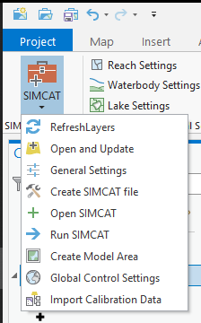

**Figure 13 Open and Update Options form**

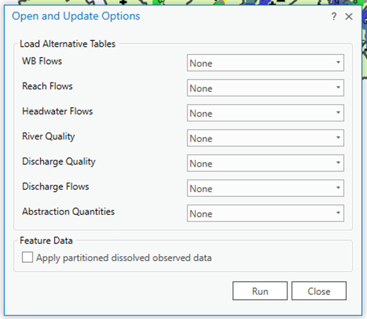

When the model **Opens and Updates**, it loads data from a series of
core databases in the **Regional Database** and **Common Database**. The
dropdown boxes in the **Load Alternative Tables** part of the form allow
the user to select different versions of these tables that are held in
the databases. For example, the user might create a version of the
waterbody flow data related to climate change scenarios which, if
selected, can then be used to carry out model runs. Similarly, water
quality for a different period might be selected or consented effluent
quality values rather than observed.

When creating these new versions of the tables, these must have the same
name as the unmodified table but with further characters added to the
end of the name (e.g. **WBFlow_Estimates** could become
**WBFlow_EstimatesCC).** If this convention is not followed the new
table will not appear in the dropdown box.

## Refresh Databases

The following steps are followed to refresh the **Regional Database**:

<table style="width:91%;">
<colgroup>
<col style="width: 7%" />
<col style="width: 84%" />
</colgroup>
<thead>
<tr>
<th style="text-align: left;"><em><strong>8</strong></em></th>
<th style="text-align: left;"><em><strong>Refresh Regional
Database</strong></em></th>
</tr>
</thead>
<tbody>
<tr>
<td><em> 
1</em></td>
<td><em>Click on <strong>Project</strong> then <strong>Options</strong>
and <strong>SAGIS Settings</strong> to open the form shown in (<a
href="#_Ref41047346">Figure 8</a>).</em></td>
</tr>
<tr>
<td><em>2</em></td>
<td><em>Specify the location of the <strong>Regional Database</strong>,
then select <strong>OK</strong>.</em></td>
</tr>
<tr>
<td><em>3</em></td>
<td><em>Select the <strong>SIMCAT</strong> icon then <strong>Refresh
Layers</strong> (<a href="#_Ref40265323">Figure 12</a>).</em></td>
</tr>
</tbody>
</table>

# Global Controls

The **Global Control Settings** form ([Figure 14](#_Ref40106459)) is
used to manage global settings which are specified in the
**DeterminandsForSIMCAT** table in the **Common Database** (pre-dates
the development of SAGIS). These are applied to any model that is opened
and updated. The **Global Controls** form is used to set up the way in
which inputs from different sectors are set up for each chemical
substance. These are implemented when the SIMCAT dat file is created.

<figure>
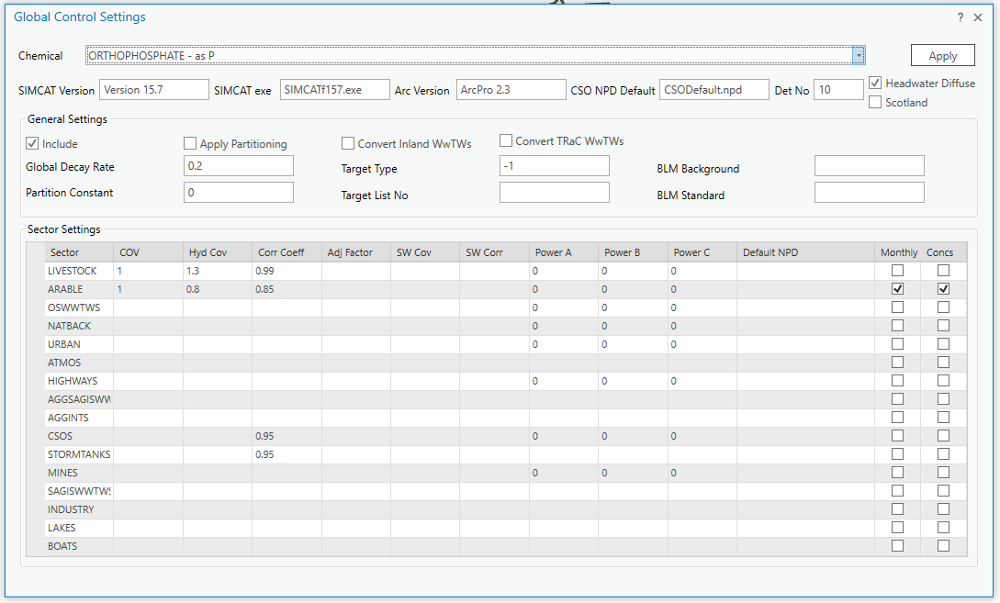
<figcaption>
Figure 14
Global Control Settings form
</figcaption>
</figure>

To change the global settings:

| ***9*** | ***Modify Global Controls*** |
|----|----|
| *1* | *Select the **SIMCAT** icon then **Global Control Settings** ([Figure 12](#_Ref40265323)) to open the **Global Control Settings** form ([Figure 14](#_Ref40106459)).* |
| *2* | *Select the determinands you wish to work with by ticking the **Include** box and clicking **Apply**. Deselect others by unticking the **Include** box. Ensure that no more than ten chemicals are included for a single dat file (this is a limitation of SIMCAT).* |
| *3* | *Change the settings and then click on **Apply** once selections are complete. It is advisable to check **General Settings** to ensure the correct/intended determinands are selected.* |

The settings are listed below (refer to the SIMCAT user manual for
information about the SIMCAT specific settings):

- **SIMCAT Version** **–** This is the version stamp printed at the top
  of the SIMCAT output files that is used for version control.

- **SIMCAT.exe –** This is the current version of the SIMCAT executable
  file. This only needs to be changed if a new version of SIMCAT is
  deployed.

- **Arc Version –** Current version of Arc (e.g. ArcPro 2.3).

- **CSO NPD Default –** Name of default npd distribution used to
  generate the CSO and stormtank non-parametric inputs files.

- **Det No –** Number of determinands included in the SIMCAT output
  files (normally 10).

- **Headwater Diffuse –** When this is ticked headwater sector inputs
  are added when the SIMCAT dat file is created.

- **Scotland –** This is ticked to apply modifications to the way SAGIS
  is set up and run for the Scottish models.

- **Include –** When this is ticked, the determinand will be added when
  the model is **Opened and Updated**.

- **Apply Partitioning –** This is ticked to ‘convert’ total metal
  concentration to a dissolved phase concentration equivalent (requires
  that a partition coefficient is pre-specified which is, however, in
  place for most metals). If observed dissolved data for determinands
  for which **Apply Partitioning** has been ticked is to be included
  (within the outputs, for example, to compare observed and predicted
  values), then, when the model is **Opened and Updated,** the **Apply
  partitioned dissolved observed data** tick box on the **Open and
  Update Options Form** ([Figure 13](#_Ref41052990)) should be checked.

- **Convert Inland WwTWs –** Converts inland point load features to flow
  and concentration features when the dat file is created.

- **Convert TraC WwTWs –** Converts coastal and estuary point load
  features to flow and concentration features when the dat file is
  created.

- **Global Decay Rate** **–** Global decay rate.

- **Partition Constant –** Partition constant/coefficient (zero if no
  value).

- **Target Type –** Target type (as defined by SIMCAT).

- **Target List No** **–** Number of WFD type target used to assess
  compliance.

- **BLM Background –** Biotic ligand model background concentration
  (background concentration allowance for bioavailability-based
  standards for trace metals).

- **BLM Standard –** Biotic ligand model standard (bioavailability-based
  standard for trace metals).

- **COV –** If a number is entered, this overrides the value for the COV
  derived from the **Land National Database** with the specified value.

- **HydCOV –** If a number is entered, this overrides the value for the
  COV derived from the **Land National Database** by applying the
  specified multiple of the COV of the diffuse inflow for the same
  reach.

- **Corr Coeff –** If a number is entered, this overrides the value for
  the correlation coefficient derived from the **Land National
  Database** with the specified value.

- **Adj Factor** **–** Factors up or down of the inputs (loads or
  concentrations) associated with the specified sector and substance.
  This can be used to adjust for systematic biases in the loads for all
  inputs. If further adjustments are later applied on a waterbody or
  reach basis these adjustments are combined.

- **SW COV –** Coefficient of variation for seawater concentrations in
  estuaries (this is used for the estuary functionality).

- **SW Corr –** Correlation coefficient for the seawater concentrations
  in estuaries (this is used for the estuary functionality).

- **Power A** **–** This is the power index term in the power functions
  to define input load distributions.

- **Power B –** This is the baseline load in the power functions to
  define input load distributions.

- **Power C** **–** This is the cut-off percentile below which loads are
  set to zero.

- **Default NPD** **–** Name of the template NPD file (with average load
  of 1) used to create the reach npd files.

- **Monthly –** If the loads in the **Land National Database** have been
  set up on a monthly basis, the dat file will be set up to receive a
  monthly distribution of inputs loads.

- **Concs** **–** If ticked sector inputs will be added as
  concentrations rather than loads.

# General Settings

The **General Settings** form ([Figure 15](#_Ref40264641)) contains the
settings related to chemical substances in SIMCAT (this translates to
the \[a\] General and \[b\] Determinands sections in the SIMCAT dat
file). The form is also used to create the SIMCAT dat file name and
location and generate the suspended solids non-parametric files if the
tool is being used carry out runs involving the partitioning of metals.

Different settings can be created as scenarios (related only to settings
on the **General Settings** form) which can then be selected using the
dropdown box.

<figure>
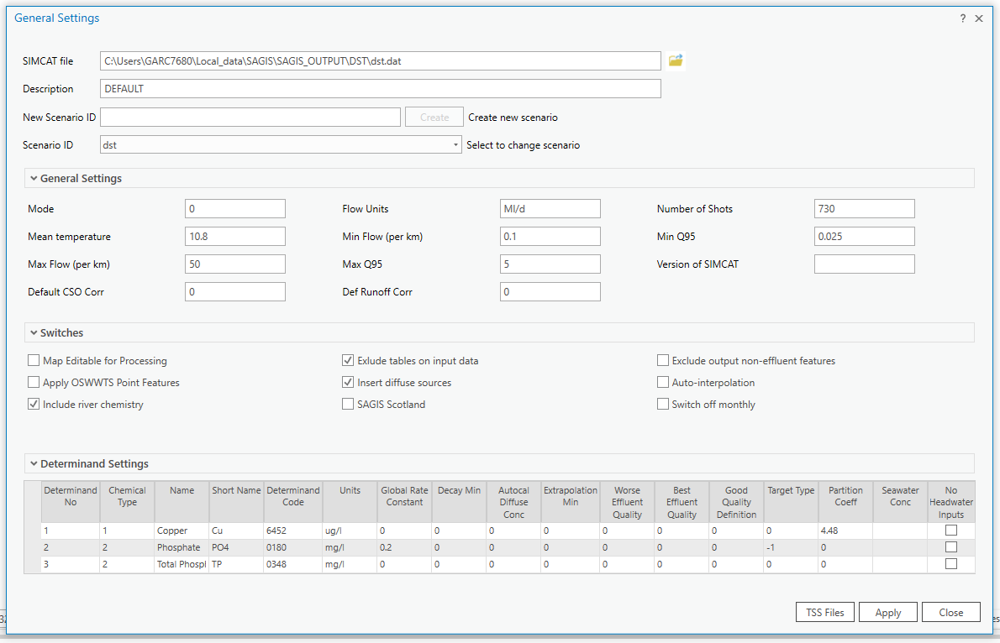
<figcaption>
Figure 15
General Settings form
</figcaption>
</figure>

To use the **General Settings** form:

<table style="width:91%;">
<colgroup>
<col style="width: 7%" />
<col style="width: 84%" />
</colgroup>
<thead>
<tr>
<th style="text-align: left;"><em><strong>10</strong></em></th>
<th style="text-align: left;"><em><strong>Apply General
Settings</strong></em></th>
</tr>
</thead>
<tbody>
<tr>
<td><em> 
1</em></td>
<td><em>Select the <strong>SIMCAT</strong> icon then <strong>General
Settings</strong> (<a href="#_Ref40265323">Figure 12</a>) which loads
the <strong>General Settings</strong> form (<a
href="#_Ref40264641">Figure 15</a>).</em></td>
</tr>
<tr>
<td><em>2</em></td>
<td style="text-align: left;"><em>To select a scenario previously set
up, click on the <strong>Scenario ID</strong> dropdown box and select
the scenario. The associated settings will then be loaded.</em></td>
</tr>
<tr>
<td><em>3</em></td>
<td><em>To create a new scenario, first select an output location and
name for the new dat file. This can be modified manually be editing the
<strong>SIMCAT File</strong> input box or by clicking on the file button
beside this box. This opens a <strong>File Open</strong> dialogue to
select the location and add the name of the dat file (extension). This
must not exceed 75 characters in length.</em></td>
</tr>
<tr>
<td><em>4</em></td>
<td><em>Add text to the <strong>Description</strong> box that describes
the scenario.</em></td>
</tr>
<tr>
<td><em>5</em></td>
<td><em>Change any of the settings (these are described
below).</em></td>
</tr>
<tr>
<td><em>6</em></td>
<td><em>To run partitioned metals, files with information on suspended
solids are required in the same folder as the SIMCAT dat file. These are
created by clicking on the <strong>TSS Files</strong> button. TSS Files
must be created prior to running the CreateSIMCAT function.</em></td>
</tr>
<tr>
<td><em>7</em></td>
<td><em>Add a Scenario ID to the <strong>New Scenario ID</strong> box.
For a new dat file name to be applied it is necessary to click on
<strong>Create</strong> new scenario after entering a scenario name,
then to click <strong>Apply</strong>.</em></td>
</tr>
</tbody>
</table>

The settings on the **General Settings** form are described below
(Further information on these settings can be found in the SIMCAT user
manual):

- **Mode** **–** If the value is zero, SIMCAT is run in mean mode. If it
  is set to one, SIMCAT is run in percentile mode.

- **Number of Shots –** Number of SIMCAT shots.

- **Flow Units –** Flow units in SIMCAT.

- **Mean Temp –** Mean temperature in SIMCAT.

- **Min Flow (per km), Max Flow (per km), Min Q95 and Max Q95 –** This
  sets limits on the maximum and minimum values for the mean and Q95
  flow per kilometre when the dat file is generated.

- **Version of SIMCAT –** The version of SIMCAT as printed on the first
  line of the SIMCAT output files. This is used to check that the
  correct version of SIMCAT is being used.

- **Default CSO Corr –** The default value for correlation between CSO
  spills and river flow (usually this is overridden by a feature
  specific value).

- **Def Runoff Corr –** The default value for correlation between runoff
  flow and river flow (usually this is overridden by a feature specific
  value).

- **Exclude tables on input data** **–** SIMCAT setting to reduce the
  size of the outputs by excluding data in the input tables.

- **Exclude output non-effluent features** **–** SIMCAT setting to
  control which features generate outputs to the SIMCAT output files.

- **Apply OSWWTS Point Features** **–** In some cases, data is available
  to create inputs from septic tanks as points rather than a diffuse
  layer (as points in the **SAGISPointFeature_LOAD** layer) which might
  be preferable when modelling small catchments (e.g. surrounding a
  lake). Ticking this box modifies how SAGIS reads in OSWWTWs (i.e. from
  **SAGISPointFeature_LOAD** instead of using the normal diffuse layer).

- **Insert diffuse sources –** SIMCAT setting to add diffuse sources
  when SIMCAT runs.

- **Auto-interpolation** **–** SIMCAT setting to control how
  autocalibration is applied.

- **Include river chemistry –** SIMCAT setting to control whether river
  chemistry is applied.

- **SAGIS Scotland** **–** This tickbox needs to be ticked if running
  the Scottish SAGIS regional models. It modifies how SAGIS reads in
  some of the data, formatted differently in these models.

- **Switch off monthly –** Ticking this tick box switches off the
  monthly simulation in SIMCAT and greatly improves the run times.

- **Global Rate Constant** **–** The global first order decay is the
  default value applied to all reaches if this is not replaced by a
  reach specific value.

- **Decay Min –** Minimum value below which the simulated concentrations
  is not allowed to go due to decay.

- **Autocal Diffuse Conc –** The concentration with which gap filling
  flows are added.

- **Extrapolation Min –** This sets a minimum value when SIMCAT
  extrapolates the extra exponential decay introduced by gap filling.

- **Worse Effluent Quality –** When SIMCAT calculates the discharge
  quality required to meet river targets, this sets a maximum value.

- **Best Effluent Quality –** When SIMCAT calculates the discharge
  quality required to meet river targets, this sets a minimum value.

- **Good Quality Definition –** This variable defines an annual mean of
  good discharge quality, which can be imposed in cases where the
  current quality is worse than this and the river target cannot be
  achieved, even if the discharge had zero concentration of pollutant.

- **Target Type –** This sets the target type, 1 = mean, 2 = 95
  percentile 3 = 90 percentile, 4 = 5 percentile, 5 = 10 Percentile and
  6 = 99 percentile. When the value is negative, SAGIS applies a reach
  specific target derived from the **ReachTargets** table in the
  **Common database**.

- **Partition Coeff –** Partition coefficient applied when calculating
  metal partitioning.

- **Seawater Conc –** the concentrations, applied in the estuary
  calculations.

- **No Headwater Inputs –** Excludes sector inputs at headwater nodes.

- **TSS Files –** Clicking this button creates files for suspended
  solids using observed suspended solids data shapefile (TSSdata) now
  stored in the **Common database** (previously the
  **SAGISObservedData** database). These files are required by SIMCAT
  when metal partitioning is applied. Once these files have been created
  in the folder containing the SIMCAT dat file, the operation does not
  need to be repeated (unless the SIMCAT dat file is written to a new
  folder). Note that TSS Files must be created in advance of dat file
  creation (CreateSIMCAT).

# Data Editing 

The editing forms described in this chapter are used to modify the
values in the attributes table of the SAGIS layers. These values are
used to create the settings and data in the SIMCAT dat file. An
alternative is to edit the attributes tables directly using standard
ArcGIS Pro tools. Creating scenarios using the editing forms is covered
in [Chapter 8](#setting-up-scenarios).

## Editing Reach data

To edit the reach data, the following steps should be followed:

<table style="width:92%;">
<colgroup>
<col style="width: 7%" />
<col style="width: 84%" />
</colgroup>
<thead>
<tr>
<th style="text-align: left;"><em><strong>11</strong></em></th>
<th style="text-align: left;"><em><strong>Edit Reach
Settings</strong></em></th>
</tr>
</thead>
<tbody>
<tr>
<td><em>1</em></td>
<td><em>Highlight a reach or reaches on the map, or select a reach in
step 3.</em></td>
</tr>
<tr>
<td><em>2</em></td>
<td><em>Click on <strong>Reach Settings</strong> (which is available in
the <strong>SAGIS</strong> tab on the ArcPro toolbar, <a
href="#_Ref41378849">Figure 4</a>) which loads the <strong>Reach
Settings</strong> form (<a href="#_Ref40187454">Figure
16</a>).</em></td>
</tr>
<tr>
<td><em>3</em></td>
<td><em>Change the values on the <strong>Reach Settings</strong> form as
required. If several reaches are highlighted, the <strong>Reach No
(Recalc)</strong> dropdown box can be used to navigate between the
selected reaches. If a reach or reaches are not already selected (in
step 1), then the <strong>Reach No (Recalc)</strong> dropdown box can be
used to select a reach from a list of all those shown on the
map.</em></td>
</tr>
<tr>
<td><em>4</em></td>
<td>
<em>Monthly flow factors can be added in the <strong>Monthly Flow
Factors</strong> tab (<a href="#_Ref40187571">Figure 17</a>).</em>
<em>These values multiply the annual mean and Q95 values to generate
monthly means and Q95 values. To activate this a value of 1 needs to be
entered into the SimReaches table in a field called
<strong>MonthlyFlow</strong> (<strong>this operation cannot be carried
out using the form</strong>).</em>

<em>netered in</em>
</td>
</tr>
<tr>
<td><em>5</em></td>
<td><em>To create new targets (i.e. which differ from those shown in the
<strong>Chemical Settings</strong> table) new entries need to be made
into the <strong>RiverQualityTargets</strong> table in the
<strong>Common</strong> <strong>Database.</strong></em></td>
</tr>
<tr>
<td><em>6</em></td>
<td><em>Click on <strong>Apply</strong> to save the changes.</em></td>
</tr>
</tbody>
</table>

<figure>
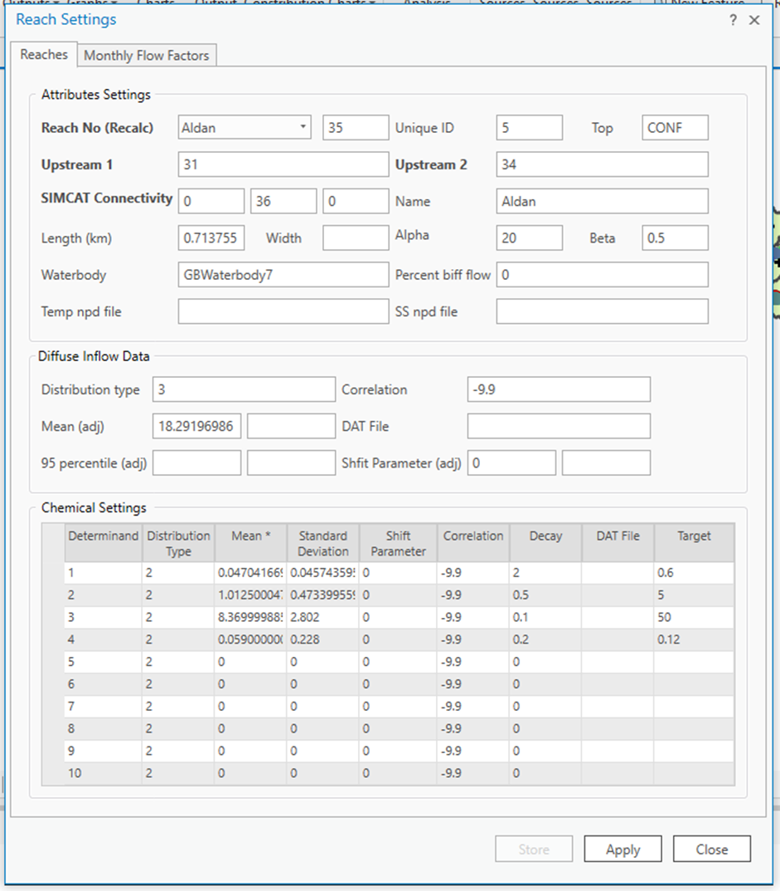
<figcaption>
Figure 16
Reach Settings form
</figcaption>
</figure>

Further explanation of the key inputs is provided below:

- **Unique ID** **–** is the unique reference for the reach which is
  used when cross referencing data from the **Regional Database**
  tables.

- **Upstream 1** and **Upstream 2 –** are the SIMCAT model numbers
  (SimNo) of the upstream reaches.

- **SIMCAT Connectivity –** defines the connectivity with the upstream
  and downstream reaches using the method applied by SIMCAT.

- **Alpha** and **Beta –** are travel time parameters.

- **Percent biff flow** **–** Where two reaches are downstream of a
  bifurcation this defines the percentage of the total flow passing down
  the selected reach.

- **Temp npd file** and **SS npd file** **–** specify non-parametric
  files for temperature and suspended solids which are applied to each
  reach when SIMCAT runs. If **Temp npd file** input box is left blank,
  SIMCAT applies the annual average temperature as specified on the
  **General Settings** form. Suspended solid npd files are generated
  automatically when the **TSS Files** button on the **General
  Settings** form is clicked (as described in [Chapter
  6](#general-settings)). Entering a file name in the **SS npd file**
  input box results in the specified file being used in preference (e.g.
  using improved local data). Note that TSS Files must be created in
  advance of dat file creation (CreateSIMCAT).

- **Diffuse Inflow Data –** The data in this box define the statistics
  for diffuse quality (mean, Q95, distribution type, shift parameter,
  correlation and non-parametric file) for each chemical substance. Once
  values have been stored, they will no longer be defined as a default.

<figure>
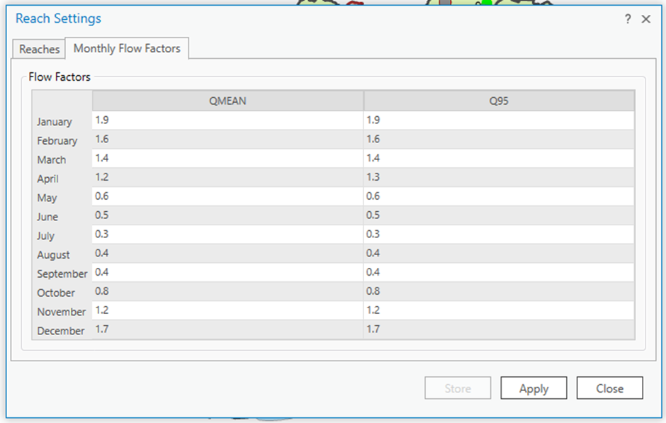
<figcaption>
Figure 17
Reach Settings Monthly Flow Factors form
</figcaption>
</figure>

**Opening and Updating** the model replaces any modifications to the
settings with the original values.

## Editing Feature data

Feature data can be edited in both the **SimFeatures, SimNodes** or
**SAGISPointFeature_LOAD** layers using **Feature Settings, Node
Settings** and **Feature Load Settings** forms, respectively. It is
important to note that features for Industry and Sewage Works are
contained in both of **SimFeatures** and **SAGISPointFeature_LOAD**
layers. The sewage works in the latter layer are smaller sewage works
and works discharging into transitional or coastal waters that were not
included in the original National SIMCAT models and are represented as
loads. The industry loads in this layer are derived from the Pollution
Inventory, whereas the values in the **SimFeatures** layer are taken
from the original National SIMCAT models. Creating scenarios using the
editing form is covered in [Chapter 8](#setting-up-scenarios).

To edit the feature data:

| ***12*** | ***Edit Feature Settings*** |
|----|----|
| *1* | *Highlight a feature or features on the map (either **SimFeatures, SimNodes** or **SAGISPointFeature_Load**). Unlike the other layers, only one feature can be selected at a time from the **SAGISPointFeatures_LOADs** and changes are only applied to the selected feature (multiple changes can only be made by editing the attributes table directly).* |
| *2* | *Select **Point Settings** (menu option which is available in the **SAGIS** tab on the ArcPro toolbar, [Figure 4](#_Ref41378849)) then **Feature Settings** (to edit **SimFeatures**), **Node Settings** (to edit **SimNodes**) or **PFL Settings** (to edit **SAGISPointFeature_LOAD**) which loads the **Feature Settings** form ([Figure 18](#_Ref40187727)), **Node Settings** form (same as **Feature Settings** form, though labelled Node Settings) or **Feature Load Settings** form ([Figure 19](#_Ref47008074)), respectively.* |
| *3* | *Change the values on the **Feature Settings, Node Settings** or **Feature Load Settings** form as required (key settings are described below).* |
| *4* | *If several reaches or nodes are highlighted, the **Site Number** dropdown box is used to navigate between the selected features.* |
| *5* | *Click on **Apply** to save the changes.* |
| *6* | *If the **Complex Abstraction Settings** (header) is selected, the **Complex Abstraction Settings** form is opened ([Figure 20](#_Ref40190515)). This is used to enter information on abstractions from intakes to reservoirs (key inputs are described below).* |
| *7* | *To specify discharge parameters in monthly format (as opposed to an annual value), selected a discharge feature on the map, click the **Monthly Feature Data** button the **Monthly Settings** form ([Figure 21](#_Ref40190535)) will open. Here, monthly values can be added for discharge flow AND discharge quality for the determinands available in the dropdown box (**quality and flow** **values must be set for each chemical available within from the dropdown – this will be the same as the determinands selected for the model run**). Once entries have been made the **Apply** button is clicked to save the changes. Note that monthly flow values will only be applied if a value of 1 is entered for the feature in a field called **MonthlyFlow** in the **SimFeatures** table (this operation cannot be carried out using the form – this selection must be set within the attributes table directly). Monthly entries should only be entered for feature types 3 (wastewater treatment works) and 5 (industrial discharges).* |
| *8* | *There are already data in the SimReaches table which set the monthly river flow profile when the Monthly option is selected. To apply a monthly river flow profile to headwater nodes (feature type 10) set the **MonthlyFlow** field in the **SimNodes** table to ‘1’ (default is ‘0’). In this case the monthly flow factors specified for the adjoining reach in the **SimReaches** table will be applied to the node.* |

**Figure 18** **Feature Settings form**

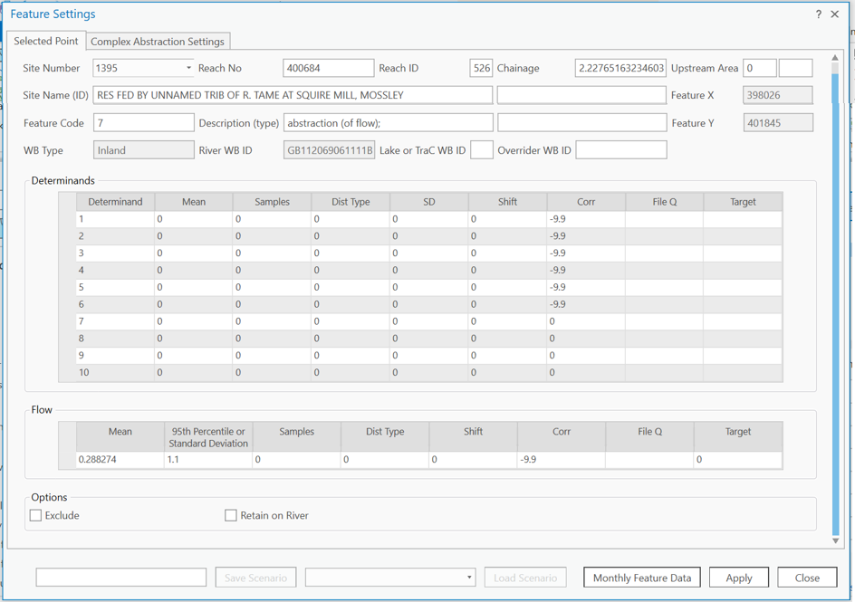

<figure>
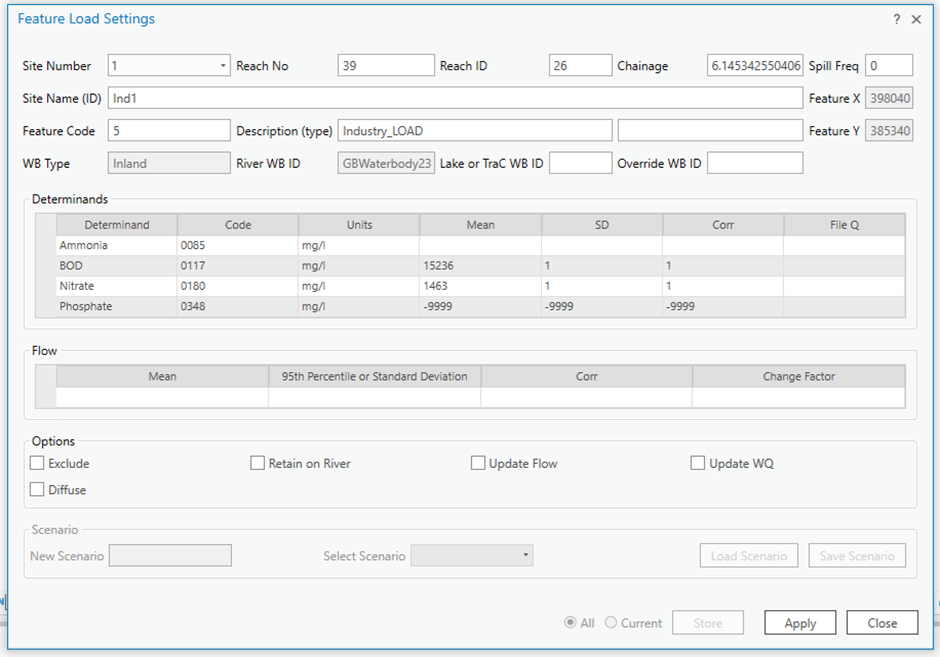
<figcaption>
Figure 19
Feature Load Settings form
</figcaption>
</figure>

Further explanation of the key settings is provided below:

- **Site Number** **–** is the Unique ID reference for the features
  which is used to cross reference the data in the **Regional Database**
  table during **Open and Update**.

- **Reach No –** SIMCAT model reach number on which the feature is
  located.

- **Reach ID –** Unique ID reference for the reach on which the feature
  is located.

- **Chainage –** Distance of the feature from the start of the reach in
  km.

- **Upstream area –** If the selected feature is a **SimNodes** this
  gives the area upstream.

- **Site Name (ID) –** The **Site Name** is the name of the features as
  used by SIMCAT, whilst the **ID** is the name of the WIMS sample
  reference as listed in the **SamplePointQuality** or
  **DischargeQuality** tables in the **Common Database.**

- **Feature Code –** is the SIMCAT feature code (e.g. 1 for monitoring
  point).

- **Description (type) –** is the SIMCAT feature description.

- **WB Type –** identifies the feature as an inland, lake or
  estuary/coastal feature.

- **River WB ID –** River waterbody ID for an inland feature.

- **Lake or TraC WB ID –** Lake or estuary/coastal waterbody ID for a
  non-inland feature.

- **Override WB ID** **–** transfers the target waterbody ID to a
  preferred water body (river, lake or estuary). This might, for
  example, be used to make a sewage works discharge to an estuary even
  though it is located close to a river.

- **Water Quality data -** These specify the statistics for the water
  quality data for up to 10 chemical substances associated with the
  feature (mean, sample number, distribution type, SD, shift parameter,
  correlation, non-parametric file and target).

- **Flow data** **–** These specify the statistics for the flow data for
  up to 10 chemical substances associated with the feature (mean, Q95 or
  SD, sample number, distribution type, shift parameter, correlation,
  non-parametric file and target).

- **Exclude –** excludes a feature from the dat file.

- **Retain on River –** retains a feature as a river feature even though
  the location indicates if it should be a lake feature.

<figure>
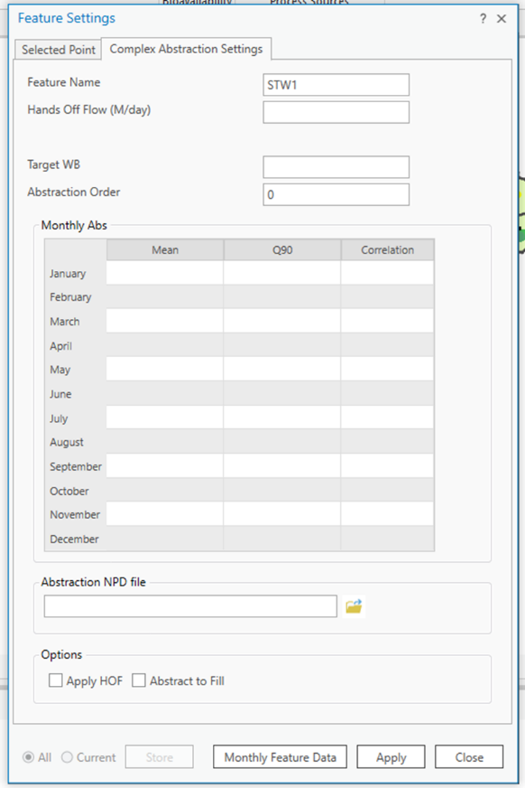
<figcaption>
Figure 20
Complex Abstraction Settings form
</figcaption>
</figure>

Further explanation of the key inputs on the **Complex Abstraction
Settings** form is provided below:

- **Hands Off Flow (Ml/day) –** the river flow value at which the
  abstraction will cease to operate.

<!-- -->

- **Target WB** **–** The reservoir or lake water body ID.

- **Abstraction Order –** shows which intake is used first, second,
  third etc. to fill the reservoir (1, 2, 3 etc is entered).

- The **Monthly Abs** boxes are used to enter monthly values for the
  mean abstraction (**Mean**), the 10%ile abstraction (**Q90**) and the
  **Correlation** between the abstraction quantity and river flow.

- **Abstraction NPD file** **–** specifies a non-parametric file for
  abstraction to the lake (selected by clicking on the button beside the
  box). The format of these files is specified in [Chapter
  18](#sagis-non-parametric-files).

- **Apply HOF** **–** applies a Hands-Off Flow specified for the
  abstraction. Water will be abstracted up to the **Mean** flow
  specified on the **Feature Settings** form**.**

- **Abstract to Fill –** specifies that water is only abstracted to a
  reservoir until it is full rather than abstracted by the full amount.

**Figure 21** **Monthly
Settings form**

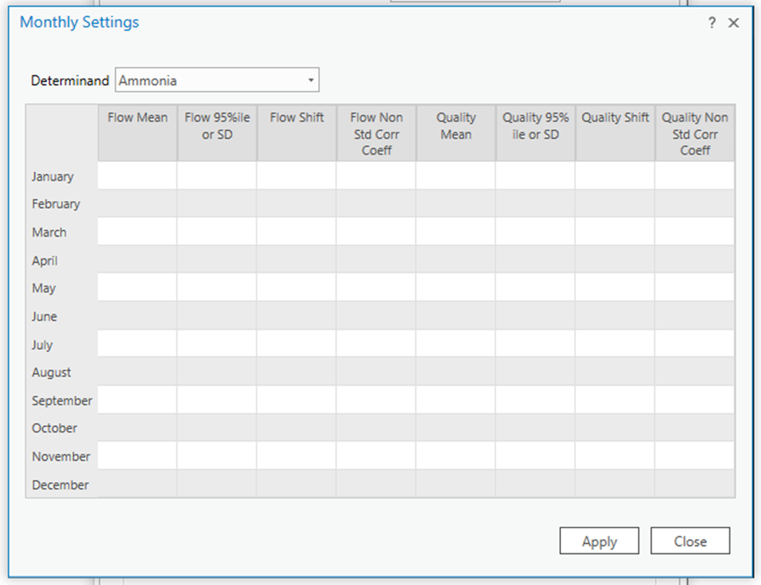

## Editing Water Body data

To edit the waterbody data:

| ***13*** | ***Edit Waterbody Settings*** |
|----|----|
| *1* | *Highlight a waterbody on the map.* |
| *2* | *Click on **Waterbody Settings** (which is available in the **SAGIS** tab on the ArcPro toolbar, [Figure 4](#_Ref41378849)) which loads the **Waterbody Settings** form ([Figure 22](#_Ref40190769)).* |
| *3* | *Change the values on the **Waterbody Settings** form as required.* |
| *5* | *If several waterbodies are highlighted, the **Selected WBs** dropdown box is used to navigate between the selected features.* |
| *6* | *Click on **Apply** to save the changes.* |

Figure 22 Waterbody
Settings form

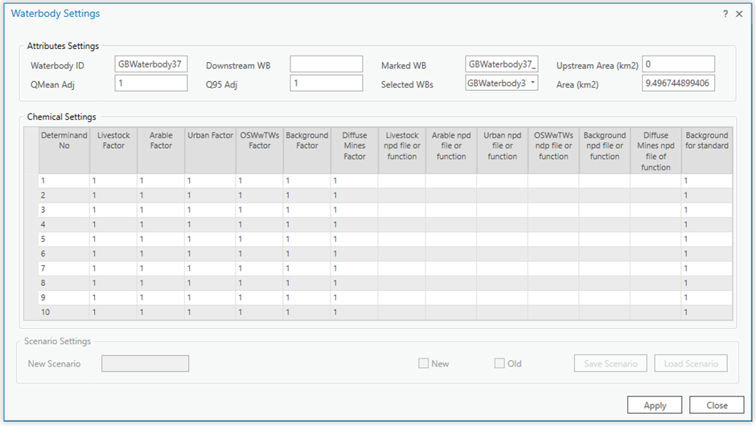

Further explanation of the inputs on the **Waterbody Settings** form is
provided below:

- **Downstream WB** **–** Waterbody ID for the downstream waterbody.
  This is only specified where the waterbody has no river reach so the
  loads associated with it needs to be transferred downstream. This can
  be disabled by unticking the box (e.g. if the transfer is carried out
  by creating a tributary).

- **QMean Adj** and **Q95 Adj –** to apply factors to the diffuse
  inflows to improve model performance with regards to flow. These
  changes are fixed in contrast to the changes made via a calibration
  table (see [Chapter
  10](#calibration-adjustments-and-calibration-tables)).

- **Factors –** are applied to the input loads for each chemical and
  diffuse input sector for each chemical substance (e.g. **Livestock
  Factor**, **Arable Factor** etc.). These can be used to apply
  scenarios for reductions in diffuse inputs.

- **NPD Files –** are used to specify non-parametric files to input
  chemical loads for each diffuse sector (e.g. **Livestock npd file**,
  **Arable npd file** etc.). These are defined as a sequence of numbers
  that have an average value of 1 which are then factored up and down to
  provide the correct annual load when SAGIS creates the SIMCAT dat
  file. A **StandardNPDs** table has been created in the **Common
  database**. This methodology is aimed at providing a better
  representation of diffuse input driven by rainfall and runoff such as
  agricultural phosphorus inputs. In these cases, the standard log
  normal distributions can input too much load at lower flows which can
  result in over representation of concentrations for these sectors.

> An alternative way to define the non-parametric relationship between
> load and flow is to enter the power function and baseload in the form
> xx_yy_zz where xx = the power function, yy = the fixed base load as a
> percentage of the total load and zz = a percentage cut-off below which
> the load is zero.
>
> If no entries are applied in the form, the global settings values are
> used.

## Editing Lakes data

Editing lakes data should be undertaken by qualified specialists with an
understanding of lakes-related processes. To edit the lakes data:

| ***14*** | ***Edit Lake Settings*** |
|----|----|
| *1* | *Highlight a lake on the map (only one can be chosen).* |
| *2* | *Click on **Lakes Settings** (which is available in the **SAGIS** tab on the ArcPro toolbar, [Figure 4](#_Ref41378849)) which loads the **Lakes Settings** form ([Figure 23](#_Ref40191690)).* |
| *3* | *Change the values on the **Lakes Settings** form as required ([Figure 23](#_Ref40191690)).* |
| *4* | *Click on **Update** to save the changes.* |
| *5* | *Monthly values for the setting and sediment release rates can be added by clicking on the **Mon Rates** button, which brings up the **Monthly Lake Rates** form ([Figure 24](#_Ref40191731)).* |
| *6* | *An estimate of the annual settling) rates can be changed by clicking on the **Ann Rates** button, which brings up the **Lake Rates** form ([Figure 25](#_Ref41566406)).* |
| *7* | *Input loads for birds can be modified by clicking on the **Birds** button which opens the **Bird Inputs** form ([Figure 26](#_Ref40191788)). Nutrient excretion rates and monthly bird counts can be modified for each species listed by the dropdown box. Values for further species that are not already contained in the database can be saved by entering the name of the species in the **Add Species** box, either selecting **Apply Default** values (from the default table which include approximately 20 species) or inserting user defined values, then clicking on the **Update** button**.*** |

Further explanation of the key inputs on the **Lakes Settings** form is
provided below:

- **Volume (Ml) –** specifies the lake volume. A volume npd file can be
  entered into the **Volume (MI) NPD File** box by clicking on the
  button and navigating to the file. This npd file is a non-parametric
  file providing information on how the volume of the lake varies (the
  format of the file is shown in [Chapter
  18](#sagis-non-parametric-files)).

- **Offline (Y/N) –** An offline lake is not connected to the SIMCAT
  reach network.

- **GW Inflow –** Groundwater mean inflow.

- **GW Inflow Q95** **–** Q95 of groundwater inflow.

- **GW Inflow Corr –** Correlation between groundwater inflow and river
  inflow to the lake.

- **Local Area (km2)** **–** This specified the local catchment area in
  km2 around the lake and is only specified for offline lakes
  (see below).

- **Angling Days** **–** allows the user to specify the number of
  anglers multiplied by the average number of days that they visit a
  lake. This overrides the default values in the **LTrac** **Database.**

- **Compensation Flow –** Mean compensation flow out of the lake or
  reservoir.

- **Simulation Period (yrs) –** Length of simulation period for the lake
  model in years.

- **Timestep (days) –** Lake model timestep in days.

- **Output Type –** This describes the way the water quality and flow
  output from the lake model is input to SIMCAT as i) Statistics (mean
  and standard deviation), ii) Monthly File (monthly means and standard
  deviation), iii) NPD File (NPD files for the flow and water quality
  probability distribution functions).

- **Hydrological Series File –** allows the user to specify a series of
  random numbers that the lake model uses to carry out the detailed lake
  simulation (see [Chapter
  11](#running-the-sagis-lake-model-and-viewing-outputs)). The sequence
  is ordered to represent sequences of dry or wet conditions. The file
  is entered by clicking on the button next to the box and navigating to
  the file. If nothing is entered into this box and default regional
  sequence is applied from the **Regional Database** or if this is
  absent, a national sequence from the **Common Database** is applied.

- **Dynamic Sediment –** if ticked, the sediment concentration will
  change as chemicals move in and out of the sediment, based on the
  settling rate, sediment release rate and burial rate. Otherwise, the
  sediment concentration is fixed at the specified value throughout the
  simulation and chemical release from the sediment is controlled by
  this concentration and the sediment release rate.

- **Run Detailed -** The lake model can be run in two modes **Fast** and
  **Detailed –** which is explained further in [Chapter
  11](#running-the-sagis-lake-model-and-viewing-outputs).

- **Exclude –** excludes the lake from the simulation.

- **Lake Temperature Settings –** monthly values for lake temperature.

- **Settling Rate –** Lake model parameter to account for the decay or
  settling of a chemical out of the water column (m/day) which forms
  part of the lake model (see [Chapter
  11](#running-the-sagis-lake-model-and-viewing-outputs)). Upper lower
  and upper limits can be specified between which values are sampled as
  part of the Monte Carlo lake simulation (alternatively just a single
  lower value can be applied as a constant setting). For settling rates,
  sediment release rates, burial rates and sediment concentrations, the
  values in these small input boxes can also be viewed and changed by
  double clicking on the box. This opens an input box into which new
  values can be entered.

- **Sediment Rel Rate –** Lake model parameter (m/day) to account for
  release of a chemical from the sediment pool (upper and lower limits
  can be applied as described above). It is only applied in the
  **Detailed** model.

- **Burial Rate –** Lake model parameter (m/day) to account for the
  permanent loss of a chemical from the sediment pool (upper and lower
  limits can be applied as described above). It is only applied in the
  **Detailed** model.

- **Sediment Conc** **–** Starting sediment concentration. This remains
  fixed unless **Dynamic Sediment** is ticked. It is only applied in the
  **Detailed** model.

- **GW Qual Mean –** If a groundwater flow (see above) is specified this
  is the mean concentration with which it is input to the lake.

- **GW Qual SD –** If a groundwater flow (see above) is specified this
  is the standard deviation of the concentration with which it is input
  to the lake.

- **GW Qual Corr –** If a groundwater flow (see above) is specified this
  is the correlation of the concentration with the input flow to the
  lake.

- **Target** **–** Lake water quality target.

**Figure 23** **Lake
Settings form**

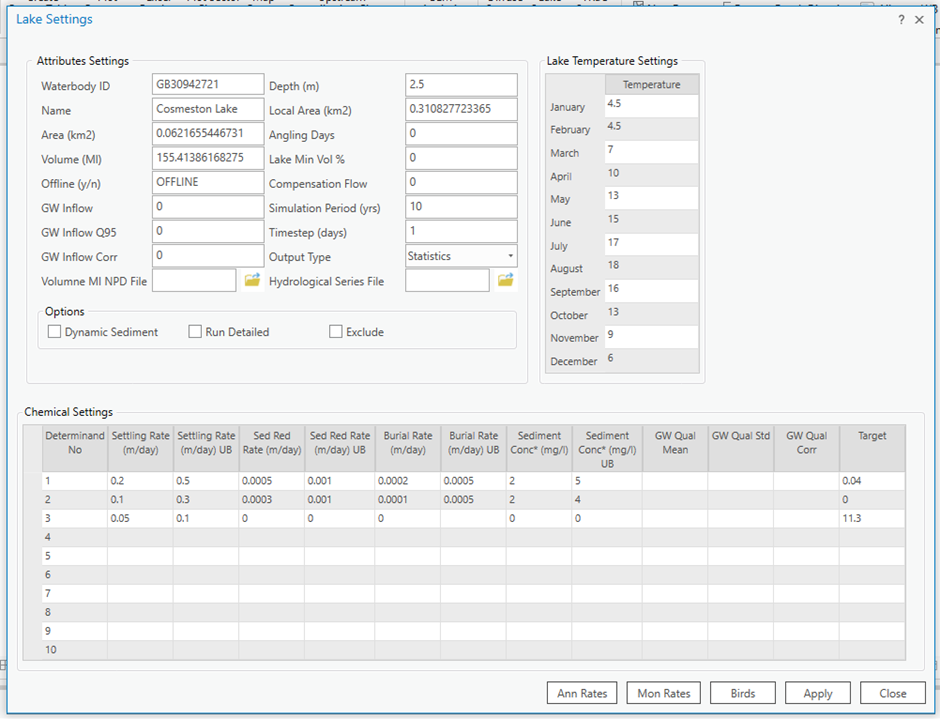

**Figure 24** **Monthly Lake Rates form**

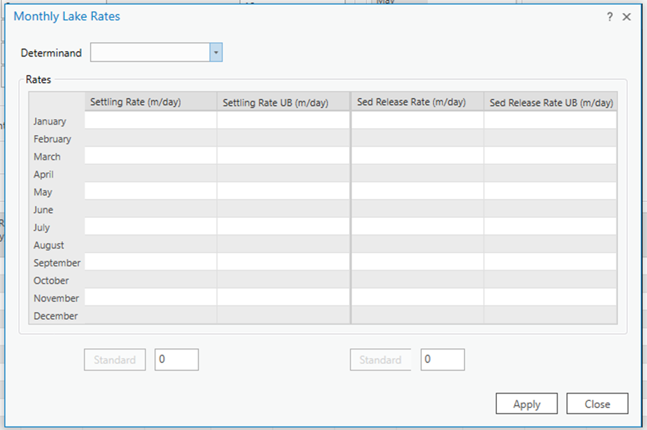

**Figure 25** **Lake Rates
form**

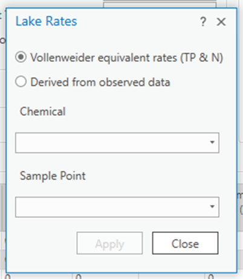

<figure>
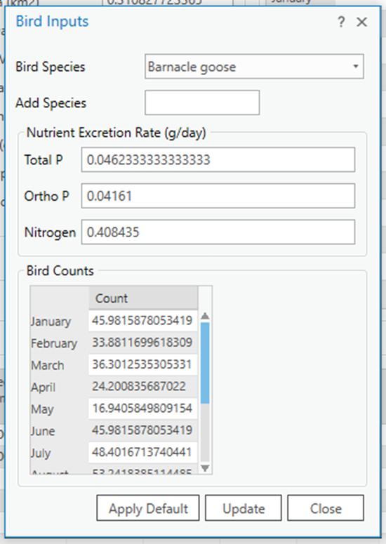
<figcaption>
Figure 26 Bird Inputs form
</figcaption>
</figure>

## Editing Estuaries data

To edit the estuary data:

| ***15*** | ***Edit Estuary Settings*** |
|----|----|
| *1* | *Highlight an estuary on the map (only one can be chosen).* |
| *2* | *Click on **Estuary Settings** (which is available in the **SAGIS** tab on the ArcPro toolbar, [Figure 4](#_Ref41378849)) which loads the **Estuary Settings** form ([Figure 27](#_Ref40192818)).* |
| *3* | *Change the values on the **Estuaries Settings** form as required.* |
| *4* | *Click on **Apply** to save the changes.* |

Figure 27 Estuary Settings
form

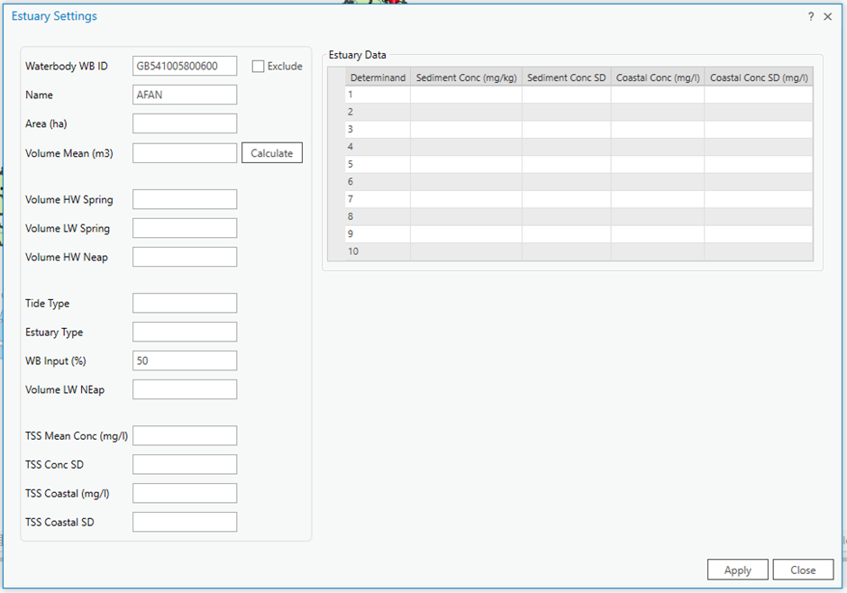

Further explanation of the key inputs on the **Estuary Settings** form
is provided below:

- **Volume Mean (m3) –** specifies the mean volume unless high water
  spring, low water spring, high water neap and low water neap values
  are specified.

- **Estuary Type –** Category of estuary type (e.g. Macrotidal,
  Mesotidal, Microtidal) with which the proportion of load passed
  downstream is associated.

- **WB Input % –** Percentage of input load that is retained by the
  estuary before the load is passed downstream.

- **TSS Mean Conc (mg/l)** and **TSS Conc SD –** Total suspended solids
  concentration in the estuary and associated standard deviation
  (derived from observed data).

- **TSS Coastal (mg/l) and TSS Coastal SD –** Total suspended solids
  concentration in the coastal waterbody into which the estuary
  discharges, and associated standard deviation (derived from observed
  data).

- **Sediment Conc (mg/kg)** and **Sediment Conc SD –** Concentration of
  each chemical substance associated with the suspended sediment.

- **Coastal Conc (mg/l)** and **Coastal Conc SD (mg/l) –** Concentration
  of each chemical in the coastal waterbody into which the estuary
  discharges.

# 

# Setting Up Scenarios

The data input forms for **Features**, **Waterbodies** and **Lakes**
described in [Chapter 7](#data-editing) can be used to set up and save
**Scenarios**. The components of these forms that are used to set up
scenarios are shown below ([Figure 28](#_Ref42598894)).

<figure>
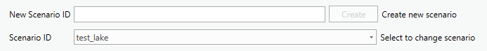
<figcaption>
Figure 28
Setting up and saving scenarios
</figcaption>
</figure>

Settings for selected features can be saved as a scenario by entering a
scenario name in the **New Scenario ID** box then clicking on the
**Create new scenario** button (this only applies to selected features
and only the currently selected feature for lakes).

To load a scenario the **Scenario ID** drop down button is selected
which lists previously saved scenarios. The required scenario is
selected from the dropdown list. This loads in all the saved values for
all features specified in the selected scenario, not just the currently
selected features.

Before creating a scenario, it is good practice to save a baseline
scenario with the original values so that these can be reloaded when
required (values can also be reset by **Opening and Updating** but this
takes much longer).

# Running SIMCAT and Viewing the Outputs

This chapter describes how the data created in the map attributes layers
are translated into the input (dat) file to SIMCAT then run. Using the
SAGIS interface, the SIMCAT outputs can then be viewed. Some of the
forms described in this chapter show options to display results for
lakes and estuaries and outputs related to the MPER model. These
elements are covered in separate chapters in the manual.

## General Settings and Create SIMCAT form

### Creating an unmodified regional dat file

To create a SIMCAT dat file the name must first be specified on the
**General Settings** form ([Chapter 6](#general-settings)). The **Create
SIMCAT** **File** form ([Figure 29](#_Ref40265115)) is then used to
create the SIMCAT dat file. The basic steps to do this are described
below followed by further information on how these steps can be
modified.

<table style="width:93%;">
<colgroup>
<col style="width: 7%" />
<col style="width: 85%" />
</colgroup>
<thead>
<tr>
<th><em><strong>16</strong></em></th>
<th><em><strong>Creating a Simple Regional SIMCAT dat
File</strong></em></th>
</tr>
</thead>
<tbody>
<tr>
<td><em>1</em></td>
<td><em>Open the <strong>General Settings</strong> form (<a
href="#_Ref40264641">Figure 15</a>) by clicking on the
<strong>SIMCAT</strong> icon then <strong>General Settings</strong> (<a
href="#_Ref41047346">Figure 8</a>).</em></td>
</tr>
<tr>
<td><em>2</em></td>
<td><em>Select an output location and name for the new dat file. This
can be modified manually be editing the <strong>SIMCAT File</strong>
input box or by clicking on the folder button beside this box. This
opens a <strong>File Open</strong> dialogue to select the location and
add the name of the dat file (extension dat). The dat file name must NOT
begin with a number (e.g. 2020scenario.dat) but may contain numbers
(e.g. scenario2020.dat). The full path length (i.e. dat file name and
file path) must not exceed 75 characters.</em></td>
</tr>
<tr>
<td><em>3</em></td>
<td><em>Add text to the <strong>Description</strong> box that describes
the scenario.</em></td>
</tr>
<tr>
<td><em>4</em></td>
<td><em>Add a Scenario ID to the <strong>New Scenario ID</strong> box
and click on <strong>Save</strong>. For a new dat file name to be
applied it is necessary to click on <strong>Save</strong> after entering
a scenario name (i.e. create a scenario) then to click
<strong>Apply</strong>.</em></td>
</tr>
<tr>
<td><em>5</em></td>
<td>
<em>Open the <strong>Create SIMCAT File</strong> form by clicking
on the <strong>SIMCAT</strong> icon then <strong>Create SIMCAT
File.</strong></em>

<a href="#_Ref40265323"><em>Figure</em> 12</a><em>).</em>
</td>
</tr>
<tr>
<td><em>6</em></td>
<td><em>Click on <strong>Run</strong>. This will create the unmodified
dat file with default settings.</em></td>
</tr>
</tbody>
</table>

<figure>
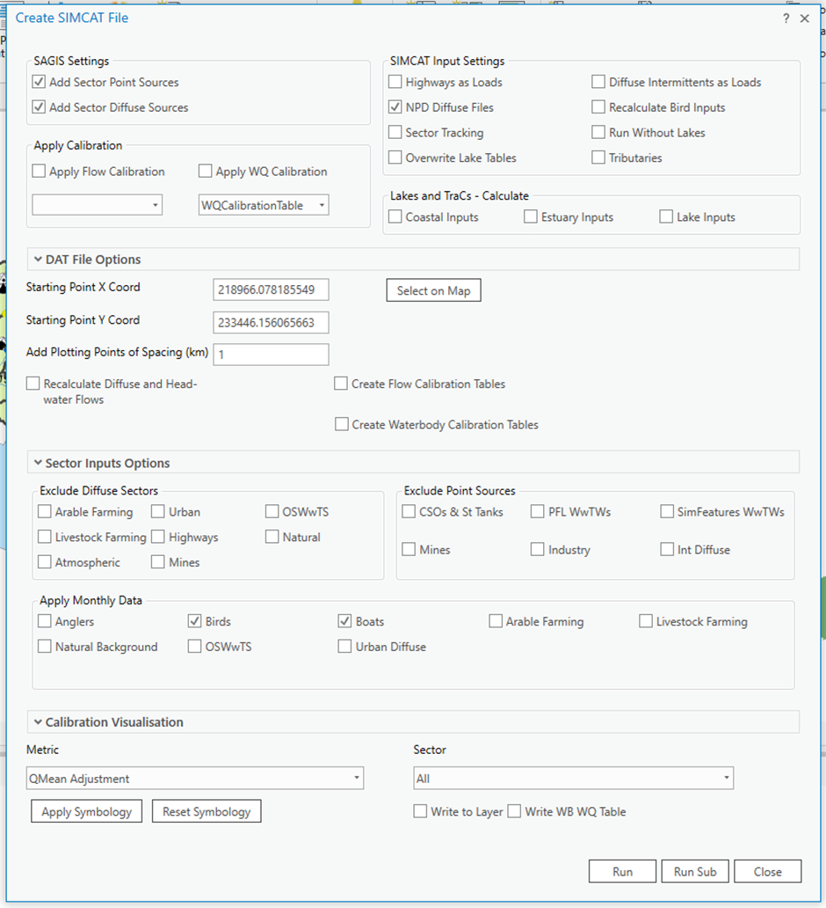
<figcaption>
Figure 29
Create SIMCAT File form
</figcaption>
</figure>

## Creating a sub-regional model

Sub areas of the regional model can be run by defining a sub-regional
polygon.

### Creating a Sub Area Polygon model

The first step is to create a polygon and SIMCAT dat file that covers
the reaches for the sub area. To do this:

| ***17*** | ***Creating a Sub-area SIMCAT dat File using a Sub-area Polygon buttons*** |
|----|----|
| *1* | *Highlight the downstream reach of the model area.* |
| *2* | *Click on the **SIMCAT** icon then **Create Model Area** [Figure 12](#_Ref40265323)) to open the **Create** **Model Area** form ([Figure 30](#_Ref40265354)).* |
| 3 | *Give the model sub area a name, typically, the name of the river catchment in the **Area Name** input box.* |
| *4* | *Click **Save** to create the sub-model area (this is saved in the **Regional Database**).* |
| *5* | *Open the **Create SIMCAT File** form by clicking on **SIMCAT** then **Create SIMCAT File**.* |
| *6* | *Select the starting point within the submodel using the ‘Select on Map’ option (*[**Figure 29**](#_Ref40265115)*)* |
| *7* | *Click on **Run Sub**. This will create the dat file with default settings.* |
| *8* | *This opens a dropdown box that lists all the sub-areas that have previously been created for the regional model ([Figure 31](#_Ref48570766)). Select the area for which the sub-area model is required. This will create the dat file with default settings**.*** |
| *9* | *Sometimes reaches are included in the sub area polygon that are not upstream of the selected downstream reach. For example, the waterbodies in SAGIS do not align perfectly with the confluences of the reaches or virtual reaches may cross the model area. This will result in the wrong reaches being selected when creating the SIMCAT dat file. This is corrected by opening the **Create Model Area form** again and selecting the model area using the dropdown box in the **Revise** area of the form and entering the **Unique_Ref** values of the reaches that need to be excluded. Once **Save** is clicked this information is stored and will be applied whenever the model sub area is used again to create a sub area SIMCAT dat file.* |
| *10* | *When creating a sub-area, it might not be required to include all areas upstream, for example if several upstream areas are linked together by virtual reaches (e.g. along the coast). To limit the extent of the upstream area created, enter the final upstream SIMCAT model number (SimNo) to include in the sub-area and the **SimNode** unique reference where the break with the upstream area is to be made. A reduced upstream area will then be created.* |
| *11* | *The existing sub-area can be mapped by clicking on the **Map** button. Clicking on the delete button removes the sub-area from the drop-down list.* |

<figure>
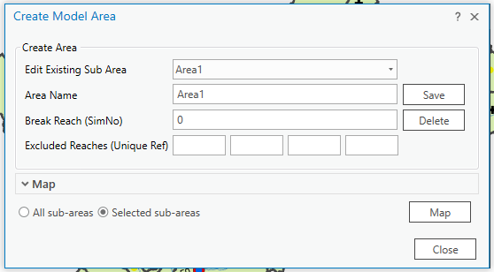
<figcaption>
Figure 30
Create Model Area form
</figcaption>
</figure>

<figure>
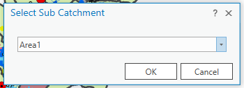
<figcaption>
Figure 31
Select Sub Catchment box
</figcaption>
</figure>

## Variations to basic model run

This following text describes how variations to the basic model run can
be specified by clicking on the tick boxes on the form ([Figure
29](#_Ref40265115)):

- **Add Sector Point Sources** **–** adds point source information (this
  is the default condition). If the box is not ticked only diffuse
  inputs will be included in the dat file.

- **Add Sector Diffuse Sources box –** adds the sector information
  derived from the **Sector Load** database (this is the default
  condition). If this is not ticked the SIMCAT models are created
  without the sector information (i.e. the pre SAGIS versions of the
  models are created in which diffuse inputs are derived from a user
  defined diffuse concentration rather than sector loads).

- **Highways as Loads** and **Diffuse Intermittents as Loads** **–**
  change the way these sectors are input to SIMCAT as loads for each
  determinand, rather than the default condition of flows and
  concentrations.

- **NPD Diffuse Files** **–** if ticked, non-parametric files are used
  to input diffuse loads (this is the default condition).

- **Recalculate Bird Inputs** **–** if ticked, input loads from birds to
  lakes will be recalculated based in the entries using the **Lake
  Settings** form (see [Chapter
  11](#running-the-sagis-lake-model-and-viewing-outputs)).

- **Sector Tracking** **–** if ticked diffuse inputs from each marked
  model area will be tracked downstream (SIMCAT tracks inputs from point
  source inputs automatically). In order for the sector tracking to
  ‘work’ it is necessary that the waterbodies to be tracked have been
  ‘marked’. Waterbodies may be ‘marked’ for tracking by highlighting the
  waterbodies to be tracked (SimWaterbodies layer) and then selecting
  the **Mark Waterbodies** icon/tool located on the ribbon in the
  **Editing Tools** command set (see Chapter
  [14.13](#mark-waterbodies)). Marking can be reset using the **Clear
  Waterbodies** icon/tool (see Chapter [14.14](#clear-waterbodies)). A
  maximum of 100 waterbodies can be tracked (SIMCAT limitation). Note
  that tracking diffuse sector inputs increases the SIMCAT run time and
  the file size of the SIMCAT outputs.

- **Run Without Lakes** **–** allows the user to switch off the inputs
  from lake outflows once the lake model has been run and these have
  been created (otherwise these are used as a default).

- **Overwrite Lake Tables –** Ticking this box forces the table with
  information on local inputs of chemicals to the lake to be
  overwritten, otherwise existing values will be used.

- **Lakes Inputs**, **Estuary Inputs** and **Coastal Inputs** **–** if
  these are ticked, SIMCAT output is generated at the boundaries between
  the river and lakes, estuaries and coastal waters, respectively, which
  are then used to calculate inputs to these water bodies (and used as
  inputs to the SAGIS Lake Model – [Chapter
  11](#running-the-sagis-lake-model-and-viewing-outputs)).

- **Starting Points** (x and y coordinates) **–** define the start and
  end of sub model reaches (as described in Section
  [9.2.1](#creating-a-sub-area-polygon-model))

- **Add Plotting Points of Spacing (km)** box **–** (1km is the default)
  sets the regular interval at which plotting points are created.

- **Exclude Sectors** **–** Sectors can be selectively ‘switched off’
  using the **Exclude Diffuse Sectors** and **Exclude Points Sectors**
  tick boxes.

- **Apply Monthly Data** **–** Inputs monthly sector data but only if
  monthly loads have been created in the **Land National Database**.
  These are only applied if the Monthly option is selected for the
  sector and chemical on the Global Controls Settings form (Section
  \*.\*)

### Calibration tables

Calibration adjustments (calculated outside SAGIS) can be applied using
the **Apply Calibration** settings. Existing tables for water quality
and flow are listed in the dropdown boxes. These are stored in the
**Regional Database** and consist of adjustments to the diffuse flows
and loads on a reach or catchment basis. The calibration tables must
have the name **FlowCalibrationTable** and **WQCalibrationTable** with
additional characters appended to differentiate between them. The
calibration table is applied by selecting the required table from the
dropdown box and ticking **Apply Flow Calibration** or **Apply WQ
Calibration** for flow and water quality, respectively. Information on
mapping the calibration factors is presented in [Chapter
10](#calibration-adjustments-and-calibration-tables).

### Running SIMCAT

SIMCAT can be run directly from the GIS interface (Box 18) or using the
stand alone SIMCAT interface (operation of this interface is described
separately in the SIMCAT manual).

| ***18*** | ***Running SIMCAT from the GIS Interface*** |
|----|----|
| *1* | *Click on the **SIMCAT** icon then **Run SIMCAT** ([Figure 12](#_Ref40265323)) to open the **Run SIMCAT** form ([Figure 32](#_Ref40269573)).* |
| *2* | *Select the dat file.* |
| *3* | *Click on the dropdown box to select the SIMCAT run option (Mode 0 to 11; the default option 0 should be applied) then tick the box **Run Rivers (SIMCAT)** before clicking on **Run**.* |
| *4* | *When SIMCAT runs the black SIMCAT screen appears and the run proceeds feature by feature.* |

<figure>
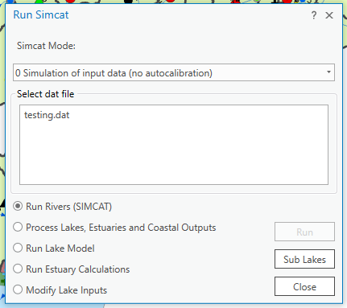
<figcaption>
Figure 32
Run SIMCAT form
</figcaption>
</figure>

## Visualisation of SIMCAT outputs

A range of visualisation options are available to present the results of
the SIMCAT simulation which are presented below.

### Plotting outputs

To map model outputs from SIMCAT:

| ***19*** | ***Plot Outputs*** |
|----|----|
| *1* | *Click on the **Plot Outputs** button (which is available in the **SAGIS** tab on the ArcPro toolbar, [Figure 4](#_Ref41378849)) then **Plot Rivers** to open the **Plot River Outputs** form ([Figure 33](#_Ref40350537)).* |
| *2* | *Select the chemical substance of interest using the dropdown box. Output for all determinands can be generated in one operation by selecting **All Chemicals.*** |
| *3* | *Select the location of the outputs points: all output locations (**All**), monitoring locations (**Monitoring Stations** - water quality and flow monitoring), or at water body boundaries (**WB Boundary**) as specified on the form. A special output format to prepare the inputs for MPER can also be selected which is described in [Chapter 13](#_Ref42582473).* |
| *4* | *For metals, select which partitioned fraction to plot, **Total, Particulate** or **Dissolved** using the option buttons in the **Partitioned Outputs** box. For other non-partitioned substances, the default of **Total** is applied.* |
| *5* | *Click on the **Create Map** button.* |
| *6* | *To change to mapped symbology adjust the options on the form and select **Change Symbology.*** |

An example of mapped output for rivers is shown below ([Figure
34](#_Ref40350744)).

Once the map has been created, further options are available for viewing
the data as specified in the **Symbology Options** part of the form.
Further information on these options is presented below:

- **Concentration, Load** or **River Flow –** changes the model output
  metric to be plotted.

- **Comp Prob** **–** Plots the probability of compliance with the
  target or standard.

- **T Test 1** and **T Test 2 –** shows whether there is a significant
  difference (Bad) or no difference (Good) between the observed and
  simulated data using a stringent (simulated mean within 95% confidence
  limits of the observed data) and less stringent (overlap between the
  95% confidence limits of the simulated and observed data) T Test.

- **Probability of WFD Class –** plots the probability that the output
  data is with the selected WFD class.

- **Simulated, Observed** or **Difference –** to select a plot of
  observed data, simulated model output or the difference between the
  simulated and observed (ratio simulated/observed).

- **Mean, 90th percentile, 95th percentile or
  99th percentile** **–** changes the model output metric to
  be plotted.

- **Cal Score –** plots scores between 1 (lowest) and 25 (highest) for
  monitoring points. Scores reflect the closeness of fit between
  observed and simulated values. This score is calculated as follows
  based on the differences between the observed data and model outputs.
  The scores are the product of the ratio between the simulated and
  observed means and the degree of overlap between the confidence
  limits. Table 1 shows the derivation of the scores.

| Ratio between simulated and observed mean | Sim mean outside confidence limits of observed mean but overlap of confidence limits on same side of the observed mean | Sim mean outside confidence limits of observed mean but overlap of confidence limits on opposite side to the observed mean | Sim mean within confidence limits of observed mean but one or both Sim confidence limits outside observed confidence limits | Sim mean within confidence limits of observed mean and Sim confidence limits within observed confidence limits on the same side as observed mean | Sim mean within confidence limits of observed mean and Sim confidence limits within observed confidence limits either side of observed mean |
|:---|:--:|:--:|:--:|:--:|:--:|
| \< 0.33 or \>3 | 2 | 3 | 3.5 | 4 | 5 |
| 0.33 to 0.5 or 2 to 3 | 4 | 6 | 7 | 8 | 10 |
| 0.5 to 0.66 or 1.5 to 2 | 6 | 9 | 10.5 | 12 | 15 |
| 0.66 to 0.8 or 1.25 to 1.5 | 8 | 12 | 14 | 16 | 20 |
| \>0.8 and \<1.25 | 10 | 15 | 17.5 | 20 | 25 |

Table 1 Scores and the ratio between the simulated and observed means
and the degree of overlap between the confidence limits

<figure>
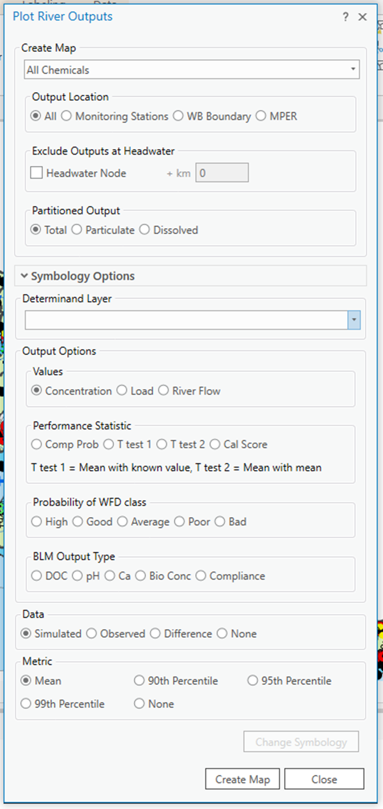
<figcaption>
Figure 33
Plot River Outputs form
</figcaption>
</figure>

<figure>
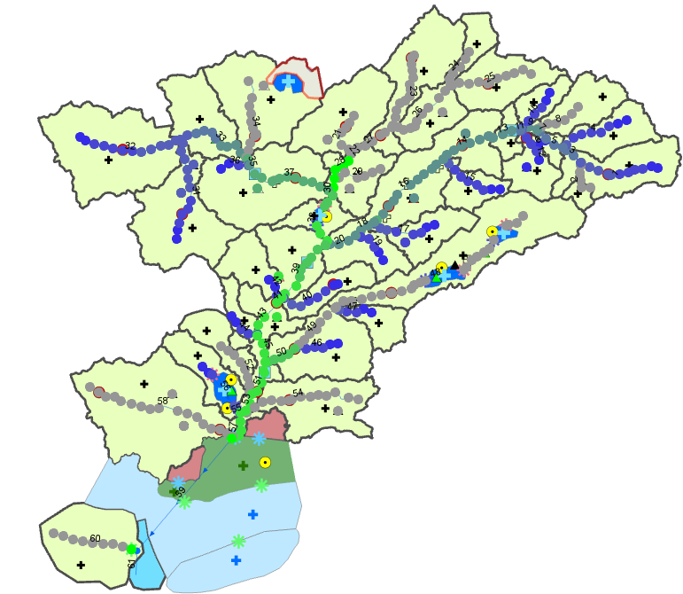
<figcaption>
Figure 34
Example output generated by Plot Outputs tools
</figcaption>
</figure>

Once created, the symbology can also be edited using the standard ArcGIS
interface (i.e. right click on the layer then click on **Properties**
then **Symbology**).

The **Lake Maps** and **BLM and MPER** plots are described later in
[Chapter 11](#running-the-sagis-lake-model-and-viewing-outputs) (Lakes
Model) and [Chapter 13](#_Ref48580149) (Bioavailability Model and MPER),
respectively.

### Mapping RQP

SIMCAT has been modified to carry out RQP type calculations at all
wastewater discharges. This involves applying mass balance calculations
to estimate downstream concentrations based on fixing the upstream
concentrations to 50% of the Environmental Quality Standard or Target.
The outputs of these calculations are contained in the \*.EFF output
file from SIMCAT (after it is run in Mode 11).

To read in the RQP output follow the steps described in the grey box.

| ***20*** | ***Mapping RQP Outputs*** |
|----|----|
| *1* | *Click on the **Plot Outputs** button (which is available in the **SAGIS** tab on the ArcPro toolbar, [Figure 4](#_Ref41378849)) then **RQP** to open the **Plot RQP** form ([Figure 35](#_Ref40272044)).* |
| *2* | *Select **Target**, **Nat Breaks** or **TargetBack**.* |
| *3* | *Click on the **RQP** button. The RQP outputs are mapped for all selected chemical substances (e.g. [Figure 36](#_Ref40272219)).* |

Figure 35 Plot RQP form

<figure>
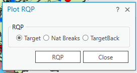
<figcaption>
Figure 36
Example of RQP output
</figcaption>
</figure>

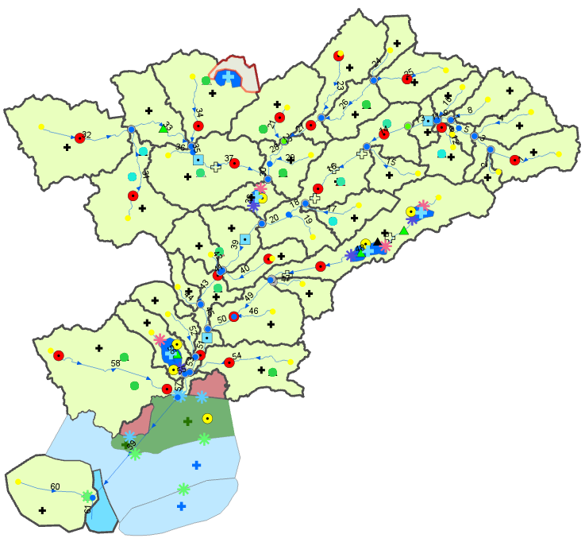

Many other outputs are contained in the mapped RQP layer which can be
used to create other symbologies using the standard ArcGIS interface.

### Mapping Input Data

The source data in the **Land National Database** 1 km grid ([Chapter
3](#building-regional-databases)) can be plotted as follows:

| ***21*** | ***Mapping Input Load Grid*** |
|----|----|
| *1* | *Click on the **Display Grid** button (which is available in the **SAGIS** tab on the ArcPro toolbar, [Figure 4](#_Ref41378849)) to open the **National loads per sq. km** form ([Figure 37](#_Ref40696001)). This requires the National Land database to be specified in the SAGIS Options form (see Chapter 2)* |
| *2* | *Using the top dropdown box, select the chemical substance of interest.* |
| *3* | *Using the lower dropdown box, select the table of interest (e.g. ArableFarming_CONC) and click on **Apply Symbology** which then creates the gridded map (e.g. [Figure 38](#_Ref40696167)).* |

**Figure 37** **National
loads per sq. km form**

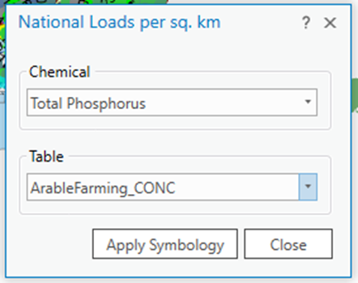

<figure>
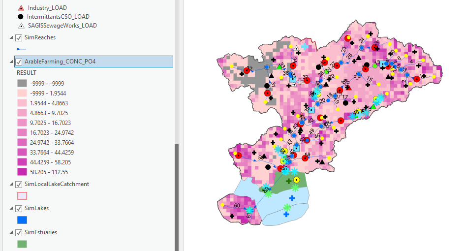
<figcaption>
Figure 38
Example output generated by Plot Outputs tools
</figcaption>
</figure>

<table style="width:92%;">
<colgroup>
<col style="width: 7%" />
<col style="width: 84%" />
</colgroup>
<thead>
<tr>
<th style="text-align: left;"><em><strong>22</strong></em></th>
<th style="text-align: left;"><em><strong>Mapping Input Waterbody
Loads</strong></em></th>
</tr>
</thead>
<tbody>
<tr>
<td><em>1</em></td>
<td><em>Click on the <strong>Display WBs</strong> button (which is
available in the <strong>SAGIS</strong> tab on the ArcPro toolbar, <a
href="#_Ref41378849">Figure 4</a>) to open the <strong>Regional loads
per Waterbody</strong> form (<a href="#_Ref47012822">Figure
39</a>).</em></td>
</tr>
<tr>
<td><em> 
2</em></td>
<td><em>Using the top dropdown box, select the chemical substance of
interest.</em></td>
</tr>
<tr>
<td><em>3</em></td>
<td><em>Using the lower dropdown box, select the table of interest (e.g.
ArableFarming_CONC) and click on <strong>Apply Symbology</strong> which
then creates the gridded map (e.g. <a href="#_Ref40698336">Figure
40</a>).</em></td>
</tr>
<tr>
<td><em>4</em></td>
<td><em>If the <strong>Total Load</strong> option is selected, the total
loads to the waterbodies are displayed and if the <strong>Load per
km2</strong> is selected the loads per km2 are
displayed.</em></td>
</tr>
</tbody>
</table>

<figure>
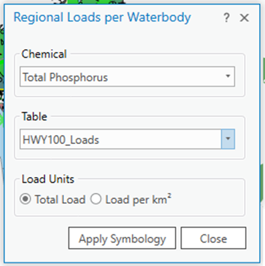
<figcaption>
Figure 39
Regional loads per Waterbody form
</figcaption>
</figure>

<figure>
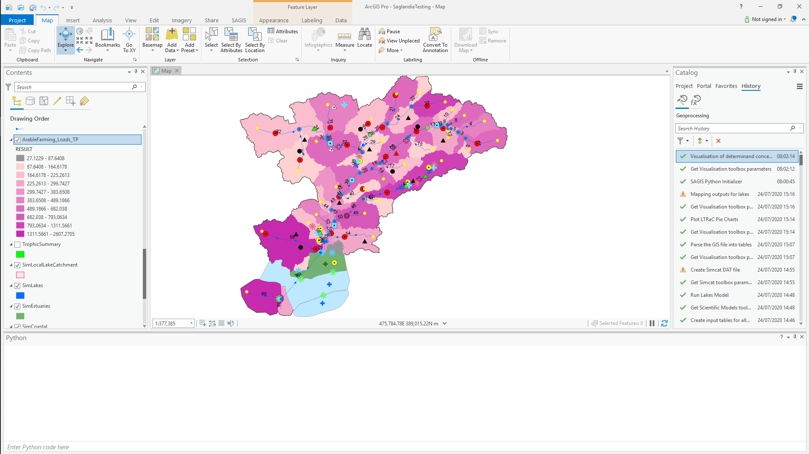
<figcaption>
Figure 40
Example waterbody export load plot
</figcaption>
</figure>

### Create Output Tables

Before the charts described in the following sections can be generated,
the SIMCAT output files need to be processed by clicking on the **Create
Output Tables** button. Three sets of output tables are created in the
**Regional Database**:

- **Sewage works tables** **–** at each waterbody outlet, the
  contributed loads from each upstream point source to the combined
  points source load are listed (table name = **dat file name +
  ContributingSTWs**).

- **Sector tables –** output tables with the sector input and output
  loads and output concentrations at each waterbody boundary (input load
  table name = **dat file name + ContributingInputs**, output load table
  name = **dat file name + ContributingOutputLoads** and output
  concentration table name = **dat file name + ContributingOutputs**).

- **Upstream diffuse contribution tables –** these tables show the
  contributing loads of all upstream marked catchment areas (e.g.
  waterbodies) and are created for each selected chemical substance and
  sector (table name = **dat file name + Contributing + sector**
  **name**; e.g. RiverDeeContributingArable).

| ***23*** | ***Create Output Tables*** |
|----|----|
| *1* | *Click on the **Create Output Tables** button (which is available in the **SAGIS** tab on the ArcPro toolbar, [Figure 4](#_Ref41378849)) to open the **Create Output Tables** form ([Figure 41](#_Ref40272946))**.*** |
| *2* | *The tick boxes specify which feature types to include in the table; **STW, Outputs, Diffuse Sectors** and **Inputs**.* |
| *3* | *Selecting a **Waterbody Calibration Table** from the dropdown will apply the calibration factors when creating the sector input tables.* |
| *4* | *Select the **Fraction** to be rendered; **Total**, **Dissolved** or **Solid.** This should typically be **Total** other than where the dissolved phase concentration is typically of interest (e.g. metals with bioavailability-based standards).* |
| *5* | *Select **Run**.* |

**Figure 41** **Create Output Tables form**

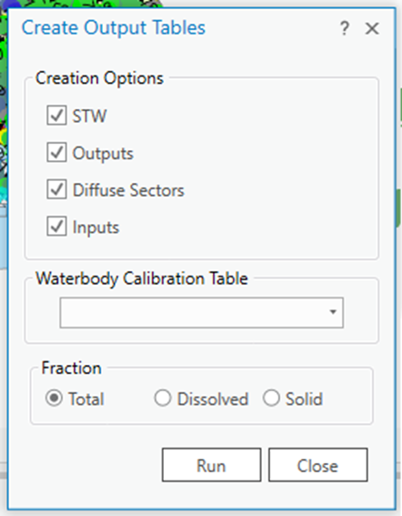

### Sector pie charts

To generate pie charts:

<table style="width:92%;">
<colgroup>
<col style="width: 7%" />
<col style="width: 84%" />
</colgroup>
<thead>
<tr>
<th><em><strong>24</strong></em></th>
<th><em><strong>Create Sector Pie Charts</strong></em></th>
</tr>
</thead>
<tbody>
<tr>
<td><em>1</em></td>
<td><em>Click on the <strong>Plot Sector Charts</strong> button (which
is available in the <strong>SAGIS</strong> tab on the ArcPro toolbar, <a
href="#_Ref41378849">Figure 4</a>) which opens the <strong>Plot Sector
Charts</strong> form (<a href="#_Ref40698516">Figure 42</a>).</em></td>
</tr>
<tr>
<td><em> 
2</em></td>
<td><em>Click on the dropdown box to select the chemical substance of
interest. Output for all determinands can be generated in one operation
by selecting <strong>All Chemicals.</strong></em></td>
</tr>
<tr>
<td><em>4</em></td>
<td><em>Click to select plot options within the
<strong>Advanced</strong> <strong>River Options</strong> section of the
form (Lakes, Estuaries and Coastal Margins are covered later in the
manual).</em></td>
</tr>
<tr>
<td><em>5</em></td>
<td><em>Click on <strong>Run</strong> to create the pie
charts.</em></td>
</tr>
</tbody>
</table>

Further information on the **Advanced River Options** on the form are
described below:

- **In-stream Conc –** Sector apportionment chart for simulated
  concentrations at the waterbody outlet.

- **In-stream Load –** Sector apportionment chart for simulated loads at
  the waterbody outlet

- **Input Load –** Sector chart of the input load to each waterbody
  (this is adjusted by the calibration factors if this option was
  selected during the **Create Output Tables** stage).

- **Input Cumulative Load –** Input load from all waterbodies upstream
  (including the load to the waterbody).

[Figure 43](#_Ref44402900) shows an example pie chart plot.

**Figure 42** **Plot
Sector Charts form**

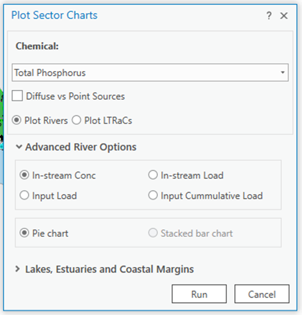

<figure>
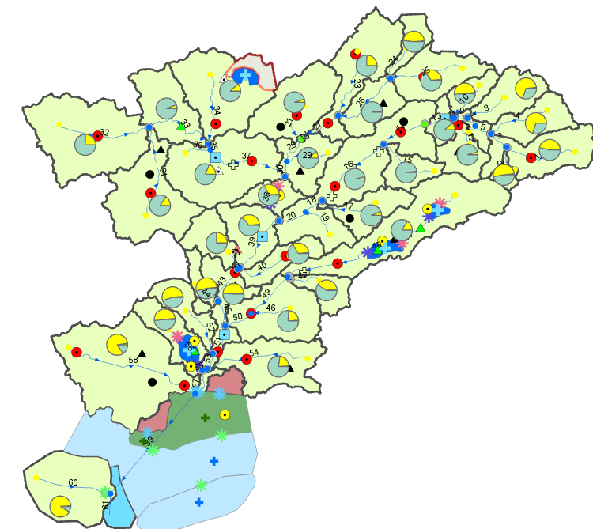
<figcaption>
Figure 43
Example of source apportionment pie chart plot
</figcaption>
</figure>

If no sector information is available for a chemical (e.g. BOD), the pie
charts show the relative contribution of diffuse and point sources. This
output can be selected for chemicals with sector information by ticking
the **Diffuse vs Point Sources** tick box.

### Upstream contribution charts

Before these charts can be generated, the output tables must be created
using **Create Output Tables** (Section [9.4.4](#create-output-tables)).
In the case of diffuse sources, **Sector Tracking** must be enabled on
the **Create SIMCAT File** form and areas to track must be created
(Section [9.3](#variations-to-basic-model-run)) before running SIMCAT to
first create the tracking information in the SIMCAT output files. To
create upstream contribution charts:

| ***25*** | ***Create Upstream Contribution Charts*** |
|----|----|
| *1* | *Click on the **Upstream Contribution Charts** button (which is available in the **SAGIS** tab on the ArcPro toolbar, [Figure 4](#_Ref41378849)) and then on either the **Sector Charts** or **Point Source Charts** option which opens the associated **Upstream Contribution Charts** form (for **Sector Charts**: [Figure 44](#_Ref40952091) and for **Point Source Charts**: [Figure 45](#_Ref40952113)).* |
| *2* | *Select the **Waterbody** of interest from the dropdown list.* |
| *3* | *Select the chemical of interest using the **Determinand** dropdown box.* |
| *4* | *Specify the **Point Source Options** or diffuse **Sector Options**.* |
| *5* | *Click on **Run** to create the chart.* |

**Figure 44** **Upstream
Contribution form for Sector Charts**

<figure>
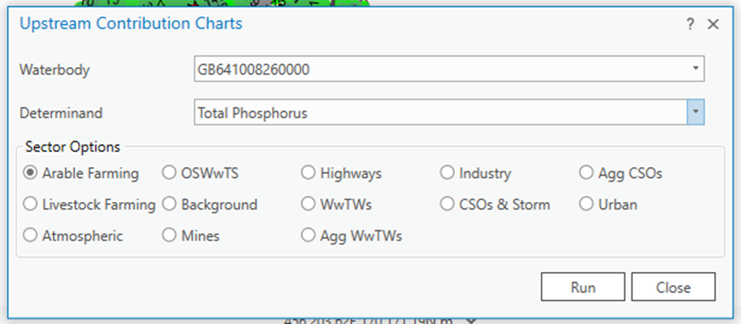
<figcaption>
Figure 45
Upstream Contribution form for Point Source Charts
</figcaption>
</figure>

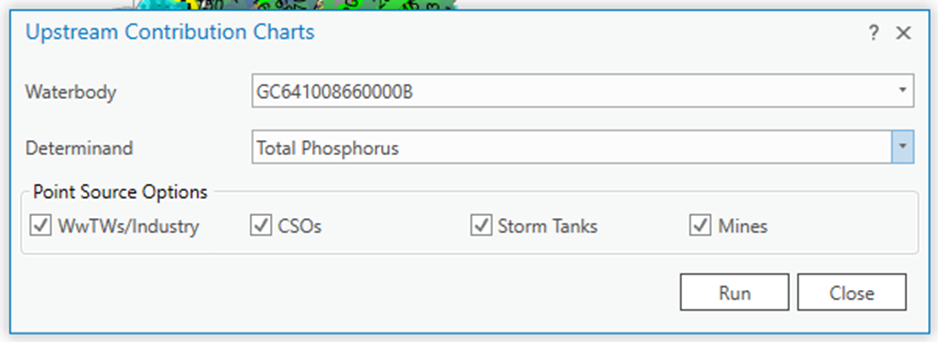

If point contributions are selected, bars will appear on the map showing
the relative contribution of upstream point sources. If diffuse
contributions are selected a coloured map is produced showing the
relative loads from upstream catchments.

### Mapped water body output charts

The **Map Output** tools takes the mapped point outputs generated by the
**Plot Output** tools, and maps these onto the water body layer to show
compliance and source apportionment at the waterbody spatial scale. To
generate these outputs:

<table style="width:92%;">
<colgroup>
<col style="width: 7%" />
<col style="width: 84%" />
</colgroup>
<thead>
<tr>
<th><em><strong>26</strong></em></th>
<th><em><strong>Create Mapped Outputs Charts</strong></em></th>
</tr>
<tr>
<th><em>1</em></th>
<th><em>Click on the <strong>Map Output</strong> button (which is
available in the <strong>SAGIS</strong> tab on the ArcPro toolbar, <a
href="#_Ref41378849">Figure 4</a>) which opens the <strong>Map
Output</strong> form (<a href="#_Ref40698694">Figure 46</a>).</em></th>
</tr>
<tr>
<th><em>2</em></th>
<th><em>Select <strong>Determinand Layer</strong> and
<strong>Sector</strong> of interest from the drop down lists.</em></th>
</tr>
<tr>
<th><em>3</em></th>
<th><em>Select a <strong>Model Output Location</strong> and an
<strong>Output Option</strong>.</em></th>
</tr>
<tr>
<th><em> 
5</em></th>
<th><em>Select the statistic to map from the <strong>Mapped
Statistic</strong> box.</em></th>
</tr>
<tr>
<th><em>6</em></th>
<th><em>Click on <strong>Apply</strong> to create the chart.</em></th>
</tr>
</thead>
<tbody>
</tbody>
</table>

<figure>
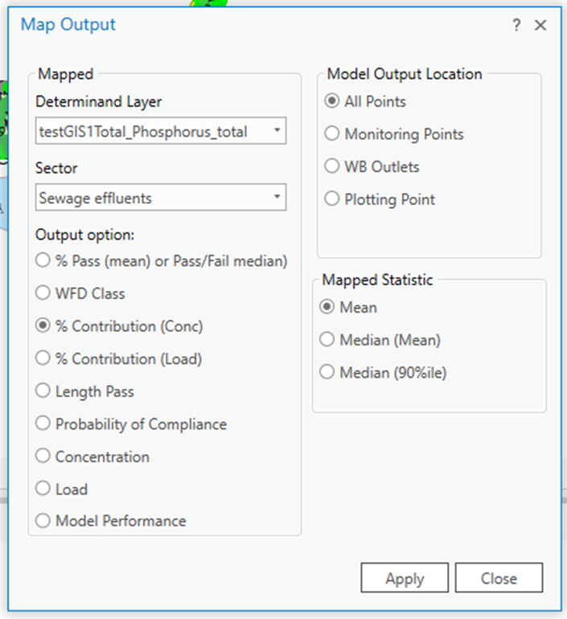
<figcaption>
Figure 46
Map Output form
</figcaption>
</figure>

Further information on the mapping options is shown below:

- **All Points** **–** all model outputs used to generate the waterbody
  statistics.

- **Monitoring Points** **–** only model output at the monitoring points
  used to generate the waterbody statistics.

- **WB Outlets** **–** only model output as the waterbody boundary used
  to generate the waterbody statistics.

- **Plotting Point** **–** only model output at plotting points used to
  generate the waterbody statistics

- **Mean –** mean of the mean concentration for the selected points.

- **Median (Mean) –** median value of the mean concentration for the
  selected points.

- **Median (90%ile)** **–** median value of the 90%ile concentration for
  the selected points.

- **% Pass (mean) or Pass/Fail (median) –** the percentage of selected
  points that are compliant compared to the standard or whether the
  median value passes or fails if the median statistic has been
  specified.

- **WFD Class** **–** WFD class of the selected points (only applies to
  chemicals with WFD classes) related to the average or median
  concentration.

- **% Contribution (Conc) –** the percentage contribution of the sector
  selected using the dropdown box to the total concentration.

- **% Contribution (Load) –** the percentage contribution of the sector
  selected using the dropdown box to the total load.

- **Probability of Compliance** **–** average or median probability of
  compliance.

- **Concentration –** average or median concentration.

- **Load** **–** average or median load.

- **Model performance** **–** average or median deviation between
  observed data and model output.

An example mapped output is shown in [Figure 47](#_Ref41394533).

<figure>
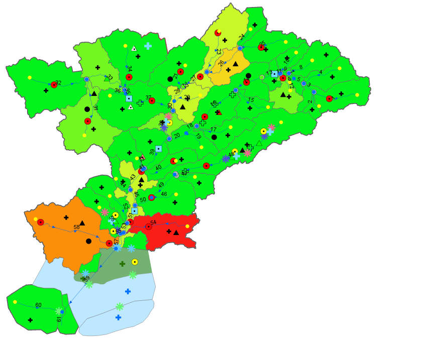
<figcaption>
Figure 47
Example mapped output plot (% Contribution (Conc))
</figcaption>
</figure>

### River chainage plots (Excel)

A chainage plot is a plot of model results and observed data along a
continuous length of river between a start point and an end point. To
create a chainage plot:

| **27** | ***Create Chainage Plot*** |
|:---|:---|
| 1 | *Select the **Excel Graphs** icon (which is available in the **SAGIS** tab on the ArcPro toolbar, [Figure 4](#_Ref41378849)) then **River Chainage** which opens the **Plot River Chainage Graphs** form ([Figure 48](#_Ref40698772)).* |
| 2 | *Select the chemical of interest using the **Determinand** dropdown box.* |
| 3 | *Select the upstream reach as the **Start Reach** and the furthest downstream reach as the **End Reach** from the dropdown lists or **Select on map**.* |
| 4 | *Select the **Fraction**; **Total, Dissolved** or **Solid.** This should typically be **Total** other than where the dissolved phase concentration is typically of interest (e.g. metals with bioavailability-based standards).* |
| 5 | *Click **Run**. Following this a spreadsheet will appear automatically in the dat file folder.* |
| 6 | *Open the spreadsheet, then click on the **Initialise Data** button (in the **Import_Controls** tab; [Figure 49](#_Ref41395065)) and* ***Simulated and Observed Concentration** chainage plots (e.g. [Figure 50](#_Ref42597726)) will appear. The chainage plots can be modified by changing the settings (described below) on the worksheet.* |
| 7 | ***Sector Chainage** and **Probability of Compliance** plots (e.g. [Figure 51](#_Ref42597754)) can be viewed by selecting the **See Load and Compliance Charts** button. The chainage plots can be modified by changing the settings on the worksheet.* |

The settings that can be adjusted to modify chainage plots are described
below (and are also detailed in the Excel spreadsheet):

- **Upstream Reach –** upstream reach in chain.

- **Downstream Reach –** downstream reach in chain.

- **Targets –** displays the water quality targets on the plot (for WFD
  chemicals the High, Good, Moderate, Poor boundaries are shown).

- **Observed Data** **–** displays the observed data on the plot.

- **Fixed Y Axis** **–** Manual control on Y axis (id blank applies
  default).

- **Observed Confidence Limits** – displays observed confidence limits.

- **Show Lake Data** – shows lake data (if exists).

- **Reach markers** – displays reach markers.

- **Mean, 90 Percentile, 95 Percentile, 99 Percentile** **–** select the
  output statistic to plot.

- **Conc** or **Load –** specifies if concentrations or loads are shown.

**Figure 48 Plot River Chainage Graphs form**

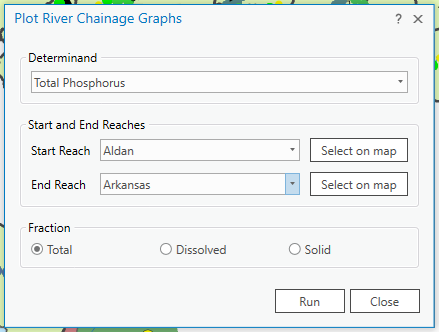

**Figure 49** **Chainage
plots via Excel**

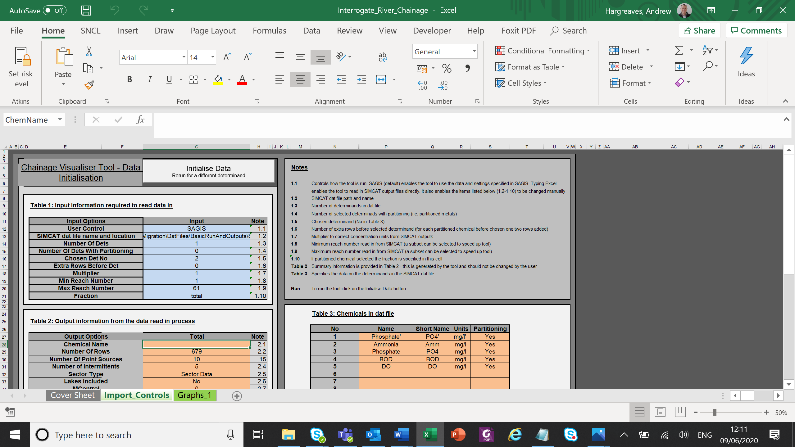

**Figure 50 Example Simulated and Observed Concentration chainage
plots**

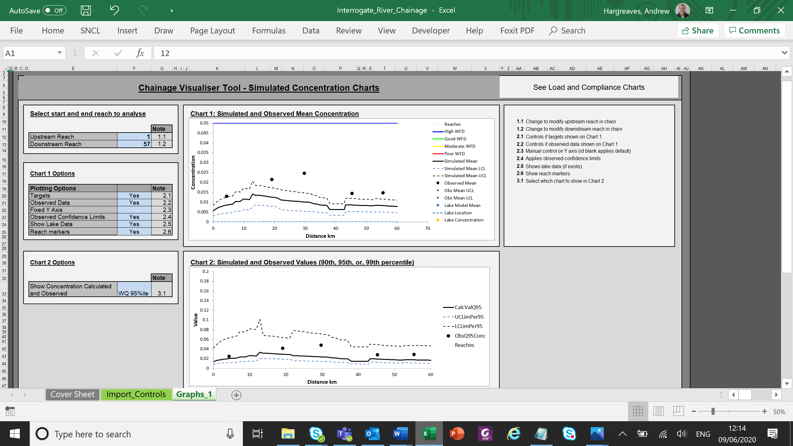

**Figure 51 Example Sector Chainage and Probability of Compliance
plots**

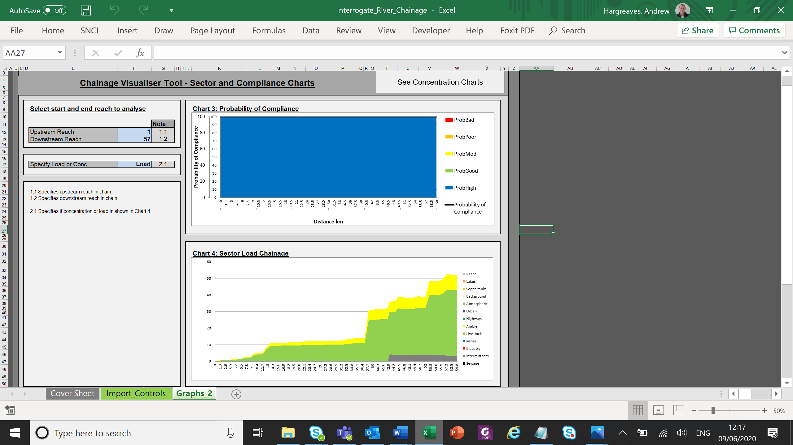

# Calibration Adjustments and Calibration Tables

SIMCAT model calibration in SAGIS is based on making adjustments to
diffuse inflows and to sector input loads. These can be applied by
modifying the source data (i.e. **Land National** databases and flow
data tables) or adjustment factors in the **SimWaterbodies** attributes
table (**Waterbody Settings**). The preferred approach in SAGIS is,
however, to create Flow and Water Quality Calibration tables that are
applied during creation of the SIMCAT dat file (see [Chapter
7](#data-editing)). This allows calibration to be consistently applied
independently of other changes that might be made to the source data
(e.g. related to land use change or climate change). Other manual
adjustments are combined with the adjustments in the calibration tables.

The format of the calibration table is shown in [Chapter
17](#sagis-databases-1). In the Flow Calibration table, adjustment
factors are defined for the Mean and Q95 flow for both Reach and Node
(Headwater) inputs. In the Water Quality Calibration table, adjustment
factors are defined for all input sectors. The coefficient of variation
associated with each sector can also be set.

Calibration adjustments can be applied at either the reach or waterbody
scale. Adjustments are applied as follows:

1.  The **Unique_ref** specified in the calibration table is applied to
    the corresponding **UniqueRef_ID** in the **SimReaches** layer (i.e.
    for reach specific diffuse flows and input loads). It is recommended
    that a **Unique_ref** value should always present.

2.  The adjustment to the reach diffuse inflow is also applied to the
    corresponding headwater node, but a further adjustment to the
    headwater node is applied if the adjustment factor for the node is
    not 1.

3.  Note that if new reaches are created no calibration adjustment will
    be applied to them. The adjustment factor needs to be added to the
    table or the calibration repeated.

Once the calibration factors have been created these can be mapped using
the **Create SIMCAT File** form:

| ***28*** | ***Mapping Calibration Adjustment Factors*** |
|----|----|
| *1* | *Open the **Create SIMCAT File** form ([Figure 52](#_Ref40704995)) by clicking on **SIMCAT** then **Create SIMCAT File** ([Figure 12](#_Ref40265323)).* |
| *2* | *Select the Flow and Water Quality Calibration tables using the dropdown boxes in the **Apply Calibration** part of the form.* |
| *3* | *Select the metric to map using the left-hand side dropdown box in the **Calibration Visualisation** part of the form.* |
| *4* | *Select the sector to map using the right-hand side dropdown box in the **Calibration Visualisation** part of the form.* |
| *5* | *Click on **Apply Symbology** to create a map of the adjustment factors.* |

**Figure 52 Create SIMCAT
File form**

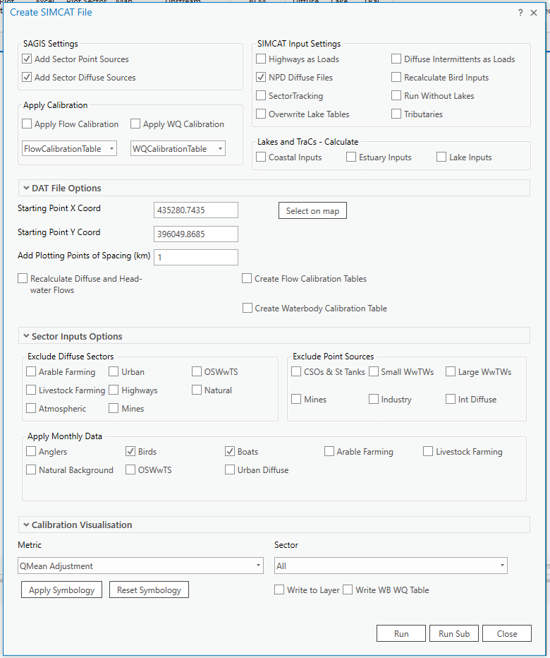

## Import Calibration Data

To import the table listing the reach and determinand specific
adjustments.

| ***29*** | ***Import Calibration Data*** |
|----|----|
| *1* | *Click on the **SIMCAT icon** then **Import Calibration Data** ([Figure 12](#_Ref40265323)) to open the form shown in [Figure 53](#_Ref45116665).* |
| *2* | *Select the location of the **Input Excel File** using the ArcGIS Pro dialogue box.* |
| *3* | *Select a location for the **Output Table** using the ArcGIS Pro dialogue box.* |
| *4* | *Insert the name of the **Sheet** in the **Input Excel File** that you want data to be extracted from.* |
| *5* | *Select the **Run** button. The **Output Table** is placed in the specified file geodatabase**.*** |

Figure 53 Import
Calibration Data

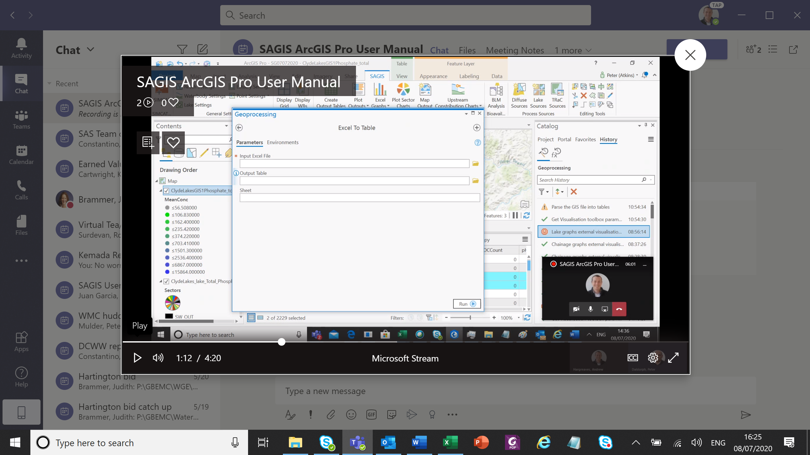

# 

# Running the SAGIS Lake Model and Viewing Outputs

## SAGIS Lake Model

The SAGIS lakes model supports two types of model run:

1.  The **Fast mode** model run is based on a fixed 30 years simulation
    with simplified parameter values. The input sectors are modelled in
    two groups, a) strongly driven by rainfall such as agricultural
    phosphorus and b) relatively constant, for example sewage works
    inputs. The sector concentrations associated with each group are
    pooled and modelled together within the lake then the lumped
    concentrations are split between the sectors, based on the relative
    size of their inputs. Chemical losses within the lake are modelled
    by a single parameter. No hydrological sequencing is applied in
    contrast to the second method. Monte Carlo iterations are not
    applied.

2.  The **Detailed mode** model run is based on a Monte Carlo simulation
    for a specified number of shots (NShots). Concentrations
    and loads associated with each sector are simulated separately. For
    each shot, different parameter values are sampled between the upper
    and low bound and NShots annual simulations are carried
    out. The model run is repeated for a user specified number of years
    until a steady state is reached which can be assessed by plotting
    the time series model output. During the annual simulation, monthly
    sequences of random numbers are applied based on observed variations
    in river flow to simulate the effect of sequences of low (drought)
    and high (wet) flow periods on the concentrations. If a lake volume
    npd is specified the starting volume in each month’s simulation is
    chosen at random from the non-parametric distribution of lake
    volumes.

The chosen approach depends on the purpose of the model run. For
example, to represent the influence of lakes on river water quality the
**Fast** **mode** model would be used but for a detailed study on a
particular lake, the **Detailed mode** model would be more appropriate.

## Running the lake model

###  SIMCAT

Before running the SAGIS lake model, the SIMCAT dat file must be set up
and run using the **Create SIMCAT File** form as shown below ([Figure
54](#_Ref40705632)). The options in the **Lakes and TraCs – Calculate**
section (within red box) must be ticked.

<figure>
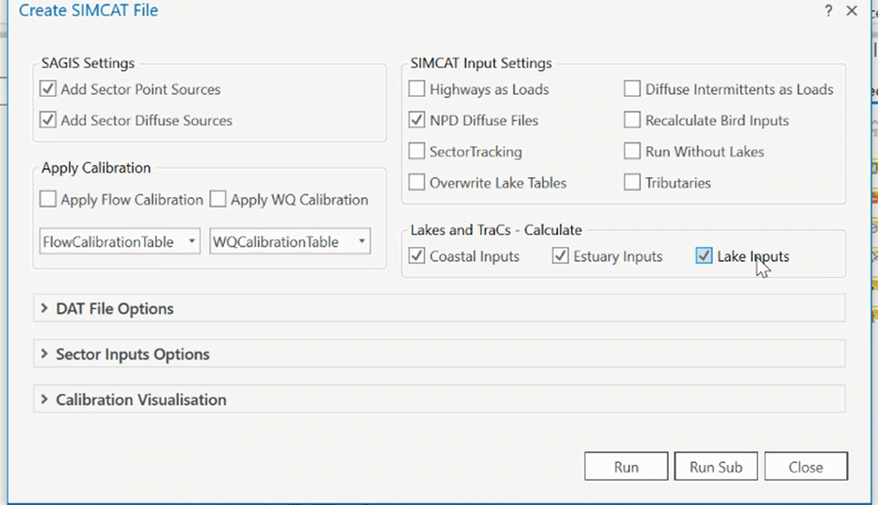
<figcaption>
Figure 54
Create SIMCAT File form set up to create the inputs for
Lakes
</figcaption>
</figure>

###  Setting up lake input tables

Before running the lake model two tables need to be created in the
**Regional Database** which record the flow and water quality inputs to
the lake to provide the input data to the SAGIS lake model; annual
inputs (table name = **dat file name + LakeInputs**) and monthly inputs
(table name = **dat file name + LakeInputsMonthly**). Corresponding
tables are also created of the coefficient of variation (COV) and
correlation coefficient (COR) for the inputs.

To create the lake input tables:

| ***30*** | ***Creating SAGIS Lake Model Input Tables*** |
|----|----|
| *1* | *Click on the **SIMCAT icon** then **Run SIMCAT** ([Figure 12](#_Ref40265323)) to open the **Run SIMCAT** form ([Figure 55](#_Ref40706815)).* |
| *2* | *Tick **Process Lakes, Estuaries and Coastal Outputs** then click **Run.*** |

### Running the SAGIS lake model

To run the SAGIS lake model:

| ***31*** | ***Running the SAGIS Lake Model*** |
|----|----|
| *1* | *Click on the **SIMCAT** icon then **Run SIMCAT** ([Figure 12](#_Ref40265323)) to open the **Run SIMCAT** form ([Figure 62](#_Ref40706815)).* |
| *2* | *Tick **Run Lake Model** then click **Run.*** |
| *3* | *This opens the **Lake Model** form. Modify the settings on the form, as required, then click the **Run** button to set the lake model running.* |

<figure>
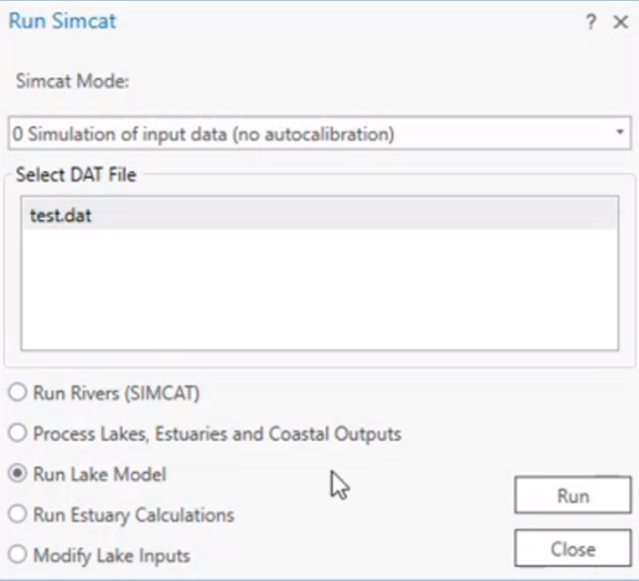
<figcaption>
Figure 55 Run SIMCAT form (for Lakes)
</figcaption>
</figure>

<figure>
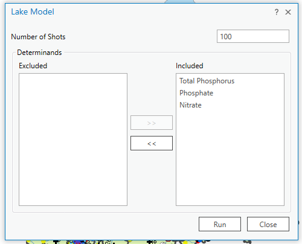
<figcaption>
Figure 56 Lake Model form
</figcaption>
</figure>

Further information on the settings on the **Lake Model** form is
provided below:

- **Number of Shots –** sets the number of shots when running the lake
  model.

- **Determinands –** sets the determinands to be **Included** and
  **Excluded.** Changes to which column a determinand features can be
  made using the \>\> and \<\< buttons.

When the model runs, it creates two output files in the **Regional
Database**:

- Summary results table (table name = **dat file name + SIM**).

- Time series results (table name = **date file name + SIMTS**), only
  for the **Detailed** mode.

If only part of the regional model area has been run in SAGIS using the
sub-area functionality (Section [9.2](#creating-a-sub-regional-model)),
only lakes included within the sub-area will be simulated when SIMCAT is
run.

### Incorporating model outputs into SIMCAT

Once the lake simulation has been carried out SIMCAT will take outflows
from the lake generated by the **Lake Model** simulation to feed into
SIMCAT downstream of each lake. SAGIS looks for files created by the
lake model and if these are found they are used to modify the dat file
to include output flows and concentrations from the lakes. This can be
disabled by clicking on the **Run Without Lakes** tick box on the
**Create SIMCAT File** form.

If more than one lake is present in the river chain, it is necessary to
run SIMCAT again to take the outputs of the upstream lakes downstream
then running the lake model again to simulate the effects of these
changed inputs. This process may need to be repeated several times if
there are several lakes in a chain.

## Viewing the Lake Model outputs

A range of options are available to view the outputs from the SAGIS
Lakes model.

### Plot outputs

To create the lake plot outputs:

| ***32*** | ***Plot Lake Model Outputs*** |
|----|----|
| *1* | *Click on the **Plot Outputs** button (which is available in the **SAGIS** tab on the ArcPro toolbar, [Figure 4](#_Ref41378849)) then **Plot Lakes** to open the **Plot Lake Outputs** form ([Figure 57](#_Ref40799576)).* |
| *2* | *Select the **Lake Centroids** or **Sample Points** option and check the **Trophic Summary** box as required.* |
| *3* | *Select **Create Map**.* |
| *4* | *Navigate to and click on a lake centroid or sample point on the map. A pop-up screen will appear ([Figure 58](#_Ref40800272)).* |
| *5* | *The pop-up screen has a top and bottom section. In the top section, scroll down until the **Trophic Summary** option appears.* |
| *6* | *In this section choose the lake that you wish to view trophic summary data for. An image similar to that given in [Figure 59](#_Ref40800282) will appear.* |

**Figure 57 Plot Lake Outputs form**

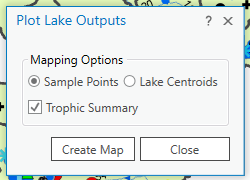

**Figure 58 Lake outputs
plotting pop-up**

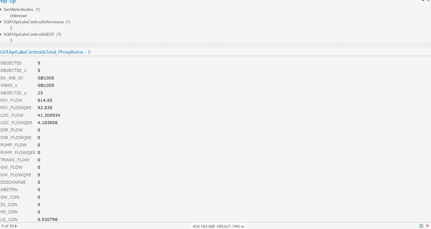

<figure>
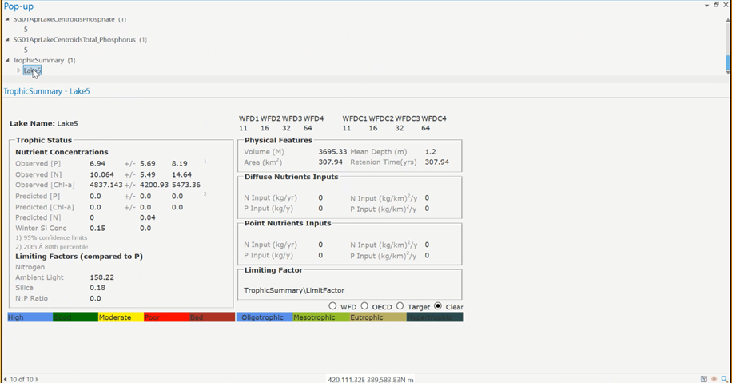
<figcaption>
Figure 59
Trophic Summary
</figcaption>
</figure>

The trophic status analysis is based on using SAGIS to estimate:

- R – Total inflow to the lake (m3/year)

- J – Total input load of total phosphorus to the lake (mg/yr)

- Tw - Retention time (yrs)

This information is then used to calculate a predicted in-lake total P
concentration using OECD lake classification equations.

For lakes with a mean depth of \>= 3 m, (a, b) = (1.55, 0.82). For
shallow lakes with a mean depth \< 3 m, (a, b) = (1.02, 0.88).
Similarly, Chlorophyll-a and Nitrate are calculated using further OECD
equations.

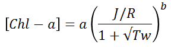

Where a = 0.38 and b = 0.86

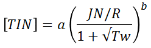

Where JN = Nitrogen Load, a = 5.34 and b = 0.78

Confidence limits are based on confidence limits in the OECD analysis.
In addition, further calculations are carried out to assess whether
Phosphorus, Nitrogen, Silica or ambient light is limiting for
phytoplankton growth based on the methodology described by Reynolds &
Maberly 2002[^2].

Further information on the key values reported in the **Trophic
Summary** are provided below:

- **Mean Depth (m)** **–** Mean lake depth.

- **Retention Time (yrs)** **–** Lake retention time.

- **Predicted \[P\], \[Chl-a\]** and \[**N\] –** Predicted annual mean
  total phosphorus, Chlorophyll-a and total inorganic nitrogen
  concentrations based on OECD equations.

- **Observed \[P\], \[N\]** and **\[Chl-a\]** **–** Observed annual mean
  total phosphorus, Chlorophyll-a and total inorganic nitrogen
  concentrations based on OECD equations.

- **Light:P Chl-a ratio** **–** Ratio of predicted chlorophyll-a limited
  by light and total phosphorus (i.e. if the ratio is below 1,
  phytoplankton are predicted to be limited by light rather than
  phosphorus).

- **N:P Chl-a ratio –** Ratio between predicted chlorophyll-a limited by
  total inorganic nitrogen and P.

- **Si:P Chl-a ratio –** Ratio between predicted chlorophyll-a limited
  by silica and total phosphorus.

- **N:P Ratio –** Ratio between predicted total inorganic nitrogen and
  total phosphorus concentration.

- **Limitation –** labels points to indicate if they are total inorganic
  nitrogen, silica, total phosphorus or light limited.

Selecting the buttons (**WFD**, **OECD**, **Target** or **Clear**) on
the form ([Figure 59](#_Ref40800282)) will apply the colour scheme to
the rows in the table in which the values are reported ([Figure
59](#_Ref40800282)) depending on the criteria specified:

- **WFD** status – High (blue), Good (green), Moderate (yellow), Poor
  (red), Bad (brown)

- **OECD** status – Oligotrophic (blue), Mesotrophic (green), Eutrophic
  (beige), Hypertrophic (grey)

- **Target** – Pass (green), Fail (red)

- **Clear** – no colour scheme

### Plot charts

To create the lake pie charts:

| ***33*** | ***Create Lake Pie Charts*** |
|----|----|
| *1* | *Click on the **Plot Sector Charts** button (which is available in the **SAGIS** tab on the ArcPro toolbar, [Figure 4](#_Ref41378849)) which opens the **Plot Sector Charts** form ([Figure 60](#_Ref40710076)).* |
| *2* | *Click on the dropdown box to select the chemical substance of interest. Output for all determinands can be generated in one operation by selecting **All Chemicals.*** |
| *3* | *Tick the **Plot LTRaCs** button.* |
| *4* | *Select the plot options within the **Lakes, Estuaries and Coastal Margins** section of the form.* |
| *6* | *Click on **Run** to create the pie charts.* |

Further information on the settings on the **Plot Sector Charts** form
related to lakes is provided below:

- **Load (input), Conc (output)** or **Flow (input) –** selects input
  loads, simulated lake concentration or input flow.

- **Sector** or **Input (river, direct, pumped) –** selects sector
  inputs or the relative magnitude of inputs from direct river inflows,
  local inputs (including direct discharges) and pumped inputs.

**Figure 60** **Plot
Sector Charts form**

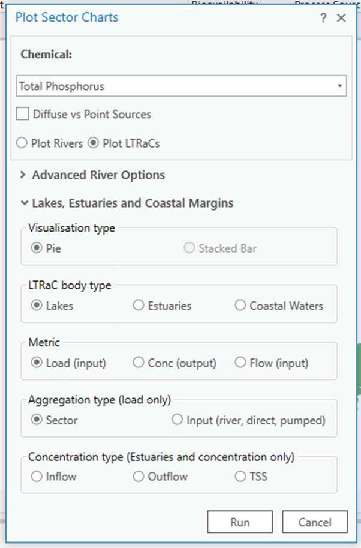

An example map is shown in [Figure 61](#_Ref40710758).

<figure>
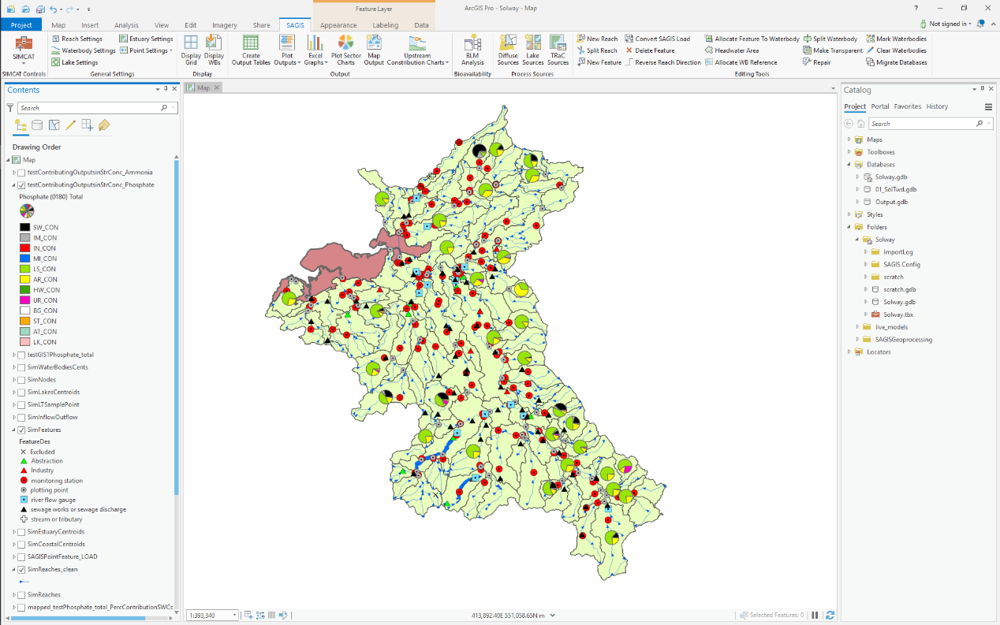
<figcaption>
Figure 61
Example lake sector pie charts
</figcaption>
</figure>

### Lake Plots (Excel)

As for data visualisation for rivers it is possible to visualise data
for lakes via an excel spreadsheet:

<table style="width:92%;">
<colgroup>
<col style="width: 7%" />
<col style="width: 84%" />
</colgroup>
<thead>
<tr>
<th><em><strong>34</strong></em></th>
<th><em><strong>Create Lake Plots in Excel</strong></em></th>
</tr>
<tr>
<th><em>1</em></th>
<th><em>Select the <strong>Excel Graphs</strong> icon then
<strong>Lakes</strong> which opens the <strong>Plot Lake Graphs</strong>
form (<a href="#_Ref40803303">Figure 62</a>).</em></th>
</tr>
<tr>
<th><em>2</em></th>
<th><em>Choose the <strong>Determinand</strong> to report data for from
the dropdown list.</em></th>
</tr>
<tr>
<th><em>3</em></th>
<th><em>In the two dropdowns in the <strong>Sample Point</strong>
section choose a lake (<strong>Waterbody</strong>) and <strong>Sample
Point</strong> that you want data for from the dropdown lists or
<strong>Select on map</strong>. These selections are mandatory with
errors arising if no selection is made.</em></th>
</tr>
<tr>
<th><em>4</em></th>
<th><em>Select <strong>Run</strong>. Following this an Excel workbook
will appear automatically in the dat file folder.</em></th>
</tr>
<tr>
<th><em> 
5</em></th>
<th><em>Open the spreadsheet, then click on the <strong>Initialise Lake
Data</strong> button (in the <strong>Import_Controls</strong> tab; <a
href="#_Ref40803320">Figure 63</a>). Monthly charts including
<strong>Chemical Concentration</strong> plot (e.g. <a
href="#_Ref40803336">Figure 64</a>), <strong>Source
Apportionment</strong> plot (e.g. <a href="#_Ref42591355">Figure
65</a>), <strong>Volume</strong> plot (e.g. <a
href="#_Ref42591363">Figure 66</a>) and <strong>Flow</strong> plot (e.g.
<a href="#_Ref42591369">Figure 67</a>) will appear.</em></th>
</tr>
<tr>
<th><em>6</em></th>
<th><em>Timeseries outputs can be viewed by selecting the <strong>See
Yearly Charts</strong> button (these are only for lakes run in detailed
mode) and include <strong>Yearly Concentration</strong> plot (e.g. <a
href="#_Ref42591396">Figure 68</a>), <strong>Sediment
Concentration</strong> plot (e.g. <a href="#_Ref42591403">Figure
69</a>), <strong>Sediment Flux</strong> plot (e.g. <a
href="#_Ref42591408">Figure 70</a>) and <strong>Yearly Flow</strong>
plot (e.g. <a href="#_Ref42591414">Figure 71</a>).</em></th>
</tr>
<tr>
<th><em>7</em></th>
<th><em>There is the facility to update the charts for another
<strong>Lake</strong> and <strong>Sample Point</strong> within the same
model by modifying the selection within the spreadsheet (in the
<strong>Import_Controls</strong> tab; <a href="#_Ref40803320">Figure
63</a>).</em></th>
</tr>
</thead>
<tbody>
</tbody>
</table>

<figure>
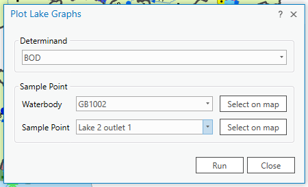
<figcaption>
Figure 62
Plot Lake Graphs form
</figcaption>
</figure>

**Figure 63 Lake plots via Excel**

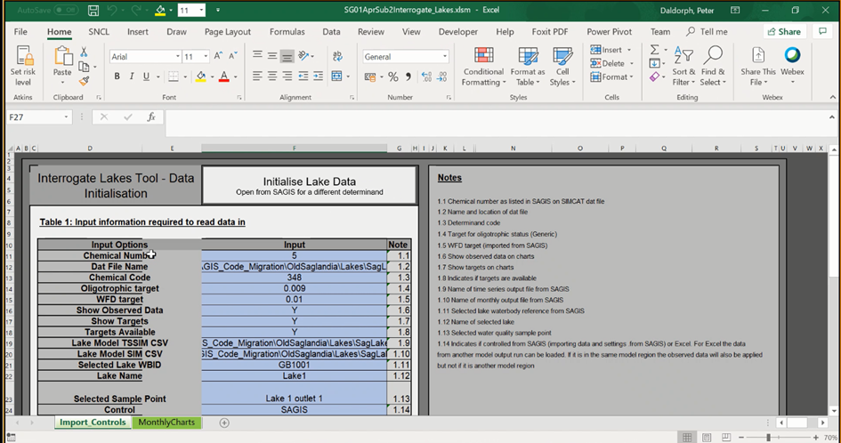

Further information on the information shown on the lake charts is
provided below:

- **Mean**, Percentile (**%ile**), Confidence Limits (**Conf**) – metric
  shown on chart.

- Quality Target – shows the **OECD Target** or **WFD Target** on the
  chart.

- Obs Data – shows observed data, if available, on the graph.

- **Sediment conc** – shows the concentration in the sediment (only
  Detailed mode).

- **Sediment flux** – shows the proportion of the concentration derived
  from the sediment input (only Detailed mode).

<figure>
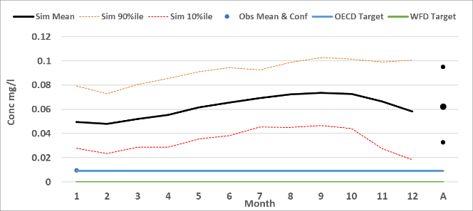
<figcaption>
Figure 64
Example Lake Chemical Concentration chart
</figcaption>
</figure>

<figure>
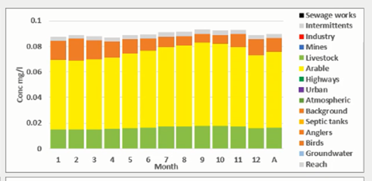
<figcaption>
Figure 65
Example Lake Source Apportionment chart
</figcaption>
</figure>

**Figure 66 Example Lake
Volume chart**

<figure>
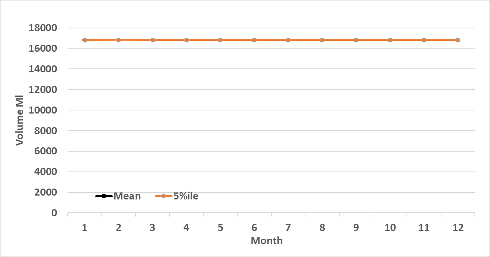
<figcaption>
Figure 67
Example Lake Flow chart
</figcaption>
</figure>

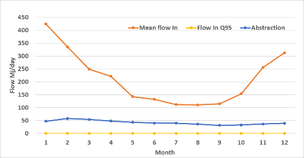

<figure>
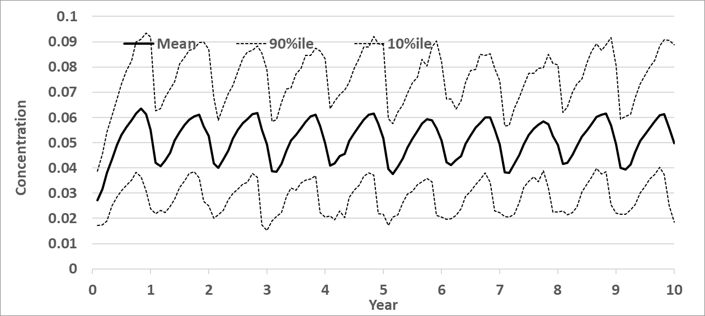
<figcaption>
Figure 68
Example Lake Yearly Chemical Concentration chart
</figcaption>
</figure>

**Figure 69 Example Lake
Sediment Concentration chart**

<figure>
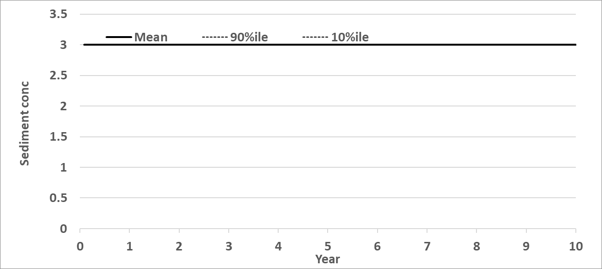
<figcaption>
Figure 70
Example Lake Sediment Flux chart
</figcaption>
</figure>

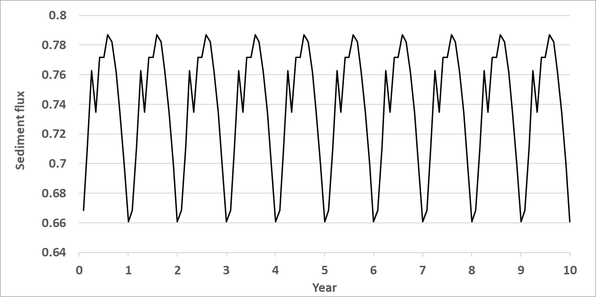

<figure>
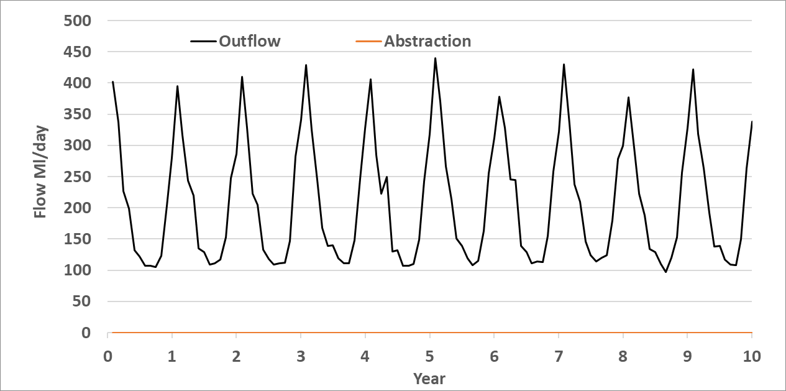
<figcaption>
Figure 71
Example Lake Yearly Flow chart
</figcaption>
</figure>

### Upstream contribution charts

Before these charts can be generated, the output tables must be created
using **Process Lakes, Estuaries and Coastal Outputs** (Chapter
[11.2.2](#setting-up-lake-input-tables)).

To create upstream contribution charts:

| ***35*** | ***Create Lake Upstream Contribution Charts*** |
|----|----|
| *1* | *Click on the **Upstream Contribution Charts** button (which is available in the **SAGIS** tab on the ArcPro toolbar, [Figure 4](#_Ref41378849)) and then on either the **Sector Charts** or **Point Source Charts** option which opens the associated **Upstream Contribution Charts** form (for **Sector Charts**: [Figure 44](#_Ref40952091) and for **Point Source** **Charts**: [Figure 45](#_Ref40952113)).* |
| *2* | Select the **Waterbody** of interest from the dropdown list. |
| *3* | Select the chemical of interest using the **Determinand** dropdown box. |
| *4* | Specify the **Point Source Options** or **Sector Options.** |
| *5* | Click on **Run** to create the chart. |

### Incorporating lake outputs into SIMCAT

Once the SAGIS lake model has been run the outputs are automatically fed
back into SIMCAT (unless this is switched off on the **Create SIMCAT
File** form - Chapter [9.1](#general-settings-and-create-simcat-form)).
When chainage plots have been created in Excel (Chapter
[9.4.8](#river-chainage-plots-excel)), the influence of the lake can be
shown on the chart by selecting **Yes** from the drop-down for the
**Show Lake Data** option ([Figure 72](#_Ref45712866)).

<figure>
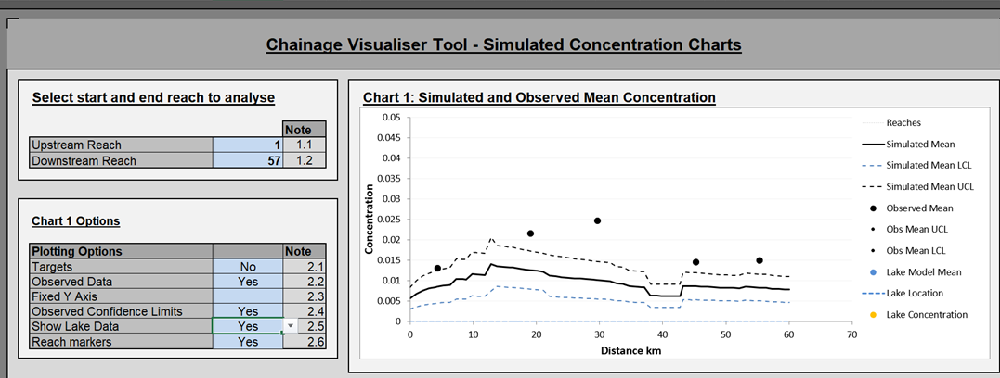
<figcaption>
Figure 72
Show Lake Data on chainage plot
</figcaption>
</figure>

# Running the Estuary and Coastal Waters Calculations and Viewing Outputs

## SIMCAT

Before carrying out the Estuary and Coastal Water calculations, the
SIMCAT dat file must be set up and run using the **Create SIMCAT File**
form as shown below ([Figure 73](#_Ref40866352)). The **Coastal Inputs**
and **Estuary Inputs** tick boxes (within red box) must be ticked.

<figure>

<figcaption>
Figure 73
Create SIMCAT File form set up to create the inputs for Estuary and
Coastal Waters
</figcaption>
</figure>

## Setting up estuary and coastal waters input table

Information on the chemical inputs to the estuaries and coastal waters
from all sources are created in the **Regional Database** for inputs
(table name = **dat file name** + **EstuaryInputs**) and monthly inputs
(table name = **dat file name + EstuaryInputsMonthly**).

To create the estuary and coastal waters input tables:

| ***36*** | ***Creating SAGIS Estuary and Coastal Waters Model Input Tables*** |
|----|----|
| *1* | *Click on the **SIMCAT** icon then **Run SIMCAT** (*[Figure 12](#_Ref40265323)*) to open the **Run SIMCAT** form ([Figure 81](#_Ref40711669)).* |
| *2* | *Tick **Process Lakes, Estuaries and Coastal Outputs** then click on **Run.*** |

<figure>
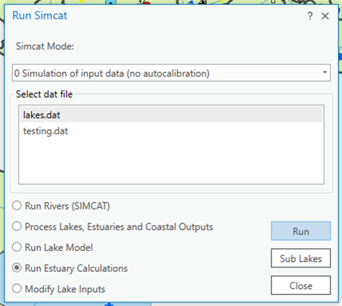
<figcaption>
Figure 74
Run SIMCAT form
</figcaption>
</figure>

## Estuary calculations

The estuary calculations are run by:

| ***37*** | ***Running the Estuary Calculations*** |
|----|----|
| *1* | *Click on the **SIMCAT** icon then **Run SIMCAT** ([Figure 12](#_Ref40265323)) to open the **Run SIMCAT** form ([Figure 83](#_Ref40711669)).* |
| *2* | *Tick **Run Estuary Calculations** then click on **Run.*** |

## Estuary and Coastal Waters Plot charts

To create the estuary and coastal waters pie charts:

<table style="width:92%;">
<colgroup>
<col style="width: 7%" />
<col style="width: 84%" />
</colgroup>
<thead>
<tr>
<th><em><strong>38</strong></em></th>
<th><em><strong>Create Estuary and Coastal Water Pie
Charts</strong></em></th>
</tr>
</thead>
<tbody>
<tr>
<td><em>1</em></td>
<td>
<em>Click on the <strong>Plot Sector Charts</strong> button
(which is available in the <strong>SAGIS</strong> tab on the ArcPro
toolbar, <a href="#_Ref41378849">Figure 4</a>) which opens the
<strong>Plot Sector Charts</strong> form (<a href="#_Ref40712903">Figure
75</a>).</em>

<em>Click on the dropdown box to select the chemical substance of
interest.</em>

<em>Tick the Plot LTRaCs button.</em>

<em>Click on the plot options within the Lakes, Estuaries and Coastal
Margins section of the form.</em>

<em>Click on Run to create the pie or stacked bar
charts..</em>
</td>
</tr>
<tr>
<td><em>2</em></td>
<td><em>Click on the dropdown box to select the chemical substance of
interest. Output for all determinands can be generated in one operation
by selecting <strong>All Chemicals.</strong></em></td>
</tr>
<tr>
<td><em>3</em></td>
<td><em>Tick the <strong>Plot LTRaCs</strong> button.</em></td>
</tr>
<tr>
<td><em>4</em></td>
<td><em>Click on the plot options within the <strong>Lakes, Estuaries
and Coastal Margins</strong> section of the form.</em></td>
</tr>
<tr>
<td><em>5</em></td>
<td><em>Click on <strong>Run</strong> to create the pie
charts.</em></td>
</tr>
</tbody>
</table>

Further information on the settings on the **Plot Sector Charts** form
related to estuaries and coastal waters is provided below:

- **Load (input), Conc (output)** or **Flow (input) –** selects input
  loads, simulated lake concentration or input flow.

- **Sector** or **Input (river, direct, pumped) –** selects sector
  inputs or the relative magnitude of inputs from direct river inflows
  and local inputs (including direct discharges).

- **Inflow, Outflow** or **TSS –** plots flow-weighted average of the
  inflow concentration, estimated outflow concentration based on
  dilution by seawater or total suspended solids concentration.

<figure>
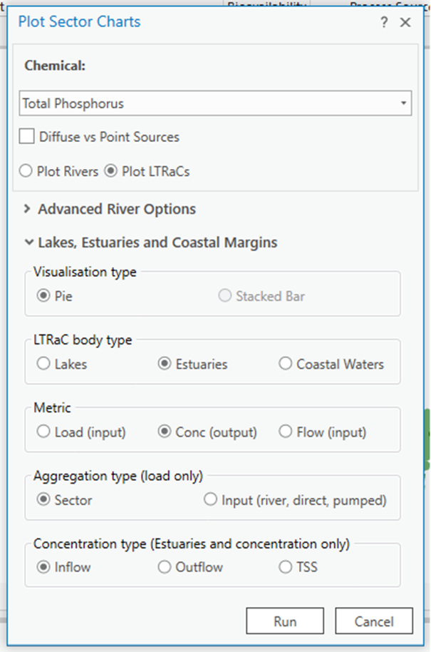
<figcaption>
Figure 75
Plot Sector Charts form (Estuaries)
</figcaption>
</figure>

An example map is shown in [Figure 76](#_Ref40713012).

**Figure 76** **Example
estuaries sector pie charts**

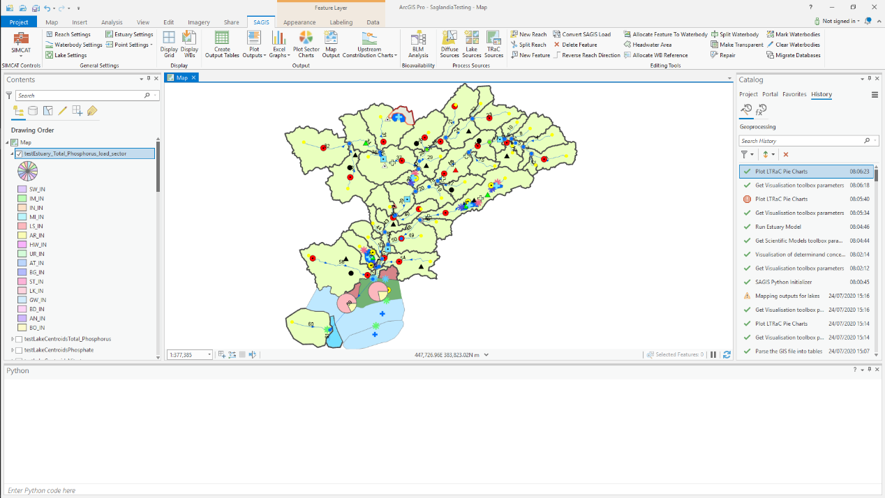

## Estuary Plots (Excel)

Two types of graph are available for output from the estuary
calculations; total suspended solids plots and concentration plots. To
generate these plots:

<table style="width:92%;">
<caption></caption>
<colgroup>
<col style="width: 7%" />
<col style="width: 84%" />
</colgroup>
<thead>
<tr>
<th><em><strong>39</strong></em></th>
<th style="text-align: left;"><em><strong>Create Estuary Plots in
Excel</strong></em></th>
</tr>
<tr>
<th><em>1</em></th>
<th><em>Select the <strong>Excel Graphs</strong> icon (which is
available in the <strong>SAGIS</strong> tab on the ArcPro toolbar, <a
href="#_Ref41378849">Figure 4</a>) then <strong>Estuary</strong> which
opens the <strong>Plot Estuary Graphs</strong> form (<a
href="#_Ref42588043">Figure 77</a>).</em></th>
</tr>
<tr>
<th><em>2</em></th>
<th><em>Choose the <strong>Determinand</strong> to report data for from
the dropdown list.</em></th>
</tr>
<tr>
<th><em> 
3</em></th>
<th><em>In the two dropdowns in the <strong>Sample Point</strong>
section choose an estuary (<strong>Waterbody</strong>) and
<strong>Sample Point</strong> that you want data for from the dropdown
lists or <strong>Select on map</strong>.</em></th>
</tr>
<tr>
<th><em>4</em></th>
<th><em>Select <strong>Run</strong>. Following this a spreadsheet will
appear automatically in the dat file folder.</em></th>
</tr>
<tr>
<th><em>5</em></th>
<th><em>Open the spreadsheet and click on the <strong>Initialise Estuary
Data</strong> button (in the <strong>Import_Controls</strong> tab; <a
href="#_Ref42588063">Figure 78</a>). Charts including a <strong>Total
Suspended Solids</strong> plot (e.g. <a href="#_Ref42588106">Figure
79</a>) and a <strong>Chemical concentration</strong> plot (e.g. <a
href="#_Ref42588115">Figure 80</a>) will appear.</em></th>
</tr>
<tr>
<th><em>6</em></th>
<th><em>There is the facility to update the charts for another
<strong>Estuary</strong> and <strong>Sample Point</strong> within the
same model by modifying the selection within the spreadsheet
(instructions are included within the worksheet itself).</em></th>
</tr>
</thead>
<tbody>
</tbody>
</table>

<figure>
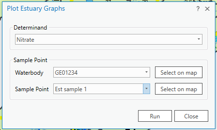
<figcaption>
Figure 77
Plot Estuary Graphs form
</figcaption>
</figure>

<figure>
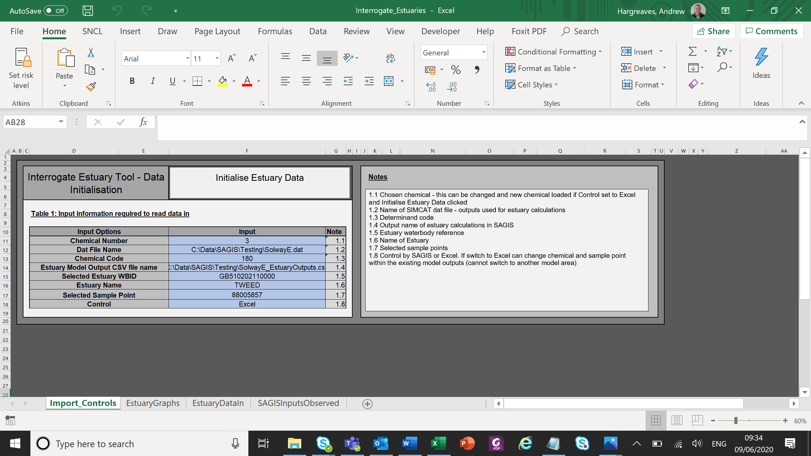
<figcaption>
Figure 78
Estuary plots via Excel
</figcaption>
</figure>

**Total Suspended Solids** plots (e.g. [Figure 86](#_Ref42588106))
compare:

- **Freshwater –** The TSS concentration that would result in the
  estuary due to the freshwater inputs and no other inputs (after mixing
  with seawater).

- **Sea –** The TSS concentration that would result in the estuary from
  seawater if there were no other inputs.

- **Estuary –** The observed TSS concentration.

<figure>
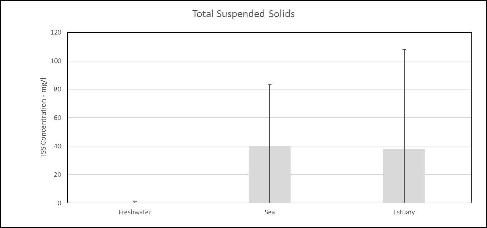
<figcaption>
Figure 79
Example Total Suspended Solids plot
</figcaption>
</figure>

**Chemical concentration** plots (e.g. [Figure 87](#_Ref42588115)) show:

- **Inflow** concentration **–** the average concentration in the
  influent water from all rivers and direct inflows.

- **Outflow** concentration **–** concentration of water flowing out of
  the estuary after full mixing of freshwater and seawater.

- **Sediment** concentration **–** the concentration in suspended
  sediment based on observed data.

- **Observed** concentration **–** observed concentration.

Comparison of the plots shows the contribution of freshwater inputs and
seawater to estuary concentrations compared to observed concentrations
and those based on sediment concentrations.

<figure>
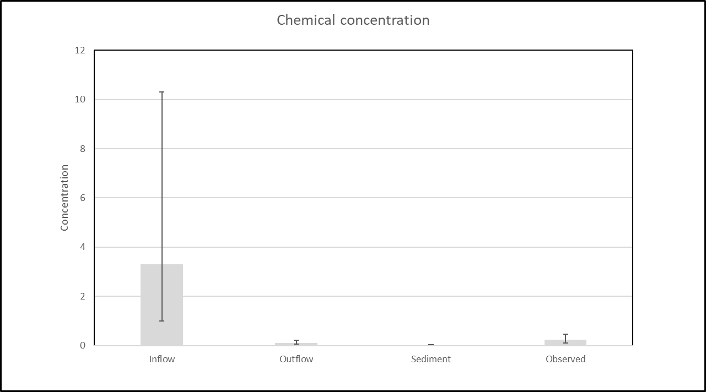
<figcaption>
Figure 80
Example Chemical concentration plot
</figcaption>
</figure>

## Upstream contribution charts

Before these charts can be generated, output tables must be created
using **Process Lakes, Estuaries and Coastal Outputs** (Chapter
[12.2](#setting-up-estuary-and-coastal-waters-input-table)). To create
upstream contribution charts follow the steps described in the box
below:

<table style="width:92%;">
<colgroup>
<col style="width: 7%" />
<col style="width: 84%" />
</colgroup>
<thead>
<tr>
<th><em><strong>40</strong></em></th>
<th><em><strong>Create Estuary and Coastal Upstream Contribution
Charts</strong></em></th>
</tr>
</thead>
<tbody>
<tr>
<td><em>1</em></td>
<td><em>Click on the <strong>Upstream Contribution Charts</strong>
button (which is available in the <strong>SAGIS</strong> tab on the
ArcPro toolbar, <a href="#_Ref41378849">Figure 4</a>) and then on either
the <strong>Sector Charts</strong> or <strong>Point Source
Charts</strong> option which opens the associated <strong>Upstream
Contribution Charts</strong> form (for <strong>Sector Charts</strong>:
<a href="#_Ref40952091">Figure 44</a> and for <strong>Point
Source</strong> <strong>Charts</strong>: <a href="#_Ref40952113">Figure
45</a>).</em></td>
</tr>
<tr>
<td><em>2</em></td>
<td><em>Select the <strong>Waterbody</strong> of interest from the
dropdown list.</em></td>
</tr>
<tr>
<td><em> 
3</em></td>
<td><em>Select the chemical of interest using the
<strong>Determinand</strong> dropdown box.</em></td>
</tr>
<tr>
<td><em>4</em></td>
<td><em>Specify the <strong>Point Source Options</strong> or
<strong>Sector Options.</strong></em></td>
</tr>
<tr>
<td><em>5</em></td>
<td><em>Click on <strong>Run</strong> to create the chart.</em></td>
</tr>
</tbody>
</table>

# Bioavailability Model and MPER

SAGIS can be used to run MPER, a metal permitting tool developed for the
Environment Agency. MPER carries out Monte Carlo RQP style mass balance
calculations at single locations using statistical information on
upstream and discharge flows and concentrations. The MPER functionality
in SAGIS allows this information to be provided from the SAGIS
databases. Model outputs from MPER run in batch mode can generate
regional scale maps of MPER at selected wastewater treatment works.

## Running MPER

Before running the tool, dissolved metal concentrations must first be
modelled using SAGIS **where partitioning has been applied to the total
concentration sector inputs**. Once SAGIS has created the SIMCAT dat
file and SIMCAT has been run, the output needs to be plotted:

<table style="width:92%;">
<colgroup>
<col style="width: 7%" />
<col style="width: 84%" />
</colgroup>
<thead>
<tr>
<th><em><strong>41</strong></em></th>
<th><em><strong>Plot Mapped Model Output for BLM and
MPER</strong></em></th>
</tr>
</thead>
<tbody>
<tr>
<td><em>1</em></td>
<td><em>Click on the Plot Outputs button (which is available in the
SAGIS tab on the ArcPro toolbar, <a href="#_Ref41378849">Figure 4</a>)
then Plot Rivers to open the Plot River Outputs form (<a
href="#_Ref40350537">Figure 33</a>).</em></td>
</tr>
<tr>
<td><em> 
2</em></td>
<td><em>Select the chemical substance of interest using the dropdown
box. Output for all determinands can be generated in one operation by
selecting <strong>All Chemicals</strong>.</em></td>
</tr>
<tr>
<td><em>3</em></td>
<td><em>Select the <strong>MPER</strong> option in the <strong>Output
Location</strong> section of the form (<a href="#_Ref40350537">Figure
33</a>).</em></td>
</tr>
<tr>
<td><em>4</em></td>
<td><em>For total metals, select the partitioned fraction to plot by
selecting <strong>Dissolved</strong> using the option buttons in the
<strong>Partitioned Outputs</strong> box.<strong>.</strong></em></td>
</tr>
<tr>
<td><em>5</em></td>
<td><em>Click on the <strong>Create Map</strong> button</em></td>
</tr>
</tbody>
</table>

The data for DOC, pH and calcium can come from a number of sources:

- Theisson polygons (created in the **BLM Biostandards** access
  database).

- Observed data (**BLMSamplePointQuality** in the **Common Database**).

- Output from SAGIS (DOC has been modelled in SAGIS previously).

- SEPAs alkalinity and BLM model which is incorporated into SAGIS but
  only operates with Scottish data.

Operation of the SAGIS MPER tool varies depending on the sources of
data. If SAGIS-SIMCAT output for DOC or the outputs from the SEPA tool
are used, these must already be run and the output layer available in
the table of contents.

To run the bio availability analysis tool:

| ***42*** | ***Running MPER*** |
|----|----|
| *1* | *Select the SEPA Alkalinity and BLM model output or SAGIS-SIMCAT DOC model output if these are to be used as sources of data.* |
| *2* | *Highlight the wastewater treatment works on the map for which outputs are required. An option is also available to run all works.* |
| *3* | *Click on the **MPER** button to open the **MPER** form ([Figure 81](#_Ref48578151)).* |
| *4* | *Select the options in the **Data Sources** section of the form. This determines where the DOC, calcium and pH data is sourced.* |
| *5* | *Click on **Calculate Stds** and select the BLM database as prompted (e.g. BioConcData.mdb). Data is gathered for pH, DOC and calcium which is populated into the existing mapped output layers of the selected metals.* |
| *6* | *Populate the **MPER Options** part of the form and click on **Create MPER File.** This opens a dialogue to select a name for the file.* |
| *7* | *Click on **Run MPER** to run MPER (a black screen appears with model output, similar to SIMCAT).* |
| *8* | *Click on **Map MPER** and select the MPER output file as prompted to create a new mapped layer with the MPER outputs for each of the selected chemical substances (e.g. [Figure 82](#_Ref48578519)). This is colour based on the ratio of the downstream concentration and the standard.* |

**Figure 81 MPER Analysis form**

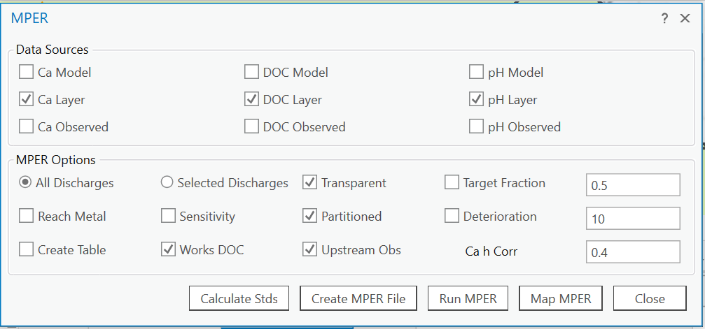

Further information on the settings on the **MPER** form is provided
below:

- **Interpolate –** When calculating the dissolved equivalent of the BLM
  standard using the lookup table in the BLM database, values are
  interpolated; otherwise the closest value is applied.

- **DOC Layer –** applies the DOC Theisson polygon layer in the
  **BioStandard** database to input DOC.

- **DOC Model –** applies either SAGIS-SIMCAT output or SEPA model DOC
  to input DOC (this layer needs to be selected in the table of contents
  first).

- **DOC Observed –** applies upstream observed values from the
  **BLMSamplePointQuality** table in the **Common database**. This is
  used in combination with one of the other DOC input options, replacing
  the mapped information with the local observed data if this is
  available.

- **Ca Layer –** applies the Ca Theisson polygon layer in the
  **BioStandard database** to input Ca.

- **Ca Model –** applies the SEPA model Ca (this layer needs to be
  selected first) to input Ca (this can only be applied for the Scottish
  models at present).

- **Ca Observed –** applies upstream observed values from the
  **BLMSamplePointQuality** table in the **Common** **database**. This
  is used in combination with one of the other Ca input options,
  replacing the mapped information with the local observed data if this
  is available.

- **pH Layer –** applies the pH Theisson polygon layer in the
  **BioStandard database** to input pH.

- **pH Model –** applies the SEPA model Ca (this layer needs to be
  selected first) to input pH (this can only be applied for the Scottish
  models at present).

- **pH Observed –** applies upsteam observed values from the
  **BLMSamplePointQuality** table in the **Common** database. This is
  used in combination with one of the other pH input options, replacing
  the mapped information with the local observed data if this is
  available.

- **All STWs –** applies the calculations to all wastewater treatment
  works (in **SimFeatures**).

- **Selected STWs –** applies the calculations only to highlighted
  wastewater treatment works (in **SimFeatures**).

- **Transparent –** makes the SAGIS layers transparent with mapping the
  MPER output to make it clearer.

- **Target Fraction –** when this is ticked the upstream concentration
  is set to the specified fraction of the dissolved equivalent of the
  BLM standard.

- **Deterioration** **–** when this is clicked MPER applies a
  deterioration assessment against the specified percentage
  deterioration.

- **Partitioned –** ticked when the metal concentrations have been
  simulated by partitioning.

- **Sensitivity –** applies MPER sensitivity calculations outputs from
  which are issued in the outputs.

- **Reach Metal –** if ticked applies, the observed upstream metal
  concentration is available upstream in the same reach.

- **Create table –** if ticked, a table is created in the regional
  database when the MPER input file is created as a record of the
  outputs.

- **Works DOC –** A default value is applied for the discharge DOC (from
  the **Def STWQual** table in the **Common database**). However, when
  ticked the value is replaced by the observed data if this is found in
  the **BLMSamplePointQuality** table in the **Common database**).

- **Upstream Obs –** if ticked, applies the observed DOC, pH or calcium
  if available on the same reach upstream of the discharge.

- **Ca pH Corrlation –** correlation between calcium and pH.

<figure>
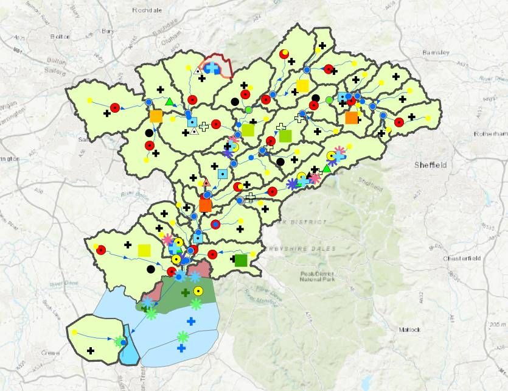
<figcaption>
Figure 82
Example mapped output from MPER (coloured squares show ratio of
bioavailable concentration and bioavailable concentration standard at
locations with discharges)
</figcaption>
</figure>

# SAGIS Tools

In addition to the SAGIS interface that drives the SAGIS-SIMCAT
functionality, several tools have been created to support model building
and analysis. These are run by clicking on icons shown below. Details of
the operation and function of these tools is provided in this chapter.

Additional model build tools are available on the ribbon in the
**Editing Tools** command set ([Figure 83](#_Ref40863191)).

<figure>
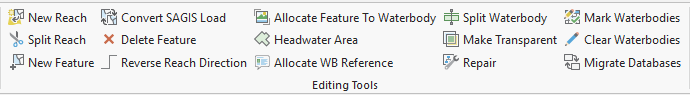
<figcaption>
Figure 83
GIS processing tools
</figcaption>
</figure>

## New Reach 

This tool is used to add a new reach to the **SimReaches** river
polyline. To add a new reach:

| ***43*** | ***Create New Reach*** |
|----|----|
| *1* | *Click on the **New Reach** tool which creates a cross hair cursor. Click on the map on the line of the new reach starting at the location of the start of the reach. Each click creates a new vertex then double click when the reach joins the existing polyline.* |
| *2* | *A new reach and headwater node will be added. The old reach will also be split at the new confluence and a new node added at the confluence.* |
| *3* | *Further information is added to the reaches including a new unique reference, length, reach type, waterbody ID and other information collected from the existing reaches.* |
| *4* | *Further information on the new reach needs to be added manually including the name and alpha and beta.* |
| *5* | *The addition of the new reaches requires recalculation of the reach connectivity. After the new features have been created, a **Yes/No** prompt appears asking to recalculate connectivity. If several reaches are to be added it is best to wait until the last is complete to recalculate the connectivity.* *Alternatively, the connectivity can be recalculated using the **Create SIMCAT File** form.* |

## Split Reach

This tool is used to split an existing reach to the **SimReaches** river
polyline. To split the reach:

| ***44*** | ***Split Reach*** |
|----|----|
| *1* | *Click on the **Split Reach** tool which creates a cross hair cursor. Click on the map on the river polyline where the river needs to be split.* |
| *2* | *A prompt indicates the X and Y location of the split.* |
| *3* | *The existing reach is split and new continuation node added between the new reaches.* |
| *4* | *A new unique ID is created for the downstream reach and reach lengths calculated. Other values such as diffuse inputs are derived from the previous reach.* |
| *5* | *Splitting the reach requires recalculation of the reach connectivity. After the reach has been split, a **Yes/No** prompt appears asking to recalculate connectivity. If several reaches are to be modified it is best to wait until the last is complete to recalculate the connectivity.* *Alternatively, the connectivity can be recalculated using the the **Create SIMCAT File** form.* |

## New Feature

| ***45*** | ***Add New Feature*** |
|----|----|
| *1* | *Click on the **New Feature** tool which creates a cross hair cursor.* |
| *2* | *Click on the map where the new feature is to be added. This opens the **Create** **Point Feature** form ([Figure 84](#_Ref41575712)).* |
| *3* | *Select the feature type on the form and click **Create**.* |
| *4* | *The new feature is created with the location, GISCode, waterbody reference and reach location. Further information needs to be added such as the feature name and water quality code reference.* |

<figure>
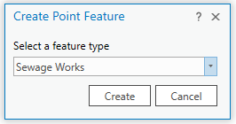
<figcaption>
Figure 84
Create Point Feature form
</figcaption>
</figure>

## Convert SAGIS Load

To convert SAGISPointFeature_LOAD features to a SimFeature:

| ***46*** | ***Converting Load to Flow features*** |
|----|----|
| *1* | *The flow statistics associated with the **SAGISPointFeature_LOAD** first need to be calculated and entered in the following attributes table fields FLOW_MEAN, FLOW_Q95 and FLOW_CORR (mean flow, standard deviation of flow and the correlation between discharge flow and river flow) in the **SAGISPointFeature_LOAD layer**. These can be calculated from the loads already in the layer and a default concentration.* |
| *2* | *Select the features to be converted (e.g. using **Select by Attributes**).* |
| *3* | *Click on the tool. A **Yes/No** prompt appears asking to remove the old **SAGISPointFeature \_LOAD** features from the map and database.* |
| *4* | *The new **SimFeatures** appear on the map with data transferred from the **SAGISPointFeature_LOAD** layer (e.g. name, location etc.), but other data in the attributes table needs to be added.* |

## Delete Feature

| ***47*** | ***Delete Feature*** |
|----|----|
| *1* | *Select feature to delete.* |
| *2* | *Click on the **Delete Feature** icon.* |
| *3* | *The number of features selected is indicated and a prompt appears to proceed with deleting each feature type in turn.* |

## Reverse Reach Direction

| ***48*** | ***Reverse Reach Direction*** |
|----|----|
| *1* | *Make the project non-editable.* |
| *2* | *Select the reach.* |
| *3* | *Click on the **Reverse Reach** **Direction** tool to reverse the reach direction.* |

## Allocate Feature to Waterbody

| ***49*** | ***Allocate Feature to Waterbody*** |
|----|----|
| *1* | *Click on the **Allocate Feature To Waterbody** tool to allocate waterbodies and point source inputs to inland rivers, estuaries and coastal waterbodies based on their location. It is used as part of the model build process.* |

## Headwater Area

| ***50*** | ***Calculate Headwater Area*** |
|----|----|
| *1* | *Click on the **Headwater Area** tool to calculate the headwater area (written to the **UpArea** field in the **SimNodes** attributes layer).* |

## Allocate WB Reference 

| ***51*** | ***Allocate Waterbody Reference*** ***to Rivers*** |
|----|----|
| *1* | *Click on the **Allocate WB Reference** tool to allocate the waterbody reference to the reaches.* |

## Split Waterbody

| ***52*** | ***Split Waterbody*** |
|----|----|
| *1* | *Select the waterbody to split.* |
| *2* | *Click on **Split Waterbody** tool. This creates a cross hair cursor which is used to click on the map along the line where the waterbody is to be split.* |
| *3* | *A prompt asks the user to provide an extension to the waterbody ID for the new waterbody (this is added to the existing waterbody ID).* |
| *4* | *A prompt asks the user if the waterbody flow inputs (in the **Regional Database** table **WB_FlowEstimates**) are to be modified (i.e. split between the two waterbodies based on area).* |
| *5* | *The user is prompted to apply other tools to update the waterbody ID references in the other layers (e.g. **SimFeatures**, **SimReaches** etc.). This needs to be carried out separately.* |
| *6* | *Note that processing of **Diffuse Sources** (Section [3.1](#populate-regional-diffuse-export-database)) must be re-run to align the diffuse sector inputs with the revised waterbody layer.* |

## Make Transparent

This icon is used to make the feature layers transparent to make the
output symbology clearer on the map:

| ***53*** | ***Make Transparent*** |
|----|----|
| *1* | *Click on the **Make Transparent** tool.* |
| *2* | *Specify the % transperency as prompted and click **OK** to apply.* |

## Repair

This tool repairs corrupted GIS layers:

| ***54*** | ***Repair Layers*** |
|----|----|
| *1* | *Highlight a layer in the table of contents then click on the **Repair** tool to apply repair. This is used to repair layers that have become corrupted.* |

## Mark Waterbodies

| ***55*** | ***Mark Waterbodies***                                |
|----------|-------------------------------------------------------|
| *1*      | *Select the waterbodies to be marked.*                |
| *2*      | *Select the **Mark Waterbodies** tool to apply mark.* |

## Clear Waterbodies

| ***56*** | ***Clear Waterbodies***                                 |
|----------|---------------------------------------------------------|
| *1*      | *Select the waterbodies for which mark to be cleared.*  |
| *2*      | *Select the **Clear Waterbodies** tool to remove mark.* |

## Migrate Databases

This tool is used in the process for converting pre-existing Access
databases (used in the ArcMap version of SAGIS) into file geodatabase
format required by the ArcGIS Pro version of SAGIS (for more detail see
[Chapter 15](#converting-database-formats)).

## Delete, Copy/Paste and Edit File Geodatabase Tables using ArcGIS Pro Interface

| ***57*** | ***Delete, Copy/Paste and Edit File Geodatabase Tables using ArcGIS Pro Interface*** |
|----|----|
| *1* | *Open the ArcGIS Pro **Catalog** by selecting **Catalog View** (located in the **View** tab) and navigate to a File Geodatabase Table added to a project.* |
| *2* | *Right click and select **Delete** from the options to delete a table.* |
| *3* | *Right click and select **Copy**; then navigate into a File Geodatabase and **Paste** to include a copy of a File Geodatabase Table in a File Geodatabase (if a File Geodatabase Table with the same name already exists then an appendix will be applied to the name e.g. ‘\_1’).* |
| *4* | *To edit a File Geodatabase Table, right click and select **Add to Map.*** |
| *5* | *Right click on the table in the **Contents** pane and select **Open**.* |
| *6* | *Double click on a cell within the table to make a modification.* |
| *7* | *Once modification(s) have been made, select the **Save** button in the **Edit** tab which opens the **Save Edits** form (press **Show Edits** to reveal the tables where edits have been made).* |
| *8* | *Select **Yes** to save edits made.* |

# Converting Database Formats

SAGIS connects and uses data from various databases, that are either
common or specific (i.e. regional model databases). Whereas in the
ArcMap version of SAGIS these databases exist in Microsoft Access
database format (this is a legacy format), the ArcGIS Pro version of
SAGIS requires data to be stored in [**<u>file
geodatabase</u>**](http://desktop.arcgis.com/en/arcmap/10.3/manage-data/administer-file-gdbs/file-geodatabases.htm)
format. The file geodatabase format offers numerous advantages over the
Access database format, in particular, that the file geodatabase
equivalents of pre-existing Access databases are much smaller in size
and have a much larger maximum file size (1tb vs 2gb). Because of the
transition of SAGIS to the ArcGIS Pro platform, all pre-existing model
databases must be converted to the new file geodatabase format. This
chapter describes a series of management tasks that should be undertaken
prior to converting databases from the legacy Access format to the file
geodatabase format, as well as the process for converting the databases.

1.  **Database management and trouble shooting**

There are two classes of data that need to be managed, namely, *tables*
and *feature classes* (i.e. tables with associated geometry and
coordinates which typical have a ‘Shape_Index’ extension). **It is
strongly recommended that modifications, edits and deletions are made to
the databases using Arc Catalog, either in ArcMap, or ArcGIS Pro after
the conversion**. Attempting these actions with Microsoft Access
directly will risk that data becomes mismatched or corrupted which may
have implications for the database migration and subsequent use within
ArcGIS Pro. For example, tools such as ArcCatalog automatically ‘group’
the components of feature class data so that data tables and their
corresponding geometry components are visible as a single entity whereas
in Access these are visible as separate entities. To avoid deleting or
corrupting any necessary data, it is advised that no tables or feature
classes are deleted from the original databases, but rather only the
necessary data is copied into the new file geodatabase using Arc
Catalog. It is, however, an opportune time to remove unnecessary data
(e.g. old outputs or intermediate data). Users should also, of course,
confirm that models are fully operational prior to the file type
conversion (e.g. test the open and update, dat file creation, outputs
plotting functions).

Information on tables and feature classes are summarised in four tables
in this document to support data management and migration processes as
well as identifying common issues that have been found to cause
problems. These are:

- [Table 1](#_Ref45206134) lists the tables in each regional model
  database, indicating those which are required, optional, and the
  essential meta data tables that are typically not visible to users.
  This also lists tables that are frequently found in regional model
  databases, but which have subsequently been deprecated in the course
  of SAGIS development and that are no longer required (i.e. unnecessary
  for these to be transferred).

- [Table 2](#_Ref45206169) lists the feature classes required for each
  regional model database.

- [Table 3](#_Ref45206190) lists the fields that should be present in
  the **DeterminandsForSIMCAT** table in the common tables database. The
  structure of this table has changed in recent years and legacy
  versions of this table may be missing fields that will generate errors
  with both the latest ArcMap and ArcPro versions of SAGIS. Prior to the
  database migration, modellers should substitute legacy versions of the
  DeterminandsForSIMCAT table with that present in the common tables
  database distributed with the Saglandia database if an update is
  required.

## Common Issues and Troubleshooting

- [Table 4](#_Ref45206264) lists a series of common data related issues
  that have been uncovered in databases in the course of working with
  (certain) live models that have been found to cause difficulties. The
  ‘DB’ field indicates if the issue relates to the common tables
  database (C) or the regional model database (R). Users should check
  and, if necessary, rectify issues prior to creating new databases.
  Please note that this list is not definitive – it is probable that
  other data-related issues will exist. Please also note that tables
  containing fields with the character length set to maximum (\>2
  million characters) will cause a memory error even if the field is not
  used by code directly. Fields with this type of formatting are likely
  to be indicative of database corruption and so, if any single instance
  is identified it is possible that other instances will be found.
  However, this is the only known cause of memory related errors
  encountered in testing thus far.

<table>
<caption>
Table 2 SAGIS
tables
</caption>
<colgroup>
<col style="width: 7%" />
<col style="width: 39%" />
<col style="width: 38%" />
<col style="width: 14%" />
</colgroup>
<thead>
<tr>
<th style="text-align: left;"><strong>No</strong></th>
<th style="text-align: left;"><strong>Name</strong></th>
<th style="text-align: left;"><strong>Comments</strong></th>
<th style="text-align: left;"><strong>Status</strong></th>
</tr>
</thead>
<tbody>
<tr>
<td style="text-align: left;">1</td>
<td style="text-align: left;">AbstractionNPDs</td>
<td style="text-align: left;">Not present in all models - only where
previously set up</td>
<td style="text-align: left;">Optional</td>
</tr>
<tr>
<td style="text-align: left;">2</td>
<td style="text-align: left;">Anglers_CORCOEFF</td>
<td style="text-align: left;"></td>
<td style="text-align: left;">Required</td>
</tr>
<tr>
<td style="text-align: left;">3</td>
<td style="text-align: left;">Anglers_LOAD</td>
<td style="text-align: left;"></td>
<td style="text-align: left;">Required</td>
</tr>
<tr>
<td style="text-align: left;">4</td>
<td style="text-align: left;">Anglers_STDDEV</td>
<td style="text-align: left;"></td>
<td style="text-align: left;">Required</td>
</tr>
<tr>
<td style="text-align: left;">5</td>
<td style="text-align: left;">ArableFarming_CONC</td>
<td style="text-align: left;">Created to test functionality to add
sector inputs as concentrations</td>
<td style="text-align: left;">Optional</td>
</tr>
<tr>
<td style="text-align: left;">6</td>
<td style="text-align: left;">ArableFarming_CORCOEFF</td>
<td style="text-align: left;"></td>
<td style="text-align: left;">Required</td>
</tr>
<tr>
<td style="text-align: left;">7</td>
<td style="text-align: left;">ArableFarming_Loads</td>
<td style="text-align: left;"></td>
<td style="text-align: left;">Required</td>
</tr>
<tr>
<td style="text-align: left;">8</td>
<td style="text-align: left;">ArableFarming_pKMReach</td>
<td style="text-align: left;"></td>
<td style="text-align: left;">Required</td>
</tr>
<tr>
<td style="text-align: left;">9</td>
<td style="text-align: left;">ArableFarming_STDDEV</td>
<td style="text-align: left;"></td>
<td style="text-align: left;">Required</td>
</tr>
<tr>
<td style="text-align: left;">10</td>
<td style="text-align: left;">AtmosphericDeposition_CORCOEFF</td>
<td style="text-align: left;"></td>
<td style="text-align: left;">Required</td>
</tr>
<tr>
<td style="text-align: left;">11</td>
<td style="text-align: left;">AtmosphericDeposition_Loads</td>
<td style="text-align: left;"></td>
<td style="text-align: left;">Required</td>
</tr>
<tr>
<td style="text-align: left;">12</td>
<td style="text-align: left;">AtmosphericDeposition_pKMReach</td>
<td style="text-align: left;"></td>
<td style="text-align: left;">Required</td>
</tr>
<tr>
<td style="text-align: left;">13</td>
<td style="text-align: left;">AtmosphericDeposition_STDDEV</td>
<td style="text-align: left;"></td>
<td style="text-align: left;">Required</td>
</tr>
<tr>
<td style="text-align: left;">14</td>
<td style="text-align: left;">Atmospheric_CORCOEFF</td>
<td style="text-align: left;"></td>
<td style="text-align: left;">Deprecated</td>
</tr>
<tr>
<td style="text-align: left;">15</td>
<td style="text-align: left;">Atmospheric_LOAD</td>
<td style="text-align: left;"></td>
<td style="text-align: left;">Deprecated</td>
</tr>
<tr>
<td style="text-align: left;">16</td>
<td style="text-align: left;">Atmospheric_STDDEV</td>
<td style="text-align: left;"></td>
<td style="text-align: left;">Deprecated</td>
</tr>
<tr>
<td style="text-align: left;">17</td>
<td style="text-align: left;">BirdCounts</td>
<td style="text-align: left;"></td>
<td style="text-align: left;">Required</td>
</tr>
<tr>
<td style="text-align: left;">18</td>
<td style="text-align: left;">Birds_CORCOEFF</td>
<td style="text-align: left;"></td>
<td style="text-align: left;">Required</td>
</tr>
<tr>
<td style="text-align: left;">19</td>
<td style="text-align: left;">Birds_LOAD</td>
<td style="text-align: left;"></td>
<td style="text-align: left;">Required</td>
</tr>
<tr>
<td style="text-align: left;">20</td>
<td style="text-align: left;">Birds_STDDEV</td>
<td style="text-align: left;"></td>
<td style="text-align: left;">Required</td>
</tr>
<tr>
<td style="text-align: left;">21</td>
<td style="text-align: left;">Boats_CORCOEFF</td>
<td style="text-align: left;"></td>
<td style="text-align: left;">Required</td>
</tr>
<tr>
<td style="text-align: left;">22</td>
<td style="text-align: left;">Boats_LOAD</td>
<td style="text-align: left;"></td>
<td style="text-align: left;">Required</td>
</tr>
<tr>
<td style="text-align: left;">23</td>
<td style="text-align: left;">Boats_STDDEV</td>
<td style="text-align: left;"></td>
<td style="text-align: left;">Required</td>
</tr>
<tr>
<td style="text-align: left;">24</td>
<td style="text-align: left;">CalculationType</td>
<td style="text-align: left;">Legacy from national SIMCAT models - not
used by SAGIS</td>
<td style="text-align: left;">Deprecated</td>
</tr>
<tr>
<td style="text-align: left;">25</td>
<td style="text-align: left;">CalDiffuseFlow</td>
<td style="text-align: left;"></td>
<td style="text-align: left;">Deprecated</td>
</tr>
<tr>
<td style="text-align: left;">26</td>
<td style="text-align: left;">CalHeadWaterFlow</td>
<td style="text-align: left;">A critical value in this table exists in a
field named ‘FivePercentFlow’. However, in certain models the field is
named ‘F5PercentFlow’. This discrepancy causes the ‘FLOW_NPILE’ value in
the SimFeatures table not to be updated. The correct field name is
‘FivePercentFlow’ and databases should be updated accordingly. This
issue affects four tables, namely ‘SimRiverFlowGauges’,
‘CalHeadWaterFlow’, ‘SimOtherFeatures’ and ‘Type13Flow’. All tables
should be updated.</td>
<td style="text-align: left;">Deprecated</td>
</tr>
<tr>
<td style="text-align: left;">27</td>
<td style="text-align: left;">DBLocations</td>
<td style="text-align: left;"></td>
<td style="text-align: left;">Deprecated</td>
</tr>
<tr>
<td style="text-align: left;">28</td>
<td style="text-align: left;">DefDiffuseWBFlow</td>
<td style="text-align: left;">Also in national common database but if
present in the regional model database these take precedent</td>
<td style="text-align: left;">Optional</td>
</tr>
<tr>
<td style="text-align: left;">29</td>
<td style="text-align: left;">DefSTWQual</td>
<td style="text-align: left;">Also in national common database but if
present in the regional model database these take precedent</td>
<td style="text-align: left;">Optional</td>
</tr>
<tr>
<td style="text-align: left;">30</td>
<td style="text-align: left;">DeterminandPrediction</td>
<td style="text-align: left;">Legacy from national SIMCAT models - not
used by SAGIS</td>
<td style="text-align: left;">Deprecated</td>
</tr>
<tr>
<td style="text-align: left;">31</td>
<td style="text-align: left;">DeterminandType</td>
<td style="text-align: left;">Legacy from national SIMCAT models - not
used by SAGIS</td>
<td style="text-align: left;">Deprecated</td>
</tr>
<tr>
<td style="text-align: left;">32</td>
<td style="text-align: left;">DiffuseQuality</td>
<td style="text-align: left;">Legacy table, previously used to apply
reach specific diffuse inputs for non-sector determinands (e.g. BOD,
ammonia). Values in this table will take precedence of values in the
‘DefDiffuseQual’ table</td>
<td style="text-align: left;">Required (table must be present but is
usually blank)</td>
</tr>
<tr>
<td style="text-align: left;">33</td>
<td style="text-align: left;">DiffuseScenarios</td>
<td style="text-align: left;"></td>
<td style="text-align: left;">Optional</td>
</tr>
<tr>
<td style="text-align: left;">34</td>
<td style="text-align: left;">FlowNPDs</td>
<td style="text-align: left;">Not present in all models - only where
previously set up</td>
<td style="text-align: left;">Optional</td>
</tr>
<tr>
<td style="text-align: left;">35</td>
<td style="text-align: left;">GeneralAttributes</td>
<td style="text-align: left;"></td>
<td style="text-align: left;">Required</td>
</tr>
<tr>
<td style="text-align: left;">36</td>
<td style="text-align: left;">GeneralSettings</td>
<td style="text-align: left;"></td>
<td style="text-align: left;">Required</td>
</tr>
<tr>
<td style="text-align: left;">37</td>
<td style="text-align: left;">HeadWaterQuality</td>
<td style="text-align: left;">Legacy table, previously used to apply
headwater specific diffuse inputs for non-sector determinands (e.g. BOD,
ammonia). Values in this table will take precedence of values in the
‘DefHeadQual’ table</td>
<td style="text-align: left;">Required (table must be present but is
usually blank)</td>
</tr>
<tr>
<td style="text-align: left;">38</td>
<td style="text-align: left;">HighwayRunoff_CORCOEFF</td>
<td style="text-align: left;"></td>
<td style="text-align: left;">Required</td>
</tr>
<tr>
<td style="text-align: left;">39</td>
<td style="text-align: left;">HWYTOTAL_Load</td>
<td style="text-align: left;">Any table ending in "Load" rather than
<strong>“Loads” (note the ‘s’)</strong> should be removed</td>
<td style="text-align: left;">Deprecated</td>
</tr>
<tr>
<td style="text-align: left;">40</td>
<td style="text-align: left;">HWY100_Loads</td>
<td style="text-align: left;"></td>
<td style="text-align: left;">Required</td>
</tr>
<tr>
<td style="text-align: left;">41</td>
<td style="text-align: left;">HWY100_pKMReach</td>
<td style="text-align: left;"></td>
<td style="text-align: left;">Required</td>
</tr>
<tr>
<td style="text-align: left;">42</td>
<td style="text-align: left;">HWY20_Loads</td>
<td style="text-align: left;"></td>
<td style="text-align: left;">Required</td>
</tr>
<tr>
<td style="text-align: left;">43</td>
<td style="text-align: left;">HWY20_pKMReach</td>
<td style="text-align: left;"></td>
<td style="text-align: left;">Required</td>
</tr>
<tr>
<td style="text-align: left;">44</td>
<td style="text-align: left;">HWY40_Loads</td>
<td style="text-align: left;"></td>
<td style="text-align: left;">Required</td>
</tr>
<tr>
<td style="text-align: left;">45</td>
<td style="text-align: left;">HWY40_pKMReach</td>
<td style="text-align: left;"></td>
<td style="text-align: left;">Required</td>
</tr>
<tr>
<td style="text-align: left;">46</td>
<td style="text-align: left;">HWY60_Loads</td>
<td style="text-align: left;"></td>
<td style="text-align: left;">Required</td>
</tr>
<tr>
<td style="text-align: left;">47</td>
<td style="text-align: left;">HWY60_pKMReach</td>
<td style="text-align: left;"></td>
<td style="text-align: left;">Required</td>
</tr>
<tr>
<td style="text-align: left;">48</td>
<td style="text-align: left;">HWY80_Loads</td>
<td style="text-align: left;"></td>
<td style="text-align: left;">Required</td>
</tr>
<tr>
<td style="text-align: left;">49</td>
<td style="text-align: left;">HWY80_pKMReach</td>
<td style="text-align: left;"></td>
<td style="text-align: left;">Required</td>
</tr>
<tr>
<td style="text-align: left;">50</td>
<td style="text-align: left;">HWYTOTAL_Loads</td>
<td style="text-align: left;"></td>
<td style="text-align: left;">Required</td>
</tr>
<tr>
<td style="text-align: left;">51</td>
<td style="text-align: left;">HWYTOTAL_pKMReach</td>
<td style="text-align: left;"></td>
<td style="text-align: left;">Required</td>
</tr>
<tr>
<td style="text-align: left;">52</td>
<td style="text-align: left;">LakeMonthlyRatesSRR</td>
<td style="text-align: left;"></td>
<td style="text-align: left;">Required</td>
</tr>
<tr>
<td style="text-align: left;">53</td>
<td style="text-align: left;">LakeMonthlyRatesSSR</td>
<td style="text-align: left;"></td>
<td style="text-align: left;">Required</td>
</tr>
<tr>
<td style="text-align: left;">54</td>
<td style="text-align: left;">LakesData</td>
<td style="text-align: left;"></td>
<td style="text-align: left;">Required</td>
</tr>
<tr>
<td style="text-align: left;">55</td>
<td style="text-align: left;">LakeVolNPDs</td>
<td style="text-align: left;">Not present in all models - available only
where previously set up</td>
<td style="text-align: left;">Optional</td>
</tr>
<tr>
<td style="text-align: left;">56</td>
<td style="text-align: left;">LakeWBAreasTable</td>
<td style="text-align: left;"></td>
<td style="text-align: left;">Optional</td>
</tr>
<tr>
<td style="text-align: left;">57</td>
<td style="text-align: left;">LivestockFarming_CORCOEFF</td>
<td style="text-align: left;"></td>
<td style="text-align: left;">Required</td>
</tr>
<tr>
<td style="text-align: left;">58</td>
<td style="text-align: left;">LivestockFarming_Loads</td>
<td style="text-align: left;"></td>
<td style="text-align: left;">Required</td>
</tr>
<tr>
<td style="text-align: left;">59</td>
<td style="text-align: left;">LivestockFarming_pKMReach</td>
<td style="text-align: left;"></td>
<td style="text-align: left;">Required</td>
</tr>
<tr>
<td style="text-align: left;">60</td>
<td style="text-align: left;">LivestockFarming_STDDEV</td>
<td style="text-align: left;"></td>
<td style="text-align: left;">Required</td>
</tr>
<tr>
<td style="text-align: left;">61</td>
<td style="text-align: left;">ModelRun</td>
<td style="text-align: left;">Legacy from national SIMCAT models - not
used by SAGIS</td>
<td style="text-align: left;">Deprecated</td>
</tr>
<tr>
<td style="text-align: left;">62</td>
<td style="text-align: left;">MonthlyFeatureData</td>
<td style="text-align: left;">Not present in all models – available only
where previously set up although table must be present (even if
empty)</td>
<td style="text-align: left;">Optional</td>
</tr>
<tr>
<td style="text-align: left;">63</td>
<td style="text-align: left;">NaturalBackground_CORCOEFF</td>
<td style="text-align: left;"></td>
<td style="text-align: left;">Required</td>
</tr>
<tr>
<td style="text-align: left;">64</td>
<td style="text-align: left;">NaturalBackground_Loads</td>
<td style="text-align: left;"></td>
<td style="text-align: left;">Required</td>
</tr>
<tr>
<td style="text-align: left;">65</td>
<td style="text-align: left;">NaturalBackground_pKMReach</td>
<td style="text-align: left;"></td>
<td style="text-align: left;">Required</td>
</tr>
<tr>
<td style="text-align: left;">66</td>
<td style="text-align: left;">NaturalBackground_STDDEV</td>
<td style="text-align: left;"></td>
<td style="text-align: left;">Required</td>
</tr>
<tr>
<td style="text-align: left;">67</td>
<td style="text-align: left;">OSWwTS_CORCOEFF</td>
<td style="text-align: left;"></td>
<td style="text-align: left;">Required</td>
</tr>
<tr>
<td style="text-align: left;">68</td>
<td style="text-align: left;">OSWwTS_Loads</td>
<td style="text-align: left;"></td>
<td style="text-align: left;">Required</td>
</tr>
<tr>
<td style="text-align: left;">69</td>
<td style="text-align: left;">OSWwTS_pKMReach</td>
<td style="text-align: left;"></td>
<td style="text-align: left;">Required</td>
</tr>
<tr>
<td style="text-align: left;">70</td>
<td style="text-align: left;">OSWwTS_STDDEV</td>
<td style="text-align: left;"></td>
<td style="text-align: left;">Required</td>
</tr>
<tr>
<td style="text-align: left;">71</td>
<td style="text-align: left;">SAGISPFL</td>
<td style="text-align: left;">Used to return the SAGISPointFeature_LOAD
layer to original values - <strong>if point features and/or data have
been edited, this table must be removed</strong></td>
<td style="text-align: left;">Optional</td>
</tr>
<tr>
<td style="text-align: left;">72</td>
<td style="text-align: left;">SimAbstractions</td>
<td style="text-align: left;">The table in the regional database
contains fields named as ‘SIM_FEATURE_TYPE’ and ‘SIMFEATURETYPE’. In the
English and Welsh regional models, the field with underscores is
normally populated, whereas the other one is blank. In Scottish models,
it seems to be the other way around. The code has been standardised to
use data in the ‘SIM_FEATURE_TYPE’ field therefore where relevant data
exists in the ‘SIMFEATURETYPE’ field this should be transferred to the
‘SIM_FEATURE_TYPE’ field.</td>
<td style="text-align: left;">Required</td>
</tr>
<tr>
<td style="text-align: left;">73</td>
<td style="text-align: left;">SimConnectivity</td>
<td style="text-align: left;"></td>
<td style="text-align: left;">Required</td>
</tr>
<tr>
<td style="text-align: left;">74</td>
<td style="text-align: left;">SimDiffuseWBTable</td>
<td style="text-align: left;"></td>
<td style="text-align: left;">Optional</td>
</tr>
<tr>
<td style="text-align: left;">75</td>
<td style="text-align: left;">SimDischarges</td>
<td style="text-align: left;"></td>
<td style="text-align: left;">Required</td>
</tr>
<tr>
<td style="text-align: left;">76</td>
<td style="text-align: left;">SimFeaturesMonthly</td>
<td style="text-align: left;">Not present in all models - only where
previously set up</td>
<td style="text-align: left;">Optional</td>
</tr>
<tr>
<td style="text-align: left;">77</td>
<td style="text-align: left;">SimFeatureTypes</td>
<td style="text-align: left;">Legacy from national SIMCAT models - not
used by SAGIS</td>
<td style="text-align: left;">Deprecated</td>
</tr>
<tr>
<td style="text-align: left;">78</td>
<td style="text-align: left;">SimLakeWQSettings</td>
<td style="text-align: left;"></td>
<td style="text-align: left;">Required</td>
</tr>
<tr>
<td style="text-align: left;">79</td>
<td style="text-align: left;">SimNodeTypes</td>
<td style="text-align: left;">Legacy from national SIMCAT models - not
used by SAGIS</td>
<td style="text-align: left;">Deprecated</td>
</tr>
<tr>
<td style="text-align: left;">80</td>
<td style="text-align: left;">SimOtherFeatures</td>
<td style="text-align: left;">A critical value in this table exists in a
field named ‘FivePercentFlow’. However, in certain models the field is
named ‘F5PercentFlow’. This discrepancy causes the ‘FLOW_NPILE’ value in
the SimFeatures table not to be updated. The correct field name is
‘FivePercentFlow’ and databases should be updated accordingly. This
issue affects four tables, namely ‘SimRiverFlowGauges’,
‘CalHeadWaterFlow’, ‘SimOtherFeatures’ and ‘Type13Flow’. All tables
should be updated.</td>
<td style="text-align: left;">Required</td>
</tr>
<tr>
<td style="text-align: left;">81</td>
<td style="text-align: left;">SimPlottingPoints</td>
<td style="text-align: left;"></td>
<td style="text-align: left;">Required</td>
</tr>
<tr>
<td style="text-align: left;">82</td>
<td style="text-align: left;">SimRiverFlowEstimates</td>
<td style="text-align: left;">Legacy from national SIMCAT models - not
used by SAGIS</td>
<td style="text-align: left;">Deprecated</td>
</tr>
<tr>
<td style="text-align: left;">83</td>
<td style="text-align: left;">SimRiverFlowGauges</td>
<td style="text-align: left;">A critical value in this table exists in a
field named ‘FivePercentFlow’. However, in certain models the field is
named ‘F5PercentFlow’. This discrepancy causes the ‘FLOW_NPILE’ value in
the SimFeatures table not to be updated. The correct field name is
‘FivePercentFlow’ and databases should be updated accordingly. This
issue affects four tables, namely ‘SimRiverFlowGauges’,
‘CalHeadWaterFlow’, ‘SimOtherFeatures’ and ‘Type13Flow’. All tables
should be updated.</td>
<td style="text-align: left;">Required</td>
</tr>
<tr>
<td style="text-align: left;">84</td>
<td style="text-align: left;">SimRiverQuality</td>
<td style="text-align: left;">Legacy from national SIMCAT models - not
used by SAGIS</td>
<td style="text-align: left;">Deprecated</td>
</tr>
<tr>
<td style="text-align: left;">85</td>
<td style="text-align: left;">SimSetup</td>
<td style="text-align: left;">Legacy from national SIMCAT models - not
used by SAGIS</td>
<td style="text-align: left;">Deprecated</td>
</tr>
<tr>
<td style="text-align: left;">86</td>
<td style="text-align: left;">SubAreasTable</td>
<td style="text-align: left;"></td>
<td style="text-align: left;">Required</td>
</tr>
<tr>
<td style="text-align: left;">87</td>
<td style="text-align: left;">TributaryQuality</td>
<td style="text-align: left;"></td>
<td style="text-align: left;">Required</td>
</tr>
<tr>
<td style="text-align: left;">88</td>
<td style="text-align: left;">Type13Flow</td>
<td style="text-align: left;">A critical value in this table exists in a
field named ‘FivePercentFlow’. However, in certain models the field is
named ‘F5PercentFlow’. This discrepancy causes the ‘FLOW_NPILE’ value in
the SimFeatures table not to be updated. The correct field name is
‘FivePercentFlow’ and databases should be updated accordingly. This
issue affects four tables, namely ‘SimRiverFlowGauges’,
‘CalHeadWaterFlow’, ‘SimOtherFeatures’ and ‘Type13Flow’. All tables
should be updated.</td>
<td style="text-align: left;">Required</td>
</tr>
<tr>
<td style="text-align: left;">89</td>
<td style="text-align: left;">Type13Qual</td>
<td style="text-align: left;"></td>
<td style="text-align: left;">Required</td>
</tr>
<tr>
<td style="text-align: left;">90</td>
<td style="text-align: left;">Type15Qual</td>
<td style="text-align: left;"></td>
<td style="text-align: left;">Required</td>
</tr>
<tr>
<td style="text-align: left;">91</td>
<td style="text-align: left;">UrbanRunoff_CORCOEFF</td>
<td style="text-align: left;"></td>
<td style="text-align: left;">Required</td>
</tr>
<tr>
<td style="text-align: left;">92</td>
<td style="text-align: left;">UrbanRunoff_Loads</td>
<td style="text-align: left;"></td>
<td style="text-align: left;">Required</td>
</tr>
<tr>
<td style="text-align: left;">93</td>
<td style="text-align: left;">UrbanRunoff_pKMReach</td>
<td style="text-align: left;"></td>
<td style="text-align: left;">Required</td>
</tr>
<tr>
<td style="text-align: left;">94</td>
<td style="text-align: left;">UrbanRunoff_STDDEV</td>
<td style="text-align: left;"></td>
<td style="text-align: left;">Required</td>
</tr>
<tr>
<td style="text-align: left;">95</td>
<td style="text-align: left;">WB_FlowEstimates</td>
<td style="text-align: left;"></td>
<td style="text-align: left;">Required</td>
</tr>
<tr>
<td style="text-align: left;">96</td>
<td style="text-align: left;">FlowCalibration**</td>
<td style="text-align: left;">Flow calibration tables start with this
string</td>
<td style="text-align: left;">Optional</td>
</tr>
<tr>
<td style="text-align: left;">97</td>
<td style="text-align: left;">WQCalibration**</td>
<td style="text-align: left;">WQ calibration tables start with this
string</td>
<td style="text-align: left;">Optional</td>
</tr>
<tr>
<td style="text-align: left;">98</td>
<td style="text-align: left;">GDB_AnnoSymbols</td>
<td rowspan="32" style="text-align: left;">These tables are metadata
from the database and should not be visible to the user within Arc
Catalog. If the database is opened with Microsoft Access these must not,
under any circumstance, be deleted or modified. Doing so may cause
irreparable damage.</td>
<td style="text-align: left;">Metadata</td>
</tr>
<tr>
<td style="text-align: left;">99</td>
<td style="text-align: left;">GDB_AttrRules</td>
<td style="text-align: left;">Metadata</td>
</tr>
<tr>
<td style="text-align: left;">100</td>
<td style="text-align: left;">GDB_CodedDomains</td>
<td style="text-align: left;">Metadata</td>
</tr>
<tr>
<td style="text-align: left;">101</td>
<td style="text-align: left;">GDB_ColumnInfo</td>
<td style="text-align: left;">Metadata</td>
</tr>
<tr>
<td style="text-align: left;">102</td>
<td style="text-align: left;">GDB_DatabaseLocks</td>
<td style="text-align: left;">Metadata</td>
</tr>
<tr>
<td style="text-align: left;">103</td>
<td style="text-align: left;">GDB_DefaultValues</td>
<td style="text-align: left;">Metadata</td>
</tr>
<tr>
<td style="text-align: left;">104</td>
<td style="text-align: left;">GDB_Domains</td>
<td style="text-align: left;">Metadata</td>
</tr>
<tr>
<td style="text-align: left;">105</td>
<td style="text-align: left;">GDB_EdgeConnRules</td>
<td style="text-align: left;">Metadata</td>
</tr>
<tr>
<td style="text-align: left;">106</td>
<td style="text-align: left;">GDB_Extensions</td>
<td style="text-align: left;">Metadata</td>
</tr>
<tr>
<td style="text-align: left;">107</td>
<td style="text-align: left;">GDB_FeatureClasses</td>
<td style="text-align: left;">Metadata</td>
</tr>
<tr>
<td style="text-align: left;">108</td>
<td style="text-align: left;">GDB_FeatureDataset</td>
<td style="text-align: left;">Metadata</td>
</tr>
<tr>
<td style="text-align: left;">109</td>
<td style="text-align: left;">GDB_FieldInfo</td>
<td style="text-align: left;">Metadata</td>
</tr>
<tr>
<td style="text-align: left;">110</td>
<td style="text-align: left;">GDB_GeomColumns</td>
<td style="text-align: left;">Metadata</td>
</tr>
<tr>
<td style="text-align: left;">111</td>
<td style="text-align: left;">GDB_JnConnRules</td>
<td style="text-align: left;">Metadata</td>
</tr>
<tr>
<td style="text-align: left;">112</td>
<td style="text-align: left;">GDB_NetDatasets</td>
<td style="text-align: left;">Metadata</td>
</tr>
<tr>
<td style="text-align: left;">113</td>
<td style="text-align: left;">GDB_ObjectClasses</td>
<td style="text-align: left;">Metadata</td>
</tr>
<tr>
<td style="text-align: left;">114</td>
<td style="text-align: left;">GDB_RangeDomains</td>
<td style="text-align: left;">Metadata</td>
</tr>
<tr>
<td style="text-align: left;">115</td>
<td style="text-align: left;">GDB_RasterCatalogs</td>
<td style="text-align: left;">Metadata</td>
</tr>
<tr>
<td style="text-align: left;">116</td>
<td style="text-align: left;">GDB_RelClasses</td>
<td style="text-align: left;">Metadata</td>
</tr>
<tr>
<td style="text-align: left;">117</td>
<td style="text-align: left;">GDB_ReleaseInfo</td>
<td style="text-align: left;">Metadata</td>
</tr>
<tr>
<td style="text-align: left;">118</td>
<td style="text-align: left;">GDB_RelRules</td>
<td style="text-align: left;">Metadata</td>
</tr>
<tr>
<td style="text-align: left;">119</td>
<td style="text-align: left;">GDB_ReplicaDatasets</td>
<td style="text-align: left;">Metadata</td>
</tr>
<tr>
<td style="text-align: left;">120</td>
<td style="text-align: left;">GDB_Replicas</td>
<td style="text-align: left;">Metadata</td>
</tr>
<tr>
<td style="text-align: left;">121</td>
<td style="text-align: left;">GDB_SpatialRefs</td>
<td style="text-align: left;">Metadata</td>
</tr>
<tr>
<td style="text-align: left;">122</td>
<td style="text-align: left;">GDB_StringDomains</td>
<td style="text-align: left;">Metadata</td>
</tr>
<tr>
<td style="text-align: left;">123</td>
<td style="text-align: left;">GDB_Subtypes</td>
<td style="text-align: left;">Metadata</td>
</tr>
<tr>
<td style="text-align: left;">124</td>
<td style="text-align: left;">GDB_Toolboxes</td>
<td style="text-align: left;">Metadata</td>
</tr>
<tr>
<td style="text-align: left;">125</td>
<td style="text-align: left;">GDB_TopoClasses</td>
<td style="text-align: left;">Metadata</td>
</tr>
<tr>
<td style="text-align: left;">126</td>
<td style="text-align: left;">GDB_Topologies</td>
<td style="text-align: left;">Metadata</td>
</tr>
<tr>
<td style="text-align: left;">127</td>
<td style="text-align: left;">GDB_TopoRules</td>
<td style="text-align: left;">Metadata</td>
</tr>
<tr>
<td style="text-align: left;">128</td>
<td style="text-align: left;">GDB_UserMetadata</td>
<td style="text-align: left;">Metadata</td>
</tr>
<tr>
<td style="text-align: left;">129</td>
<td style="text-align: left;">GDB_ValidRules</td>
<td style="text-align: left;">Metadata</td>
</tr>
</tbody>
</table>

| **No** | **Name** | **Comments** | **Status** |
|---:|:---|:---|:---|
| 1 | SimFeatures |   | Required |
| 2 | SimNodes |   | Required |
| 3 | SAGISPointFeature_LOAD |   | Required |
| 4 | SimLTSamplePoint |   | Required |
| 5 | SimInflowOutflow |   | Required |
| 6 | SimCoastal |   | Required |
| 7 | SimEstuaries |   | Required |
| 8 | SimLocalLakeCatchment |   | Required |
| 9 | SimReaches |   | Required |
| 10 | SimWaterBodies |   | Required |
| 11 | SimLakes |   | Required |
| 12 | SimWaterBodiesCents |   | Required |
| 13 | SimLakesCentroids |   | Required |
| 14 | SimCoastalCentroids |   | Required |
| 15 | SimEstuaryCentroids |   | Required |
| 16 | ModelBoundary |   | Required |
| 17 | Sub\*\*\* | All sub-model polygons will be as the listed feature classes but include the prefix ‘Sub’. | Required |

Table 3 SAGIS feature classes

<table style="width:99%;">
<caption>
Table 4
DeterminandsForSIMCAT table (common tables database)
</caption>
<colgroup>
<col style="width: 6%" />
<col style="width: 27%" />
<col style="width: 6%" />
<col style="width: 26%" />
<col style="width: 7%" />
<col style="width: 25%" />
</colgroup>
<thead>
<tr>
<th style="text-align: left;"><strong>No.</strong></th>
<th style="text-align: left;"><strong>Field</strong></th>
<th style="text-align: left;"><strong>No.</strong></th>
<th style="text-align: left;"><strong>Field</strong></th>
<th style="text-align: left;"><strong>No.</strong></th>
<th style="text-align: left;"><strong>Field</strong></th>
</tr>
</thead>
<tbody>
<tr>
<td style="text-align: right;">1</td>
<td style="text-align: left;">Include</td>
<td style="text-align: right;">60</td>
<td style="text-align: left;">CorCoeff_Livestock</td>
<td style="text-align: right;">119</td>
<td style="text-align: left;">SWHWCOR</td>
</tr>
<tr>
<td style="text-align: right;">2</td>
<td style="text-align: left;">ID</td>
<td style="text-align: right;">61</td>
<td style="text-align: left;">CorCoeff_NatBack</td>
<td style="text-align: right;">120</td>
<td style="text-align: left;">SWURCOR</td>
</tr>
<tr>
<td style="text-align: right;">3</td>
<td style="text-align: left;">OBJECTID</td>
<td style="text-align: right;">62</td>
<td style="text-align: left;">CorCoeff_Highways</td>
<td style="text-align: right;">121</td>
<td style="text-align: left;">SWBGCOR</td>
</tr>
<tr>
<td style="text-align: right;">4</td>
<td style="text-align: left;">DETERMINAND_CODE</td>
<td style="text-align: right;">63</td>
<td style="text-align: left;">CorCoeff_OSWwTWs</td>
<td style="text-align: right;">122</td>
<td style="text-align: left;">SWSTCOR</td>
</tr>
<tr>
<td style="text-align: right;">5</td>
<td style="text-align: left;">SCOTTISH_DETCODE</td>
<td style="text-align: right;">64</td>
<td style="text-align: left;">CorCoeff_Urban</td>
<td style="text-align: right;">123</td>
<td style="text-align: left;">SWBOCOR</td>
</tr>
<tr>
<td style="text-align: right;">6</td>
<td style="text-align: left;">DETERMINAND_NAME</td>
<td style="text-align: right;">65</td>
<td style="text-align: left;">CorCoeff_Atmos</td>
<td style="text-align: right;">124</td>
<td style="text-align: left;">BioStandard</td>
</tr>
<tr>
<td style="text-align: right;">7</td>
<td style="text-align: left;">DET_TYPE</td>
<td style="text-align: right;">66</td>
<td style="text-align: left;">CorCoeff_AggInts</td>
<td style="text-align: right;">125</td>
<td style="text-align: left;">BioBackground</td>
</tr>
<tr>
<td style="text-align: right;">8</td>
<td style="text-align: left;">DETERMINAND_UNIT</td>
<td style="text-align: right;">67</td>
<td style="text-align: left;">CorCoeff_ AggSAGISWwTWs</td>
<td style="text-align: right;">126</td>
<td style="text-align: left;">TargetListNo</td>
</tr>
<tr>
<td style="text-align: right;">9</td>
<td style="text-align: left;">UNIT_NAME</td>
<td style="text-align: right;">68</td>
<td style="text-align: left;">CorCoeff_CSOs</td>
<td style="text-align: right;">127</td>
<td style="text-align: left;">SWLKCOR</td>
</tr>
<tr>
<td style="text-align: right;">10</td>
<td style="text-align: left;">DET_LABEL</td>
<td style="text-align: right;">69</td>
<td style="text-align: left;">CorCoeff_StormTanks</td>
<td style="text-align: right;">128</td>
<td style="text-align: left;">SWLKCOV</td>
</tr>
<tr>
<td style="text-align: right;">11</td>
<td style="text-align: left;">DET_SHORTNAME</td>
<td style="text-align: right;">70</td>
<td style="text-align: left;">CorCoeff_Mines</td>
<td style="text-align: right;">129</td>
<td style="text-align: left;">SWRDCOV</td>
</tr>
<tr>
<td style="text-align: right;">12</td>
<td style="text-align: left;">UNIT_LABEL</td>
<td style="text-align: right;">71</td>
<td style="text-align: left;">CorCoeff_Industry</td>
<td style="text-align: right;">130</td>
<td style="text-align: left;">SWRDCOR</td>
</tr>
<tr>
<td style="text-align: right;">13</td>
<td style="text-align: left;">GlobalRateConstant</td>
<td style="text-align: right;">72</td>
<td style="text-align: left;">
CorCoeff_

SAGISWwTWs
</td>
<td style="text-align: right;">131</td>
<td style="text-align: left;">ConvertINL</td>
</tr>
<tr>
<td style="text-align: right;">14</td>
<td style="text-align: left;">MinQualtyDecay</td>
<td style="text-align: right;">73</td>
<td style="text-align: left;">Factor_Arable</td>
<td style="text-align: right;">132</td>
<td style="text-align: left;">ConvertSW</td>
</tr>
<tr>
<td style="text-align: right;">15</td>
<td style="text-align: left;">AutoCalQuality</td>
<td style="text-align: right;">74</td>
<td style="text-align: left;">Factor_Livestock</td>
<td style="text-align: right;">133</td>
<td style="text-align: left;">DiffuseCorr</td>
</tr>
<tr>
<td style="text-align: right;">16</td>
<td style="text-align: left;">AutoCalMinQuality</td>
<td style="text-align: right;">75</td>
<td style="text-align: left;">Factor_NatBack</td>
<td style="text-align: right;">134</td>
<td style="text-align: left;">DiffuseConc</td>
</tr>
<tr>
<td style="text-align: right;">17</td>
<td style="text-align: left;">WorstEffQuality</td>
<td style="text-align: right;">76</td>
<td style="text-align: left;">Factor_Highways</td>
<td style="text-align: right;">135</td>
<td style="text-align: left;">Conc_Arable</td>
</tr>
<tr>
<td style="text-align: right;">18</td>
<td style="text-align: left;">BestEffQuality</td>
<td style="text-align: right;">77</td>
<td style="text-align: left;">Factor_OSWwTWs</td>
<td style="text-align: right;">136</td>
<td style="text-align: left;">Conc_Livestock</td>
</tr>
<tr>
<td style="text-align: right;">19</td>
<td style="text-align: left;">GoodEffQuality</td>
<td style="text-align: right;">78</td>
<td style="text-align: left;">Factor_Urban</td>
<td style="text-align: right;">137</td>
<td style="text-align: left;">Conc_NatBack</td>
</tr>
<tr>
<td style="text-align: right;">20</td>
<td style="text-align: left;">DET_Order</td>
<td style="text-align: right;">79</td>
<td style="text-align: left;">Factor_Atmos</td>
<td style="text-align: right;">138</td>
<td style="text-align: left;">Conc_Atmos</td>
</tr>
<tr>
<td style="text-align: right;">21</td>
<td style="text-align: left;">TargetType</td>
<td style="text-align: right;">80</td>
<td style="text-align: left;">Factor_AggInts</td>
<td style="text-align: right;">139</td>
<td style="text-align: left;">Conc_OSWwTWs</td>
</tr>
<tr>
<td style="text-align: right;">22</td>
<td style="text-align: left;">High</td>
<td style="text-align: right;">81</td>
<td style="text-align: left;">
Factor_

AggSAGISWwTWs
</td>
<td style="text-align: right;">140</td>
<td style="text-align: left;">Conc_Urban</td>
</tr>
<tr>
<td style="text-align: right;">23</td>
<td style="text-align: left;">Good</td>
<td style="text-align: right;">82</td>
<td style="text-align: left;">Factor_CSOs</td>
<td style="text-align: right;">141</td>
<td style="text-align: left;">Conc_Highways</td>
</tr>
<tr>
<td style="text-align: right;">24</td>
<td style="text-align: left;">Moderate</td>
<td style="text-align: right;">83</td>
<td style="text-align: left;">Factor_StormTanks</td>
<td style="text-align: right;">142</td>
<td style="text-align: left;">Conc_SAGISWwTWs</td>
</tr>
<tr>
<td style="text-align: right;">25</td>
<td style="text-align: left;">PartCoeff</td>
<td style="text-align: right;">84</td>
<td style="text-align: left;">Factor_Mines</td>
<td style="text-align: right;">143</td>
<td style="text-align: left;">Conc_SAGISIndustry</td>
</tr>
<tr>
<td style="text-align: right;">26</td>
<td style="text-align: left;">Poor</td>
<td style="text-align: right;">85</td>
<td style="text-align: left;">Factor_Industry</td>
<td style="text-align: right;">144</td>
<td style="text-align: left;">Conc_Mines</td>
</tr>
<tr>
<td style="text-align: right;">27</td>
<td style="text-align: left;">SectorData</td>
<td style="text-align: right;">86</td>
<td style="text-align: left;">
Factor_

SAGISWwTWs
</td>
<td style="text-align: right;">145</td>
<td style="text-align: left;">PowerA_Livestock</td>
</tr>
<tr>
<td style="text-align: right;">28</td>
<td style="text-align: left;">Parent</td>
<td style="text-align: right;">87</td>
<td style="text-align: left;">Monthly_Arable</td>
<td style="text-align: right;">146</td>
<td style="text-align: left;">PowerA_Arable</td>
</tr>
<tr>
<td style="text-align: right;">29</td>
<td style="text-align: left;">ApplyPartition</td>
<td style="text-align: right;">88</td>
<td style="text-align: left;">Monthly_Livestock</td>
<td style="text-align: right;">147</td>
<td style="text-align: left;">PowerA_Urban</td>
</tr>
<tr>
<td style="text-align: right;">30</td>
<td style="text-align: left;">Daughter</td>
<td style="text-align: right;">89</td>
<td style="text-align: left;">Monthly_NatBack</td>
<td style="text-align: right;">148</td>
<td style="text-align: left;">PowerA_Background</td>
</tr>
<tr>
<td style="text-align: right;">31</td>
<td style="text-align: left;">COV_Arable</td>
<td style="text-align: right;">90</td>
<td style="text-align: left;">Monthly_Atmos</td>
<td style="text-align: right;">149</td>
<td style="text-align: left;">PowerA_Highways</td>
</tr>
<tr>
<td style="text-align: right;">32</td>
<td style="text-align: left;">COV_Livestock</td>
<td style="text-align: right;">91</td>
<td style="text-align: left;">
Monthly_

OSWwTWs
</td>
<td style="text-align: right;">150</td>
<td style="text-align: left;">PowerA_OSWWTWs</td>
</tr>
<tr>
<td style="text-align: right;">33</td>
<td style="text-align: left;">COV_NatBack</td>
<td style="text-align: right;">92</td>
<td style="text-align: left;">Monthly_Urban</td>
<td style="text-align: right;">151</td>
<td style="text-align: left;">PowerA_Mines</td>
</tr>
<tr>
<td style="text-align: right;">34</td>
<td style="text-align: left;">COV_Highways</td>
<td style="text-align: right;">93</td>
<td style="text-align: left;">NPD_Arable</td>
<td style="text-align: right;">152</td>
<td style="text-align: left;">PowerA_CSOs</td>
</tr>
<tr>
<td style="text-align: right;">35</td>
<td style="text-align: left;">COV_OSWwTWs</td>
<td style="text-align: right;">94</td>
<td style="text-align: left;">NPD_Livestock</td>
<td style="text-align: right;">153</td>
<td style="text-align: left;">PowerB_Livestock</td>
</tr>
<tr>
<td style="text-align: right;">36</td>
<td style="text-align: left;">COV_Urban</td>
<td style="text-align: right;">95</td>
<td style="text-align: left;">NPD_NatBack</td>
<td style="text-align: right;">154</td>
<td style="text-align: left;">PowerB_Arable</td>
</tr>
<tr>
<td style="text-align: right;">37</td>
<td style="text-align: left;">COV_Atmos</td>
<td style="text-align: right;">96</td>
<td style="text-align: left;">NPD_Mines</td>
<td style="text-align: right;">155</td>
<td style="text-align: left;">PowerB_Urban</td>
</tr>
<tr>
<td style="text-align: right;">38</td>
<td style="text-align: left;">COV_AggInts</td>
<td style="text-align: right;">97</td>
<td style="text-align: left;">NPD_OSWWTWs</td>
<td style="text-align: right;">156</td>
<td style="text-align: left;">PowerB_Background</td>
</tr>
<tr>
<td style="text-align: right;">39</td>
<td style="text-align: left;">COV_AggSAGISWwTWs</td>
<td style="text-align: right;">98</td>
<td style="text-align: left;">NPD_Urban</td>
<td style="text-align: right;">157</td>
<td style="text-align: left;">PowerB_Highways</td>
</tr>
<tr>
<td style="text-align: right;">40</td>
<td style="text-align: left;">COV_CSOs</td>
<td style="text-align: right;">99</td>
<td style="text-align: left;">SeaWaterConc</td>
<td style="text-align: right;">158</td>
<td style="text-align: left;">PowerB_OSWWTWs</td>
</tr>
<tr>
<td style="text-align: right;">41</td>
<td style="text-align: left;">COV_StormTanks</td>
<td style="text-align: right;">100</td>
<td style="text-align: left;">SWSWCOV</td>
<td style="text-align: right;">159</td>
<td style="text-align: left;">PowerB_Mines</td>
</tr>
<tr>
<td style="text-align: right;">42</td>
<td style="text-align: left;">COV_Mines</td>
<td style="text-align: right;">101</td>
<td style="text-align: left;">SWINCOV</td>
<td style="text-align: right;">160</td>
<td style="text-align: left;">PowerB_CSOs</td>
</tr>
<tr>
<td style="text-align: right;">43</td>
<td style="text-align: left;">COV_Hyd_Arable</td>
<td style="text-align: right;">102</td>
<td style="text-align: left;">SWIMCOV</td>
<td style="text-align: right;">161</td>
<td style="text-align: left;">PowerC_Livestock</td>
</tr>
<tr>
<td style="text-align: right;">44</td>
<td style="text-align: left;">COV_Industry</td>
<td style="text-align: right;">103</td>
<td style="text-align: left;">SWMICOV</td>
<td style="text-align: right;">162</td>
<td style="text-align: left;">PowerC_Arable</td>
</tr>
<tr>
<td style="text-align: right;">45</td>
<td style="text-align: left;">COV_SAGISWwTWs</td>
<td style="text-align: right;">104</td>
<td style="text-align: left;">SWLSCOV</td>
<td style="text-align: right;">163</td>
<td style="text-align: left;">PowerC_Urban</td>
</tr>
<tr>
<td style="text-align: right;">46</td>
<td style="text-align: left;">COV_Hyd_Livestock</td>
<td style="text-align: right;">105</td>
<td style="text-align: left;">SWARCOV</td>
<td style="text-align: right;">164</td>
<td style="text-align: left;">PowerC_Background</td>
</tr>
<tr>
<td style="text-align: right;">47</td>
<td style="text-align: left;">COV_Hyd_NatBack</td>
<td style="text-align: right;">106</td>
<td style="text-align: left;">SWATCOV</td>
<td style="text-align: right;">165</td>
<td style="text-align: left;">PowerC_Highways</td>
</tr>
<tr>
<td style="text-align: right;">48</td>
<td style="text-align: left;">COV_Hyd_Highways</td>
<td style="text-align: right;">107</td>
<td style="text-align: left;">SWHWCOV</td>
<td style="text-align: right;">166</td>
<td style="text-align: left;">PowerC_OSWWTWs</td>
</tr>
<tr>
<td style="text-align: right;">49</td>
<td style="text-align: left;">COV_Hyd_OSWwTWs</td>
<td style="text-align: right;">108</td>
<td style="text-align: left;">SWURCOV</td>
<td style="text-align: right;">167</td>
<td style="text-align: left;">PowerC_Mines</td>
</tr>
<tr>
<td style="text-align: right;">50</td>
<td style="text-align: left;">COV_Hyd_Urban</td>
<td style="text-align: right;">109</td>
<td style="text-align: left;">SWBGCOV</td>
<td style="text-align: right;">168</td>
<td style="text-align: left;">PowerC_CSOs</td>
</tr>
<tr>
<td style="text-align: right;">51</td>
<td style="text-align: left;">COV_Hyd_Atmos</td>
<td style="text-align: right;">110</td>
<td style="text-align: left;">SWSTCOV</td>
<td style="text-align: right;">169</td>
<td style="text-align: left;">HeadDiffuse</td>
</tr>
<tr>
<td style="text-align: right;">52</td>
<td style="text-align: left;">COV_Hyd_AggInts</td>
<td style="text-align: right;">111</td>
<td style="text-align: left;">SWBOCOV</td>
<td style="text-align: left;"> 170</td>
<td style="text-align: left;">n/a</td>
</tr>
<tr>
<td style="text-align: right;">53</td>
<td style="text-align: left;">COV_Hyd_ AggSAGISWwTWs</td>
<td style="text-align: right;">112</td>
<td style="text-align: left;">SWSWCOR</td>
<td style="text-align: left;"> 171</td>
<td style="text-align: left;"> n/a</td>
</tr>
<tr>
<td style="text-align: right;">54</td>
<td style="text-align: left;">COV_Hyd_CSOs</td>
<td style="text-align: right;">113</td>
<td style="text-align: left;">SWINCOR</td>
<td style="text-align: left;"> 172</td>
<td style="text-align: left;">n/a </td>
</tr>
<tr>
<td style="text-align: right;">55</td>
<td style="text-align: left;">COV_Hyd_StormTanks</td>
<td style="text-align: right;">114</td>
<td style="text-align: left;">SWIMCOR</td>
<td style="text-align: left;"> 173</td>
<td style="text-align: left;"> n/a</td>
</tr>
<tr>
<td style="text-align: right;">56</td>
<td style="text-align: left;">COV_Hyd_Mines</td>
<td style="text-align: right;">115</td>
<td style="text-align: left;">SWMICOR</td>
<td style="text-align: left;"> 174</td>
<td style="text-align: left;"> n/a</td>
</tr>
<tr>
<td style="text-align: right;">57</td>
<td style="text-align: left;">CorCoeff_Arable</td>
<td style="text-align: right;">116</td>
<td style="text-align: left;">SWLSCOR</td>
<td style="text-align: left;"> 175</td>
<td style="text-align: left;"> n/a</td>
</tr>
<tr>
<td style="text-align: right;">58</td>
<td style="text-align: left;">COV_Hyd_Industry</td>
<td style="text-align: right;">117</td>
<td style="text-align: left;">SWARCOR</td>
<td style="text-align: left;"> 176</td>
<td style="text-align: left;"> n/a</td>
</tr>
<tr>
<td style="text-align: right;">59</td>
<td style="text-align: left;">COV_Hyd_ SAGISWwTWs</td>
<td style="text-align: right;">118</td>
<td style="text-align: left;">SWATCOR</td>
<td style="text-align: left;"> 177</td>
<td style="text-align: left;"> n/a</td>
</tr>
</tbody>
</table>

<table>
<caption>
Table 5 Model
database data issues and errors
</caption>
<colgroup>
<col style="width: 3%" />
<col style="width: 19%" />
<col style="width: 11%" />
<col style="width: 37%" />
<col style="width: 27%" />
</colgroup>
<thead>
<tr>
<th style="text-align: center;"><strong>DB</strong></th>
<th style="text-align: left;"><strong>Table / feature
class</strong></th>
<th style="text-align: left;"><strong>Field</strong></th>
<th style="text-align: left;"><strong>Problem</strong></th>
<th style="text-align: left;"><strong>Solution</strong></th>
</tr>
</thead>
<tbody>
<tr>
<td style="text-align: center;">C</td>
<td style="text-align: left;">General_</td>
<td style="text-align: left;">OBJECTID</td>
<td style="text-align: left;">OBJECTID field missing or not formatted as
‘auto number’</td>
<td style="text-align: left;">Create or recreate OBJECTID field and
format as auto number</td>
</tr>
<tr>
<td style="text-align: center;">C</td>
<td style="text-align: left;">ReachTargets</td>
<td style="text-align: left;">N/A</td>
<td style="text-align: left;">Table exists in common tables database but
contains incorrect data</td>
<td style="text-align: left;">Remove table from database</td>
</tr>
<tr>
<td style="text-align: center;">C</td>
<td style="text-align: left;">SIMCATText</td>
<td style="text-align: left;">N/A</td>
<td style="text-align: left;">Table absent from common tables database,
prevents dat file creation with latest version of ArcMap version of
SAGIS</td>
<td style="text-align: left;">Add SIMCATText table (copy from common
tables database distributed with Saglandia databases)</td>
</tr>
<tr>
<td style="text-align: center;">C</td>
<td style="text-align: left;">DeterminandsForSIMCAT</td>
<td style="text-align: left;">N/A</td>
<td style="text-align: left;">The structure of this table has changed in
recent years and legacy versions of this table may be missing fields
(refer to <a href="#_Ref34829247">Table 3</a>) that will generate errors
with both the latest ArcMap and ArcPro versions of SAGIS.</td>
<td style="text-align: left;">Prior to the database migration,
substitute legacy versions of the DeterminandsForSIMCAT table with the
version in the common tables database distributed with the Saglandia
database.</td>
</tr>
<tr>
<td style="text-align: center;">R</td>
<td style="text-align: left;">DiffuseQuality</td>
<td style="text-align: left;">N/A</td>
<td style="text-align: left;">Empty row at the top of the table</td>
<td style="text-align: left;">Remove empty row</td>
</tr>
<tr>
<td style="text-align: center;">R</td>
<td style="text-align: left;">SimLakes</td>
<td style="text-align: left;">GWInflow</td>
<td style="text-align: left;">Field is 'text' formatted, and contains
spaces</td>
<td style="text-align: left;">Remove spaces, change field to numeric
type</td>
</tr>
<tr>
<td style="text-align: center;">R</td>
<td style="text-align: left;">LakesData</td>
<td style="text-align: left;">GWInflow</td>
<td style="text-align: left;">Field is 'text' formatted, and contains
spaces</td>
<td style="text-align: left;">Remove spaces, change field to numeric
type</td>
</tr>
<tr>
<td style="text-align: center;">R</td>
<td style="text-align: left;">LakesData</td>
<td style="text-align: left;">GWInflowSD</td>
<td style="text-align: left;">Field is 'text' formatted, and contains
spaces</td>
<td style="text-align: left;">Remove spaces, change field to numeric
type</td>
</tr>
<tr>
<td style="text-align: center;">R</td>
<td style="text-align: left;">LakesData</td>
<td style="text-align: left;">GWInflowCorr</td>
<td style="text-align: left;">Field is 'text' formatted, and contains
spaces</td>
<td style="text-align: left;">Remove spaces, change field to numeric
type</td>
</tr>
<tr>
<td style="text-align: center;">R</td>
<td style="text-align: left;">LakesData</td>
<td style="text-align: left;">Comp_Flow</td>
<td style="text-align: left;">Field is 'text' formatted, and contains
spaces</td>
<td style="text-align: left;">Remove spaces, change field to numeric
type</td>
</tr>
<tr>
<td style="text-align: center;">R</td>
<td style="text-align: left;">LakesData</td>
<td style="text-align: left;">Comp_FlowSD</td>
<td style="text-align: left;">Field is 'text' formatted, and contains
spaces</td>
<td style="text-align: left;">Remove spaces, change field to numeric
type</td>
</tr>
<tr>
<td style="text-align: center;">R</td>
<td style="text-align: left;">SimLakes</td>
<td style="text-align: left;">EA_WB_ID</td>
<td style="text-align: left;">Field length set to maximum (&gt;2 million
characters), causes memory error</td>
<td style="text-align: left;">Recreate field (as 'text' type, sets
256-char limit), transfer pre-existing values</td>
</tr>
<tr>
<td style="text-align: center;">R</td>
<td style="text-align: left;">SimLTSamplePoint</td>
<td style="text-align: left;">EA_WB_ID</td>
<td style="text-align: left;">Field length set to maximum (&gt;2 million
characters), causes memory error</td>
<td style="text-align: left;">Recreate field (as 'text' type, sets
256-char limit), transfer pre-existing values</td>
</tr>
<tr>
<td style="text-align: center;">R</td>
<td style="text-align: left;">SimLTSamplePoint</td>
<td style="text-align: left;">LakesData</td>
<td style="text-align: left;">Field length set to maximum (&gt;2 million
characters), causes memory error</td>
<td style="text-align: left;">Recreate field (as 'text' type, sets
256-char limit), transfer pre-existing values</td>
</tr>
<tr>
<td style="text-align: center;">R</td>
<td style="text-align: left;">SimDischarges</td>
<td style="text-align: left;">Correlation</td>
<td style="text-align: left;">Field is 'text' formatted, should be
'numeric' type</td>
<td style="text-align: left;">Change field to numeric type</td>
</tr>
<tr>
<td style="text-align: center;">R</td>
<td style="text-align: left;">SimFeatures</td>
<td style="text-align: left;">Mean_Q1</td>
<td style="text-align: left;">Field is 'text' formatted, should be
'numeric' type</td>
<td style="text-align: left;">Change field to numeric type</td>
</tr>
<tr>
<td style="text-align: center;">R</td>
<td style="text-align: left;">SimFeatures</td>
<td style="text-align: left;">PermitNo</td>
<td style="text-align: left;">Field length inadequate, data
truncated</td>
<td style="text-align: left;">Recreate field ('text' type) transfer
pre-existing values</td>
</tr>
<tr>
<td style="text-align: center;">R</td>
<td style="text-align: left;">SimFeatures</td>
<td style="text-align: left;">CORR_Q1</td>
<td style="text-align: left;">Field is 'text' formatted, should be
'numeric' type</td>
<td style="text-align: left;">Change field to numeric type</td>
</tr>
<tr>
<td style="text-align: center;">R</td>
<td style="text-align: left;">SimFeatures</td>
<td style="text-align: left;">SD_Q1</td>
<td style="text-align: left;">Field is 'text' formatted, should be
'numeric' type</td>
<td style="text-align: left;">Change field to numeric type</td>
</tr>
<tr>
<td style="text-align: center;">R</td>
<td style="text-align: left;">SimReaches</td>
<td style="text-align: left;">N/A</td>
<td style="text-align: left;">Mismatching feature class data (i.e.
differences in the number of rows/entries in the feature class table and
'Shape_Index' file component). Affected reaches are not visible in the
reach polyline layer. Probable cause is incorrect reach layer
modification.</td>
<td style="text-align: left;">Remove mismatched data, recreate reaches
using GIS</td>
</tr>
<tr>
<td style="text-align: center;">R</td>
<td style="text-align: left;">SimReaches</td>
<td style="text-align: left;">N/A</td>
<td style="text-align: left;">
Poorly connecting reach polylines (i.e.
gaps between connected reaches). In some instances, there are gaps
between reach polylines. If these are large this may result in
connectively errors that are either visible (i.e. SIMCAT run fails) or
invisible (the ‘stranded’ reach is connected incorrectly to another
reach).

Automated processes within SAGIS use the shortest reach within a
given model as the reach ‘auto-connect’ tolerance. For example, if the
shortest reach in a model is 10m, where there are gaps between
polylines, an automated process will search for reaches within 10m of
the ‘stranded’ reach and connect it with the nearest reach. If the
‘stranded’ reach is more than 10m from its nearest reach, SIMCAT will
produce an error when run. Another risk is, of course, that the
automated process connects reaches incorrectly.
</td>
<td style="text-align: left;">Review reach polylines within the model
and modify the reach structure (i.e. extend reaches) to minimise any
gaps between connected reaches.</td>
</tr>
<tr>
<td style="text-align: center;">R</td>
<td style="text-align: left;">Sector data tables (all sectors, all
models)</td>
<td style="text-align: left;">N/A</td>
<td style="text-align: left;">The data tables for individual sectors
must contain their four component parts, that is, the [SECTOR NAME] and
‘CORCOEFF’, ‘Load’ or ‘CONC’, ‘STDDEV’. The absence of any one of these
will generate a dat file creation error.</td>
<td style="text-align: left;">Ensure required data tables are present
(<a href="#_Ref45206134">Table 1</a>).</td>
</tr>
</tbody>
</table>

1.  

2.  **Database migration**

ArcMap is (one of) the only tools that can read and write data to and
from Access and file geodatabase formats. When converting the Access
databases there are two classes of data that need to be moved
independently, namely, *tables* and *feature classes*. The most
straightforward approach to converting the Access databases is to use
the in-built conversion toolbox in ArcMap 10.2 ([Figure
85](#_Ref45203842)). **Please ensure ArcPro is closed before attempting
this process using ArcMap to avoid data management conflicts**.

<figure>
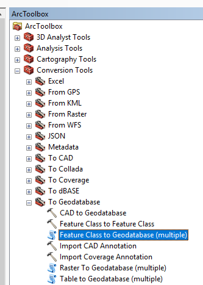
<figcaption>
Figure 85
ArcMap 10.2 tools to convert filetypes across databases
</figcaption>
</figure>

The ArcToolbox in ArcMap has two tools within the ‘Conversion Tools’
toolbox that allow the user to select feature classes and tables and
convert these to the file geodatabase format. These are:

- ‘Feature Class to Geodatabase (multiple)’

- ‘Table to Geodatabase (multiple)’

The database conversion process entails several steps, namely:

- Within ArcCatalog ([Figure 86](#_Ref45203936)), create the target file
  geodatabases for each of the databases to be migrated, that is, the
  regional model, the commontables, the LTRaC database (the ‘lakes’ and
  ‘estuaries’ databases will be included within a single file
  geodatabase), the land national database (rarely used), and
  optionally, an ‘Outputs’ database where model outputs can be stored.

<figure>
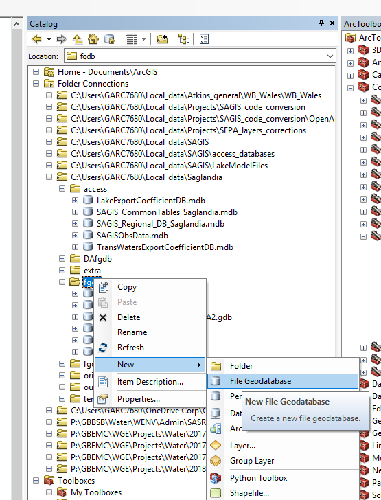
<figcaption>
Figure 86
ArcMap 10.2 catalog tools to create the new file
geodatabase
</figcaption>
</figure>

- Using ArcCatalog, open the Access ‘lakes’ database and create a copy
  of the ‘MasterTableNames’ table named ‘MasterTableNames_lakes’.

- Using ArcCatalog, open the Access ‘estuaries’ database and create a
  copy of the ‘MasterTableNames’ table named
  ‘MasterTableNames_estuaries’.

- Using the ‘Feature Class to Geodatabase (multiple)’ tool, navigate to
  the relevant Access database (only regional model databases contain
  feature class data so this step will not be necessary for converting
  the common tables database), select the feature classes ([Table
  2](#_Ref45206169)) to be migrated (only feature class data will be
  visible – note that some feature class data may be located in folders
  \[named ‘simcat’\] within the Access database), select the target file
  geodatabase, and then select ‘ok’. The ‘TSSData’ feature class located
  in the ‘Obs’ database should be moved into the common tables
  geodatabase. A ‘pop up’ notification will indicate once the process is
  complete (time dependent on the size of the database and the
  processing capacity of the computer used).

- Using the ‘Table to Geodatabase (multiple)’ tool, navigate to the
  relevant Access database (this will need to be done for the regional
  models, common tables, lakes and estuaries, and the land databases),
  select the tables to be migrated (users should be careful not to
  select tables associated with feature classes), select the destination
  file geodatabase, and then select ‘ok’. For the ‘lakes’ and
  ‘estuaries’ databases only export the renamed ‘MasterTableNames’

- Run the ‘database adaptation’ tool (this modifies a number of tables
  within the regional databases, specifically normalising nomenclature,
  scans for file conversion errors and searches for missing fields) on
  the new file geodatabase. There are two steps associated with running
  this tool:

  - Click the ‘Migrate Databases’ icon in ‘editing tools’ ([Figure
    87](#_Ref45203970)).

  - Navigate to the regional model file geodatabase and select ‘Run’
    ([Figure 88](#_Ref45203994)). If a database is specified in the
    configuration menu this will be used by the migration tool although
    you will be able to specify the database to be ‘processes’ when
    prompted upon selecting ‘Run’.

<figure>
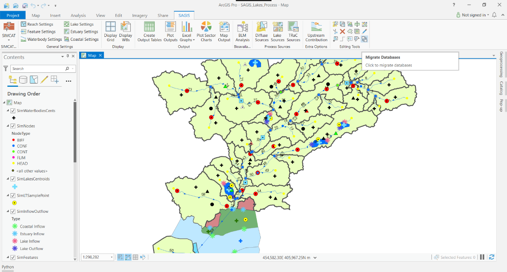
<figcaption>
Figure 87
The ‘Migrate Databases’ tool located in ‘Editing Tools’
</figcaption>
</figure>

<figure>
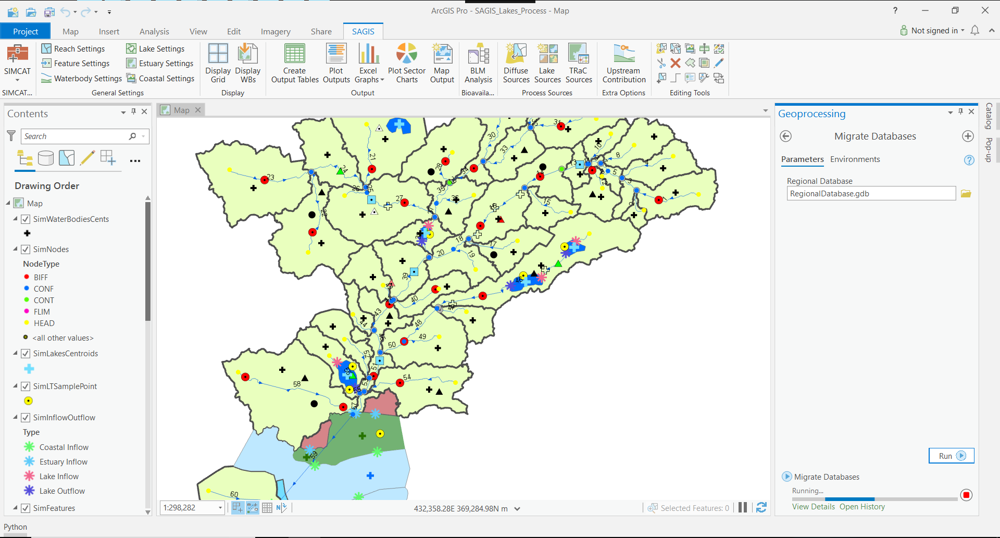
<figcaption>
Figure 88
Navigate to the relevant regional model file geodatabase and select
‘Run’
</figcaption>
</figure>

# SAGIS Databases

## Data sources

The source apportionment tool is underpinned by export loads for each of
the sector inputs. Diffuse source information has been processed into a
1 km2 grid of England and Wales (~150,000 squares) and point
source inputs (e.g. over 5,000 WwTWs and almost 400,000 on-site
wastewater treatment systems) have been processed on a site basis.

The diffuse loads are reported on a common 1 km2 grid then
translated to the waterbody scale (automatically using GIS tools), which
allows for any future changes in waterbody boundaries and the river
network to be made without compromising the tool. Export loads for each
of the identified substances have been generated using methodologies
that were agreed (and ‘signed off’) by the Environment Agency and the
UKWIR Project Steering Group. These methodologies are based on datasets
on the location of sources, combined with literature, monitoring data
and assumptions on the magnitude of the load associated with each
source.

Inevitably, significant uncertainty is associated with some of the input
data and in some cases, it is necessary to use default values. SAGIS
has, therefore, been designed to allow input of improved data and
settings without requiring changes to the functionality; for example,
improved local data or refined spatial information.

For some substances, output from existing models has been used; notably
for nutrients - phosphorus (via the PSYCHIC model) and nitrogen (via
NEAP-N). For other substances, values have been derived from reported
literature on export coefficients and national datasets on sources.

The SAGIS tool structure builds upon existing National SIMCAT models and
associated geo-databases containing the input data and model structure.

In addition to the existing SAGIS export load databases, new lakes and
estuaries export load databases have been created to provide export
loads to each lake and estuary for each chemical substance. SIMCAT
generates output files that are processed by the GIS tool to create
inputs to lake and estuary models. Direct inputs to the estuaries, lakes
and coastal waters and inputs from the local catchment, not covered by
SIMCAT, are also estimated by the GIS tools and mapped onto the water
bodies.

The information provided in the following sections does not describe all
of the fields in all of the tables; it focuses on input values that
might be directly manipulated by the user and outputs that might be
processed outside of SAGIS.

## Export loads databases

The export loads databases contain the national data on diffuse and
point sources generated as part of the UKWIR project. The export loads
databases are used to create the **regional databases** using the
**Diffuse Sources, Lakes Sources** and **TRaC Sources** tools in the GIS
interface.

The tables in the **Land National Database** (e.g.
*ExportCoefficientDB_230420.gdb*) are summarised and referenced in the
database table **MasterTableNames** ([Table 5](#_Ref287281822)).

| **Sector** | **Variable** | **TableName** | **Load Type** | **Use** |
|----|----|----|----|---:|
| ArableFarming | CONC | ArableFarming_CONC | Diffuse | Yes |
| ArableFarming | LOAD | ArableFarming_LOAD | Diffuse | Yes |
| ArableFarming | COR COEFF | ArableFarming_CORCOEFF | Diffuse | Yes |
| ArableFarming | STD DEVIATION | ArableFarming_STDDEV | Diffuse | Yes |
| AtmosphericDeposition | LOAD | AtmosphericDeposition_LOAD | Diffuse | Yes |
| AtmosphericDeposition | COR COEFF | AtmosphericDeposition_CORCOEFF | Diffuse | Yes |
| AtmosphericDeposition | STD DEVIATION | AtmosphericDeposition_STDDEV | Diffuse | Yes |
| HighwayRunoff | COR COEFF | HighwayRunoff_CORCOEFF | Diffuse | Yes |
| HWY100 | LOAD | HWY100_LOAD | Diffuse | Yes |
| HWY20 | LOAD | HWY20_LOAD | Diffuse | Yes |
| HWY40 | LOAD | HWY40_LOAD | Diffuse | Yes |
| HWY60 | LOAD | HWY60_LOAD | Diffuse | Yes |
| HWY80 | LOAD | HWY80_LOAD | Diffuse | Yes |
| HWYTOTAL | LOAD | HWYTOTAL_LOAD | Diffuse | Yes |
| Industry | COR COEFF | Industry_CORCOEFF | Point | Yes |
| Industry | STD DEVIATION | Industry_STDDEV | Point | Yes |
| Industry | LOAD | Industry_LOAD | Point | Yes |
| IntermittantsCSO | STD DEVIATION | IntermittantsCSO_STDDEV | Point | Yes |
| IntermittantsCSO | LOAD | IntermittantsCSO_LOAD | Point | Yes |
| IntermittantsCSO | COR COEFF | IntermittantsCSO_CORCOEFF | Point | Yes |
| IntermittantsStorm | LOAD | IntermittantsStorm_LOAD | Point | Yes |
| IntermittantsStorm | STD DEVIATION | IntermittantsStorm_STDDEV | Point | Yes |
| IntermittantsStorm | COR COEFF | IntermittantsStorm_CORCOEFF | Point | Yes |
| LivestockFarming | LOAD | LivestockFarming_LOAD | Diffuse | Yes |
| LivestockFarming | COR COEFF | LivestockFarming_CORCOEFF | Diffuse | Yes |
| LivestockFarming | STD DEVIATION | LivestockFarming_STDDEV | Diffuse | Yes |
| MineWaters | LOAD | MineWaters_LOAD | Point | Yes |
| MineWaters | COR COEFF | MineWaters_CORCOEFF | Point | Yes |
| MineWaters | STD DEVIATION | MineWaters_STDDEV | Point | Yes |
| NaturalBackground | LOAD | NaturalBackground_LOAD | Diffuse | Yes |
| NaturalBackground | COR COEFF | NaturalBackground_CORCOEFF | Diffuse | Yes |
| NaturalBackground | STD DEVIATION | NaturalBackground_STDDEV | Diffuse | Yes |
| NorthernOSWWT | LOAD | NorthernOSWWT_LOAD | Point | Yes |
| NorthernOSWWT | STD DEVIATION | NorthernOSWWT_STDDEV | Point | Yes |
| NorthernOSWWT | COR COEFF | NorthernOSWWT_CORCOEFF | Point | Yes |
| OSWwTS | LOAD | SepticTanks_LOAD | Diffuse | Yes |
| OSWwTS | COR COEFF | SepticTanks_CORCOEFF | Diffuse | Yes |
| OSWwTS | STD DEVIATION | SepticTanks_STDDEV | Diffuse | Yes |
| SAGISSewageWorks | COR COEFF | SAGISSewageWorks_LOAD | Point | Yes |
| SAGISSewageWorks | STD DEVIATION | SAGISSewageWorks_STDDEV | Point | Yes |
| SAGISSewageWorks | LOAD | SAGISSewageWorks_CORCOEFF | Point | Yes |
| SepticTankPoint | LOAD | SepticTankPoint_LOAD | Point | Yes |
| SepticTankPoint | COR COEFF | SepticTankPoint_CORCOEFF | Point | Yes |
| SepticTankPoint | STD DEVIATION | SepticTankPoint_STDDEV | Point | Yes |
| UrbanRunoff | LOAD | UrbanRunoff_LOAD | Diffuse | Yes |
| UrbanRunoff | STD DEVIATION | UrbanRunoff_STDDEV | Diffuse | Yes |
| UrbanRunoff | COR COEFF | UrbanRunoff_CORCOEFF | Diffuse | Yes |

Table 6 Land National
Database table MasterTableNames

For each sector there are separate tables specifying the annual load in
kg per km2 (LOAD), concentration (CONC), the coefficient of
variation (STDDEV) and correlation coefficient (CORCOEFF). Some tables
are for diffuse inputs and some for point inputs as specified by the
**LoadType** field.

In each table the load, concentration, coefficient of variation or
correlation coefficient, associated with each substance, is specified in
the column headed by the appropriate determinand code (e.g. **D0348_A**
**–** the annual load for total phosphorus).

Loads and concentrations can also be added monthly. In this case, the
month is indicated in the field name – e.g. **D0348_1** for January.
Monthly inputs are only set up for a few substances and sectors
(agricultural and background P and N).

The determinand codes are specified in the **Common Database** in the
table **DeterminandsForSimcat**.

For sectors for which inputs are intermittent (e.g. urban runoff and
intermittent discharges), a field called **InputPerc1** specifies the
proportion of the time that the discharge occurs. For highways, there
are separate database for different rainfall bands following the method
developed by the WRc.

The format of the **LTRaC National Database** (consolidated export
coefficient database for lakes and transitional waters) is the same as
the rivers database but the associated loads (birds, anglers, boats,
atmospheric) are specified as total loads for each lake, estuary and
coastal water body.

The table **Def_RndDeviate** specifies a hydrologically sequenced series
of random numbers that are used for the lake model simulation. The
values in this database are only used if a similar table is not present
in the **Regional Database.** The table **EstuaryPassOn** specifies the
percentage of sediment loads that are passed onto the coastal water for
different estuary types, and **Trans_Sed** gives sediment concentrations
for each estuary.

## Common database

The **Common database** contains data related to all the regional
models. Key tables are described below:

- **SamplePointQuality –** This table contains the observed river water
  quality data which is collated at the monitoring features in the
  **SimFeatures** layer. This data is also presented when creating
  chainage plots. Each set of data has a unique determinand (specified
  by the **MEAS_DETERMINAND_CODE** field) and sample point code
  (specified by the **SAMP_SMPT_USER_REFERENCE** field).

- **LakeSampleQuality –** This table contains all the observed lake
  water quality data which is collated at the monitoring features in the
  **LakeEstuarySamplePoint** layer. This data is also presented when
  creating lake calibration plots. Each set of data has a unique
  determinand (specified by the **DETCODE** field) and sample point code
  (specified by the **SAMPLEPOINTCODE** field).

- **EstuarySampleQuality –** This table contains all the observed
  estuary water quality data which is collated at the monitoring
  features in the **LakeEstuarySamplePoint** layer. This data is also
  presented when creating estuary calibration plots. Each set of data
  has a unique determinand (specified by the **DETCODE** field) and
  sample point code (specified by the **SAMPLEPOINTCODE** field).

- **DischargeQuality –** This table contains all the observed effluent
  water quality data which is collated at the discharges features in the
  **SimFeatures** layer. Each set of data has a unique determinand
  (specified by the **MEAS_DETERMINAND_CODE** field) and sample point
  code (specified by the **SAMP_SMPT_USER_REFERENCE** field).

- **RiverQualityTargets –** This table specifies the river quality
  targets which are collated in the **SimReaches** and **SimFeatures**
  attributes tables and shown on the chainage plots. Values associated
  with a target number (specified by the **Target** field) are specified
  for a range of determinands. The target number is specified for each
  reach or feature and entered in the SIMCAT data file accordingly.

- **LakeQualityTargets –** This table specifies the lakes quality
  targets which are collated in the **SimLakes** attributes table.
  Values associated with a target number (specified by the **Target**
  field) are specified for a range of determinands.

- **ReachTargets –** Reach and waterbody specific targets (e.g. for
  phosphorus) are specified in this table.

- **General\_ –** This table specifies the default general setting for
  SIMCAT such as the number of shots and average river temperature which
  are shown in the **General Settings** form in the GIS interface. These
  values can be modified using this form before carrying out a SIMCAT
  run.

- **DefSTWQual –** This table specifies the default effluent
  concentrations for the substances specified in the
  **DeterminandsForSimcat** table if no observed effluent data is
  available. There are a number of similar tables specifying default
  concentrations (e.g. **DefDiffuseQual**), which are only used if the
  inputs from the export load database are switched off and SIMCAT is
  run in the old way.

- **Def_LakeSettings –** This table specifies the default values for
  sediment concentrations and lake settling rates, release rates and
  burial rates in lakes for the substances specified in the
  **DeterminandsForSimcat** table if no observed effluent data is
  available.

- **Def_EstSed –** This table specifies the default values for suspended
  sediment concentrations in estuaries (different tidal categories) for
  the substances specified in the **DeterminandsForSimcat** table if no
  observed effluent data is available.

- **DeterminandsForSimcat –** This table specifies the chemicals
  included in SAGIS tools and associated data and settings related to
  each chemical substance. Information on the key fields is listed below
  ([Table 7](#_Ref45206501)).

<table style="width:100%;">
<caption>
Table 7 Common
Database table DeterminandsForSimcat
</caption>
<colgroup>
<col style="width: 25%" />
<col style="width: 74%" />
</colgroup>
<thead>
<tr>
<th><strong>Field Name</strong></th>
<th><strong>Description</strong></th>
</tr>
</thead>
<tbody>
<tr>
<td>DET_TYPE</td>
<td>
Defines the SIMCAT determinand type:

Type 1 = Conservative.

Type 2 = Exponential decay define by decay constant.
</td>
</tr>
<tr>
<td>Include</td>
<td>If ticked included in SIMCAT run (up to a maximum of 10
determinands). This value is modified using the SIMCAT determinands
form.</td>
</tr>
<tr>
<td>ApplyPartition</td>
<td>If ticked the partition coefficient is applied. This value is
modified using the SIMCAT determinands form.</td>
</tr>
<tr>
<td>GlobalRateConstant</td>
<td>Sets the global decay rate decay rate for each determinand. The rate
can be modified using the General Settings form.</td>
</tr>
<tr>
<td>PartCoeff</td>
<td>Sets the partition coefficient for each determinand (this can only
be applied to determinands (i.e. metals) with a dissolved and solid
phase). The rate can be modified using the General Settings form.</td>
</tr>
<tr>
<td>COV_****</td>
<td>A separate field for each sector setting the Coefficient of
Variation. A non-zero value will override the values in the export
coefficient database.</td>
</tr>
<tr>
<td>COV_Hyd****</td>
<td>A separate field for each sector setting the Coefficient of
Variation in relation to the Coefficient of Variation of the Diffuse
Inflow for each reach. A non-zero value will override the values in the
export coefficient database. This is used for determinands for which
inputs are driven by runoff. A value of 1 should result in a constant
Load as the inflows vary.</td>
</tr>
<tr>
<td>CorCoeff****</td>
<td>A separate field for each sector setting the Correlation
Coefficient. A non-zero value will override the values in the export
coefficient database.</td>
</tr>
<tr>
<td>Factor****</td>
<td>A separate field for each sector factoring the diffuse input up or
down. This can be used to adjust inputs for a particular sector if there
is evidence that these are systematically too low or high.</td>
</tr>
<tr>
<td>Monthly****</td>
<td>A value of 1 results in the tool applying monthly input data. This
can only be applied for determinands and sectors for which monthly data
exists in the export coefficient database.</td>
</tr>
<tr>
<td>NPD****</td>
<td>Name and location of unit non-parametric file to apply to diffuse
loads if this option is selected.</td>
</tr>
<tr>
<td>SeawaterConc</td>
<td>Average concentration of the chemical substance in seawater</td>
</tr>
<tr>
<td>SW**COV</td>
<td>Coefficient of variation for freshwater input to the estuaries and
coastal waters for the specified (**) sector.</td>
</tr>
<tr>
<td>SW**COR</td>
<td>Correlation factor for freshwater input to the estuaries and coastal
waters for the specified (**) sector.</td>
</tr>
<tr>
<td>Biostandard</td>
<td>BLM standard for the chemical.</td>
</tr>
<tr>
<td>BioBackground</td>
<td>Background concentration for the BLM standard.</td>
</tr>
<tr>
<td>ConvertINL</td>
<td>Flag to convert load features to flow and concentrations features
for inland waterbodies when the dat file is created.</td>
</tr>
<tr>
<td>ConvertSW</td>
<td>Flag to convert load features to flow and concentrations features
for estuary and coastal discharges when the dat file is created.</td>
</tr>
<tr>
<td>Conc****</td>
<td>Flag to apply sector inputs as a concentration.</td>
</tr>
<tr>
<td>PowerA****</td>
<td>First part of power function for each sector.</td>
</tr>
<tr>
<td>PowerB****</td>
<td>Second part of power function for each sector.</td>
</tr>
<tr>
<td>PowerC****</td>
<td>Third part of power function for each sector.</td>
</tr>
<tr>
<td>HeadDiffuse</td>
<td>Flag to apply headwater diffuse sector inputs.</td>
</tr>
</tbody>
</table>

## Regional databases - Inputs

The Regional Databases contain data and information specific to each
regional SIMCAT models.

When the **Diffuse Sources** tool is run, the national sector loads are
mapped onto the water bodies in the **regional databases** in a series
of tables mirroring those in the **Land National Database** (e.g.
**NaturalBackground_Loads**, **NaturalBackground_CORCOEFF** and
**NaturalBackground_STDDEV**). These tables are accessed when the SIMCAT
data file is created. The loads in the tables are the total annual load
to each waterbody in kg per year.

The point source loads, coefficients of variation and correlation
coefficients are mapped onto the regional model area as a single table
called **SAGISPointFeature_LOAD** which is also presented as a layer in
the GIS interface. Key fields in the table are presented below. Values
can be modified using the **Feature Settings** form in the tool.

When the **TRaC Sources** tool is run the loads, coefficients of
variation and correlation coefficients associated with the input sectors
to these water bodies (anglers, boats, birds) are mapped onto the
regional model mirroring those in the **LTRaC National Database**.

### SAGISPointFeature_LOAD table

The key fields for this feature class are shown below ([Table
8](#_Ref45206529)). When the model is rebuilt, modified values are
replaced with the original values.

| **Field Name** | **Description** |
|----|----|
| FeatName | Name of feature. |
| WBID | Waterbody number within which feature is located. |
| Diffuse | A value of 1 includes the feature in aggregated diffuse load for intermittent discharges or small wastewater treatment works. |
| Exclude | Exclude feature from model run. |
| FLOW_MEAN | Mean flow. |
| FLOW_Q95 | Standard deviation or Q95 for flow. |
| FLOW_CORR | Correlation between flow and river flow. |
| D\*\*\*\*\_A | Average load for determinand. \*\*\*\* |
| D\*\*\*\*\_AS | Standard deviation for load for determinand. \*\*\*\* |
| D\*\*\*\*\_AC | Correlation coefficient for determinand. \*\*\*\* |
| D\*\*\*\*\_AF | Non-parametric distribution file for determinand. \*\*\*\* |
| InputPerc1 | Percentage of time inputting for intermittent discharges. |
| Offshore | Flag to mark if the discharge occurs offshore. |
| OtherWBID | Waterbody ID of the waterbody into which the feature discharges if it does not discharge to a river. |

Table 8 Regional Database
table SAGISPointFeature_LOAD

### SimReaches Table

This feature class, containing information on the SIMCAT reaches, is
populated when the regional model is initialised using the **Open and
Update** tool in the GIS interface. It collates information held in
other tables in the selected **Regional Database** and the **Common
Database**. Tables that are accessed during this process are:

- **WB_FlowEstimates –** This table contains estimates of diffuse inflow
  to each waterbody per square kilometre derived from Lowflows 2000 (the
  **QMeanNatPerKm2** and **Q95NatPerKm2** fields).

- **CalDiffuseFlow –** Values in this table override the diffuse inflows
  from the **WB_FlowEstimates** table and are used to calibrate the flow
  model. These values are added to the reaches as flow per
  km2.

- **DiffuseQuality –** This table inputs diffuse quality for each reach
  (default values are added from the Simcat Common Table Database if no
  values are specified). It also contains values for the travel time
  parameters alpha and beta.

Values in the table can be edited using the **Reach Settings** form. Key
fields in the table are listed below ([Table 9](#_Ref45206590)).

| **Field Name** | **Description** |
|----|----|
| SIMNAME | Name of Reach. |
| WaterBodyNo | Waterbody number within which each reach is located. |
| ALPHA | Travel time parameter Alpha for the reach (see SIMCAT manual). |
| BETA | Travel time parameter Beta for the reach (see SIMCAT manual). |
| DIFF_DTYPE | Distribution type for diffuse inflows. |
| DIFF_MEAN | Mean diffuse inflow. |
| DIFF_NFIVE | Q95 for the diffuse inflow. |
| DIFF_SHIFT | Shift parameter for the diffuse inflow. |
| DIFF_CORR | Correlation coefficient for the diffuse inflow. |
| DIFF_DAT | Non-parametric file for the diffuse inflow. |
| DetDecay1 | Decay rate for the determinand 1. |
| DIFFQ1_DTY | Distribution type for determinand 1. |
| DIFFQ1_MEA | Mean Load for determinand 1. |
| DIFFQ1_SD | Standard deviation for Load for determinand 1. |
| DIFFQ1_SHI | Shift parameter for determinand 1. |
| DIFFQ1_COR | Correlation coefficient for the determinand 1. |
| DIFFQ1_DAT | Non-parametric file for determinand 1. |
|  | Same as above for determinands 2 to 10. |
| TempNPD | Non-parametric file for temperature for the reach. |
| SSNPD | Suspended solids file for the reach. If a file is entered this overwrites the file created automatically by the tool using the General Settings form. |
| TARGET_1 | Target concentration for determinand 1. Repeated for determinands 2 to 10. |
| WFD_Std1_1 | WFD class boundary (high) for determinand 1 (the boundary good is specified in the WFD_Std2_1 field etc.). Repeated for determinands 2 to 10. |
| QMeanJan | Change factor for the QMean for January. The annual QMean is multiplied by this factor to generate monthly statistics. Repeated for months Feb to Dec. |
| Q95Jan | Change factor for the Q95 for January. The annual Q95 is multiplied by this factor to generate monthly statistics. Repeated for months Feb to Dec. |
| MonthlyFlow | A value of 1 in this field instructs the tool to generate a monthly npd file for this reach. |
| DiffuseCalAdjQ1 | Calibration adjustments for determinand Q1 which can be created by the calibration mapping tool on the Create SIMCAT File form. |

Table 9 Regional Database
table SimReaches

### SimFeatures Table

This feature class, containing information on the SIMCAT features, is
populated when the regional model is initialised using the **Open and
Update** tool in the GIS interface. It collates information held in
other tables in the **Regional Database** and the **Common Database.**
Tables that are accessed during this process are:

- **SamplePointQuality –** Observed river quality data.

- **DischargeQuality –** Observed effluent quality data.

- **SimDischarges –** Information (including spatial) on the discharges
  including flow data.

- **SimAbstractions –** Information (including spatial) on the
  abstractions including flow data.

- **SimRiverFlowGauges –** Information (including spatial) on the river
  flow gauges including flow data.

- **SimPlottingPoints:** Information (including spatial) on the plotting
  points (separate to those created at regular intervals when running
  the **Create SIMCAT File** tool (i.e. in the National SIMCAT models).

- **SimRiverQuality –** Information (including spatial) on river
  monitoring stations.

- **SimOtherFeatures –** Information (including spatial) on other
  features including tributaries.

- **SimNodes Table –** Information (including spatial) on the nodes,
  marking the start and end of reaches, is included in the attributes
  table. The table includes a field called **UpstreamArea** that defines
  the area upstream of a headwater. This area is used to calculate the
  headwater flows based on the flows derived from the
  **WB_FlowEstimates** table, as described earlier. Calculated values
  are overridden by flows in the **CalHeadwaterFlow,** also in the
  **Regional Database**, which can be used to calibrate the flow model.
  When the **Open and Update** tool is used, the **SimNodes** attributes
  table is populated with quality data from the **HeadWaterQuality**
  table in the **Regional Database** or the default setting from the
  **Common Database**.

Settings in the **SimFeatures** and **SimNodes** attributes tables can
be edited using the settings forms (Feature Settings, Feature Load
Settings, Node Settings) or directly in ArcGIS. Values in the source
tables are, however, not modified so that when the model is rebuilt, the
modified values are replaced with the original values from the source
tables.

Key fields in the **SimFeatures** and **SimNodes** tables are listed
below in [Table 10](#_Ref45206641).

| **Field Name** | **Description** |
|----|----|
| WaterBodyNo | Waterbody number within which feature is located. |
| FEATURE_NA | Name of feature. |
| SAMPLES_F | Number of samples for flow for the feature. |
| FLOW_DIST | Distribution type for flow for the feature. |
| FLOW_MEAN | Mean flow for the feature. |
| FLOW_NPILE | Q95 for flow for the feature. |
| FLOW_SHIFT | Shift parameter for flow for the feature. |
| FLOW_CORR | Correlation coefficient for flow for the feature. |
| SAMPLES_Q1 | Number of samples for determinand 1. |
| DIST_Q1 | Distribution type for determinand 1. |
| MEAN_Q1 | Mean Concentrations for determinand 1. |
| SD_Q1 | Standard deviation for Concentration for determinand 1. |
| SHIFT_Q1 | Shift parameter for Concentration for determinand 1. |
| CORR_Q1 | Correlation coefficient for Concentration for determinand 1. |
|  CORR_Q\* | Repeated determinand 2 to 10. |
| FILE_Q | Flow non-parametric distribution file. |
| FILE_Q1 | Non-parametric file for Load for determinand 1. |
|  FILE_Q\* | Repeated determinand 2 to 10. |
| TARGET_1 | Target type for determinand 1. |
|  | Repeated for determinands 2 to 10 |
|  TargetWB | Target lake waterbody if water is pumped to a lake. |
| OverrideWB | Overrides target waterbody in SIMCAT dat file that is generated by the Create SIMCAT processing tools. |
| OtherWB | Waterbody ID of the waterbody into which the feature discharges if it does not discharge to a river. |
| QMeanJan | Average monthly abstraction for January (used by the lake model). |
| Q95Jan | Average monthly Q95 abstraction for January (used by the lake model). |
| QCorrJan | Average correlation between abstraction and river flow for January (used by the lake model) . |
| Qcorr\* | Repeated for Feb to Dec |
| WQDataCode | Sample point code for features (discharge or river quality). |
| PermitNo | Permit number for discharges. |
| PC_Q\*\*\*\* | 90 percentile concentration. |

Table 10 Regional Database
table SimFeatures

### SimWaterBodies Table

This attributes feature class, containing information on the SIMCAT
waterbodies, is populated when the regional model is initialised using
the **Open and Update** tool. It collates information held in other
tables in the selected **Regional Database** that are accessed during
this process.

Key fields in the **SimWaterBodies** table are listed below in [Table
11](#_Ref45206684).

| **Field Name** | **Description** |
|----|----|
| EA_WB_ID | Waterbody number. |
| DSTREAM_WB | Downstream waterbody for waterbodies with no reaches (loads and flows are routed downstream). |
| RoutingWB | Reference for estuary or coastal waterbody for which loads and flows are transferred. |
| RoutingWB2 | Second reference for estuary or coastal waterbody for which loads and flows are transferred if the waterbody connects to more than one estuary or coastal waterbody. |
| RoutingPC | Percentage of flows and loads routed to the first waterbody. |
| RoutingPC2 | Percentage of flows and loads routed to the second waterbody. |
| LVChangeQ1 | Change factor for loads from livestock. |
| ARChangeQ1 | Change factor for loads from arable. |
| STChangeQ1 | Change factor for loads from septic tanks. |
| URChangeQ1 | Change factor for loads from urban. |
| BGChangeQ1 | Change factor for loads from background. |
| DMChangeQ1 | Change factor for loads from diffuse mines. |
| LVNPDQ1 | Reference npd file name for livestock inputs. |
| ARNPDQ1 | Reference npd file name for arable inputs. |
| STNPDQ1 | Reference npd file name for septic tank inputs. |
| URNPDQ1 | Reference npd file name for urban inputs. |
| BGNPDQ1 | Reference npd file name for background inputs. |
| DMNPDQ1 | Reference npd file name for diffuse mine inputs. |
|  | Repeated for determinands 2 to 10. |
| QMeanAdj | Change factor for mean diffuse flow. |
| Q95Adj | Change factor for Q85 diffuse flows. |
| StdBackQ1 | Background concentration to calculate BLM standard. |
|  | Repeated for determinands 2 to 10. |

Table 11 Regional Database
table SimWaterBodies

### SimLakes Table

This attributes feature class, containing information on the lake
features, is populated when the regional model is initialised using the
**Open and Update** tool. It collates information held in other tables
in the national and regional databases and the **Common Database**.
Tables that are accessed during this process are:

- **LakeSampleQuality –** Observed water quality data for the lakes in
  the **Common Database**.

- **Def_LakeSettings –** Default settings for lake sediment
  concentrations and process rates in the **Common Database**.

- **Lake_RATES –** Lakes specific settings for sediment concentrations
  and process rates in the **Regional Database**.

- **LakeMonthlyRatesSSR –** Monthly setting rates in the **Regional
  Database**.

- **LakeMonthlyRatesSRR –** Monthly sediment release rates in the
  **Regional Database**.

| **Field Name** | **Description** |
|----|----|
| Name | Name of lake. |
| OffOnline | Specifies if lake is online, connected to SIMCAT reaches or offline. |
| LakeArea | Area of the lake in km. |
| LakeVolume | Volume of the lake in Ml. |
| LakeDepth | Average depth of the lake in m. |
| LocalCatch | Local catchment area in km2. |
| SimPeriod | Period in years of the simulation. |
| VolNPDFile | Name of NPD file with details of volume variability. |
| GWInflow | Mean groundwater inflow. |
| GWInflowQ9 | Q95 of groundwater inflow. |
| GWInflowCo | Correlation between groundwater inflow and river flow. |
| CompFlow | Mean compensation flow. |
| CompFlowSD | Standard deviation of compensation flow. |
| Q1_SetRate | Settlement rate parameter (det 1). |
| Q1_SRUB | Upper bound of settlement rate (det 1). |
| Q1_RelRate | Sediment release rate (det 1). |
| Q1_RRUB | Upper bound of sediment release rate (det 1). |
| Q1_BurRate | Permanent burial rate (det 1). |
| Q1_BRUB | Upper bound of permanent burial rate (det 1). |
| Q1_SedConc | Sediment concentration (det 1). |
| Q1_SCUB | Upper bound of sediment concentration (det 1). |
| AnglingDay | Number of angling days. |
| Exclude | Exclude from simulation. |
| GWQual_Q1 | Mean of groundwater concentration (det 1). |
| GWQualSD_1 | Standard deviation of groundwater concentration (det 1). |
| GWQualCo_1 | Correlation between groundwater concentration and river flow (det 1). |
| TARGET1 | Lake quality target (det 1). |
| AvTemp_1 | Average lake temperature for January. |
| DynSed | Flag to apply dynamic sediment interaction. |
| Timestep | Time set in days for the simulation. |
| Detailed | Flag to run detailed model. |

Table 12 Regional Database table SimLakes

## Model Outputs

When SIMCAT is run and the GIS interface is used to generate plots, a
number of output tables are created in the **Output Database**. These
are used to generate the various maps and plots that the interface
creates.

###  Mapped output layer (GIS1)

When the **Plot Output** tool is used in the GIS interface and the
**Create Maps** menu item selected, a new layer is created, based on the
name of the Simcat dat file name. The fields in the output table for the
layers created from the GIS1.csv files are shown below in [Table
13](#_Ref45206753).

<table style="width:99%;">
<caption>
Table 13
Output table *GIS1
</caption>
<colgroup>
<col style="width: 25%" />
<col style="width: 73%" />
</colgroup>
<thead>
<tr>
<th colspan="2"><strong>*GIS1_**_*** (* = name of Simcat dat file, ** =
determinand, *** = partitioning)</strong></th>
</tr>
<tr>
<th><strong>Field Name</strong></th>
<th><strong>Description</strong></th>
</tr>
</thead>
<tbody>
<tr>
<td>ReachNo</td>
<td>Reach Number from SIMCAT run.</td>
</tr>
<tr>
<td style="text-align: left;">GISCode</td>
<td>GIS code providing Easting (first 6 digits) and Northing (last 6
digits).</td>
</tr>
<tr>
<td>DISHeadKM</td>
<td>Distance from head of reach in km.</td>
</tr>
<tr>
<td>MeanQMld</td>
<td>Average river flow.</td>
</tr>
<tr>
<td>Q90Mld</td>
<td>Q90 river flow.</td>
</tr>
<tr>
<td>Q95Mld</td>
<td>Q95 river flow.</td>
</tr>
<tr>
<td>Q99Mld</td>
<td>Q99 River flow.</td>
</tr>
<tr>
<td style="text-align: left;">MeanConc_ug/l</td>
<td>Mean Load (ng/l, ug/l or mg/l). When Simcat runs it carries out the
simulation in the smallest unit (e.g. ng/l if one of the determinands
has these units).</td>
</tr>
<tr>
<td>LCLimMnCon</td>
<td>Lower confidence limit for simulated mean Load.</td>
</tr>
<tr>
<td>UCLimMnCon</td>
<td>Upper confidence limit for simulated mean Load.</td>
</tr>
<tr>
<td>CalcValQ90</td>
<td>90 percentile for simulated Load.</td>
</tr>
<tr>
<td>LCLimPer90</td>
<td>Lower confidence limit for 90 percentile for simulated Load.</td>
</tr>
<tr>
<td>UCLimPer90</td>
<td>Upper confidence limit for 90 percentile for simulated Load.</td>
</tr>
<tr>
<td>CalcValQ95</td>
<td>95 percentile for simulated Load.</td>
</tr>
<tr>
<td>LCLimPer95</td>
<td>Lower confidence limit for 95 percentile for simulated Load.</td>
</tr>
<tr>
<td>UCLimPer95</td>
<td>Upper confidence limit for 95 percentile for simulated Load.</td>
</tr>
<tr>
<td>CalcValQ99</td>
<td>99 percentile for simulated Load.</td>
</tr>
<tr>
<td>LCLimPer99</td>
<td>Lower confidence limit for 99 percentile for simulated Load.</td>
</tr>
<tr>
<td>UCLimPer99</td>
<td>Upper confidence limit for 99 percentile for simulated Load.</td>
</tr>
<tr>
<td>MeanLdKGd</td>
<td>Mean chemical load.</td>
</tr>
<tr>
<td>LCLimMnLd</td>
<td>Lower confidence limit for mean chemical load.</td>
</tr>
<tr>
<td>UCLimMnLd</td>
<td>Upper confidence limit for mean chemical load.</td>
</tr>
<tr>
<td>Q90LdKGd</td>
<td>90 percentile for chemical load.</td>
</tr>
<tr>
<td>LCLQ90MnLd</td>
<td>Lower confidence limit for 90 percentile of chemical load.</td>
</tr>
<tr>
<td>UCLQ90MnLd</td>
<td>Upper confidence limit for 90 percentile of chemical load.</td>
</tr>
<tr>
<td>Q95LdKGd</td>
<td>95 percentile for chemical load.</td>
</tr>
<tr>
<td>LCLQ95MnLd</td>
<td>Lower confidence limit for 95 percentile of chemical load.</td>
</tr>
<tr>
<td>UCLQ95MnLd</td>
<td>Upper confidence limit for 95 percentile of chemical load.</td>
</tr>
<tr>
<td>Q99LdKGd</td>
<td>99 percentile for chemical load.</td>
</tr>
<tr>
<td>LCLQ99MnLd</td>
<td>Lower confidence limit for 99 percentile of chemical load.</td>
</tr>
<tr>
<td>UCLQ99MnLd</td>
<td>Upper confidence limit for 99 percentile of chemical load.</td>
</tr>
<tr>
<td>TargDetMgl</td>
<td>Target Load.</td>
</tr>
<tr>
<td>PercEffDis</td>
<td>Percentage contribution of discharges to load.</td>
</tr>
<tr>
<td>FeatName</td>
<td>Feature name.</td>
</tr>
<tr>
<td>US_DS_Feat</td>
<td>Upstream (U/S), downstream (D/S) or at (at) feature.</td>
</tr>
<tr>
<td>ReachName</td>
<td>Reach name.</td>
</tr>
<tr>
<td>TypeCode</td>
<td>SIMCAT feature type (see SIMCAT manual).</td>
</tr>
<tr>
<td>X</td>
<td>X coordinate.</td>
</tr>
<tr>
<td>Y</td>
<td>Y coordinate.</td>
</tr>
<tr>
<td>Det_No</td>
<td>Determinand number (1-10 from General Settings form).</td>
</tr>
<tr>
<td>ObsFlow</td>
<td>Observed river flow.</td>
</tr>
<tr>
<td>ObsQ90Flow</td>
<td>Observed Q90 flow.</td>
</tr>
<tr>
<td>ObsQ95Flow</td>
<td>Observed Q95 flow.</td>
</tr>
<tr>
<td>ObsQ99Flow</td>
<td>Observed Q99 flow.</td>
</tr>
<tr>
<td>ObsConc</td>
<td>Observed Load.</td>
</tr>
<tr>
<td>ObsQ90Conc</td>
<td>Observed 90 percentile Load.</td>
</tr>
<tr>
<td>ObsQ95Conc</td>
<td>Observed 95 percentile Load.</td>
</tr>
<tr>
<td>ObsQ99Conc</td>
<td>Observed 99 percentile Load.</td>
</tr>
<tr>
<td>NumSamples</td>
<td>Number of samples for observed data.</td>
</tr>
<tr>
<td>ObsConcUCL</td>
<td>Observed mean Load upper confidence limit.</td>
</tr>
<tr>
<td>ObsConcLCL</td>
<td>Observed mean Load lower confidence limit.</td>
</tr>
<tr>
<td>TargetMean</td>
<td>1 = above target, 0 = below target for simulated mean Load.</td>
</tr>
<tr>
<td style="text-align: left;">Target90</td>
<td>2 = above target, 0 = below target for simulated 90 percentile
Load.</td>
</tr>
<tr>
<td style="text-align: left;">ObsDiffMean</td>
<td>Percentage difference between simulated and observed mean Load.</td>
</tr>
<tr>
<td style="text-align: left;">ObsDiff90</td>
<td>Percentage difference between simulated and observed 90%ile
Load.</td>
</tr>
<tr>
<td>ObsDiff95</td>
<td>Percentage difference between simulated and observed 95%ile
Load.</td>
</tr>
<tr>
<td>ObsDiff99</td>
<td style="text-align: left;">Percentage difference between simulated
and observed 99%ile Load</td>
</tr>
<tr>
<td style="text-align: left;">FlowDiffMe</td>
<td>Percentage difference between simulated and observed mean flow.</td>
</tr>
<tr>
<td style="text-align: left;">FlowDiffQ95</td>
<td>Percentage difference between simulated and observed Q95 flow.</td>
</tr>
<tr>
<td>FLoadSim</td>
<td>Simulated load (product of average flow and average Load).</td>
</tr>
<tr>
<td>FLoadObs</td>
<td>Observed load (product of average flow and average Load).</td>
</tr>
<tr>
<td>ObsTargetMean</td>
<td>1 = above target, 0 = below target for observed mean Load.</td>
</tr>
<tr>
<td>ObsTarget90</td>
<td>2 = above target, 0 = below target for observed 90 percentile
Load.</td>
</tr>
<tr>
<td style="text-align: left;">FLoadDiff</td>
<td>Percentage difference between simulated and observed load (product
of average flow and average Load).</td>
</tr>
<tr>
<td>SWConc</td>
<td>Average concentration from sewage works.</td>
</tr>
<tr>
<td>IMConc</td>
<td>Average concentration from intermittent discharges.</td>
</tr>
<tr>
<td>INConc</td>
<td>Average concentration from industry.</td>
</tr>
<tr>
<td>MIConc</td>
<td>Average concentration from minewaters.</td>
</tr>
<tr>
<td>LSConc</td>
<td>Average concentration from agricultural livestock.</td>
</tr>
<tr>
<td>ARConc</td>
<td>Average concentration from agricultural arable.</td>
</tr>
<tr>
<td>HWConc</td>
<td>Average concentration from highways.</td>
</tr>
<tr>
<td>URConc</td>
<td>Average concentration from urban sources.</td>
</tr>
<tr>
<td>ATConc</td>
<td>Average concentration from atmospheric sources.</td>
</tr>
<tr>
<td>BGConc</td>
<td>Average concentration from background.</td>
</tr>
<tr>
<td>STConc</td>
<td>Average concentration from OSWwTWs.</td>
</tr>
<tr>
<td>LKConc</td>
<td>Average concentration from lake sources.</td>
</tr>
<tr>
<td>SWLoad</td>
<td>Average load from sewage works.</td>
</tr>
<tr>
<td>IMLoad</td>
<td>Average load from intermittent discharges.</td>
</tr>
<tr>
<td>INLoad</td>
<td>Average load from industry.</td>
</tr>
<tr>
<td>MILoad</td>
<td>Average load from minewaters.</td>
</tr>
<tr>
<td>LSLoad</td>
<td>Average load from agricultural livestock.</td>
</tr>
<tr>
<td>ARLoad</td>
<td>Average load from agricultural arable.</td>
</tr>
<tr>
<td>HWLoad</td>
<td>Average load from highways.</td>
</tr>
<tr>
<td>URLoad</td>
<td>Average load from urban sources.</td>
</tr>
<tr>
<td>ATLoad</td>
<td>Average load from atmospheric sources.</td>
</tr>
<tr>
<td>BGLoad</td>
<td>Average load from background.</td>
</tr>
<tr>
<td>STLoad</td>
<td>Average load from OSWwTWs.</td>
</tr>
<tr>
<td>LKLoad</td>
<td>Average load from lake sources.</td>
</tr>
<tr>
<td>DConc</td>
<td>Total Load associated with diffuse sources.</td>
</tr>
<tr>
<td>DLoad</td>
<td>Total load associated with diffuse sources.</td>
</tr>
<tr>
<td style="text-align: left;">TargetHigh</td>
<td>Target concentration for WFD class High. This is repeated for Good,
Moderate, Poor and Bad.</td>
</tr>
<tr>
<td style="text-align: left;">EA_WB_ID</td>
<td>Waterbody in which the output point is located (populated using the
Map Output tools).</td>
</tr>
<tr>
<td>DOCMean</td>
<td>Mean DOC generated by BLM Analysis processing tools.</td>
</tr>
<tr>
<td>pHMean</td>
<td>Mean pH generated by BLM Analysis processing tools.</td>
</tr>
<tr>
<td>CaMean</td>
<td>Mean Ca generated by BLM Analysis processing tools.</td>
</tr>
<tr>
<td style="text-align: left;">StdBackground</td>
<td>Background for calculating BLM standards generated by BLM Analysis
processing tools.</td>
</tr>
<tr>
<td>BioF</td>
<td>Bioavailablity factor generated by BLM Analysis processing
tools.</td>
</tr>
<tr>
<td>BLMStd</td>
<td>BLM standard generated by BLM Analysis processing tools.</td>
</tr>
<tr>
<td style="text-align: left;">BLMConc</td>
<td>Bioavailable metal concentration generated by BLM Analysis
processing tools.</td>
</tr>
<tr>
<td style="text-align: left;">BLMCompliance</td>
<td>Compliance (0 or 1) with BLM standard generated by BLM Analysis
processing tools.</td>
</tr>
<tr>
<td>PntConc</td>
<td>Point source concentration.</td>
</tr>
<tr>
<td>PntLoad</td>
<td>Point source load.</td>
</tr>
<tr>
<td>CalScore</td>
<td>Calibration score.</td>
</tr>
<tr>
<td>GapAdded</td>
<td>Load added by gap filling.</td>
</tr>
<tr>
<td>GapRemoved</td>
<td>Load removed by gap filling.</td>
</tr>
<tr>
<td>DecayRemoved</td>
<td>Load removed by decay.</td>
</tr>
<tr>
<td>AbsRemoved</td>
<td>Load removed by abstraction.</td>
</tr>
<tr>
<td>Obs_SD</td>
<td>Standard deviation of observed data.</td>
</tr>
<tr>
<td>TValue1</td>
<td>T test value 1.</td>
</tr>
<tr>
<td>TValue2</td>
<td>T test value 2.</td>
</tr>
<tr>
<td>TValue1Desc</td>
<td>Description of whether passes or fails T test 1.</td>
</tr>
<tr>
<td>TValue2Desc</td>
<td>Description of whether passes of fails T test 2.</td>
</tr>
</tbody>
</table>

###  Apportionment tables 

When the **Create Output Tables** menu item is applied a number of
tables are created in the **Output Database** which are used to create
apportionment pie charts and upstream contribution charts. All of the
table names are appended onto the SIMCAT dat file name.

When pie charts are created using the **Plot Sector Charts** tool,
values for the selected waterbodies are transferred to the
**SimWaterBodiesCents** table for mapping at the waterbody centroid
(values and units are the same).

**ContributingInputs –** This table collates the inputs to each
waterbody from each sector and the cumulative inputs for all waterbodies
upstream and including each waterbody. The key fields are listed below.

<table style="width:99%;">
<caption>
Table 14 Output table ***ContributingInputs
</caption>
<colgroup>
<col style="width: 25%" />
<col style="width: 73%" />
</colgroup>
<thead>
<tr>
<th colspan="2"><strong>***ContributingInputs</strong></th>
</tr>
<tr>
<th><strong>Field Name</strong></th>
<th><strong>Description</strong></th>
</tr>
</thead>
<tbody>
<tr>
<td>Catchment</td>
<td>Waterbody Reference Number.</td>
</tr>
<tr>
<td>DetNo</td>
<td>Determinand number as listed on <strong>General Settings</strong>
form.</td>
</tr>
<tr>
<td>DetCode</td>
<td>Determinand code as listed in the
<strong>DeterminandsForSimcat</strong> table.</td>
</tr>
<tr>
<td>DatFile</td>
<td>Dat file that was used to generate the output.</td>
</tr>
<tr>
<td>Units</td>
<td>Units for input loads.</td>
</tr>
<tr>
<td>SW_CON</td>
<td>Load from sewage works.</td>
</tr>
<tr>
<td>IM_CON</td>
<td>Load from intermittent discharge.</td>
</tr>
<tr>
<td>IN_CON</td>
<td>Load from industry.</td>
</tr>
<tr>
<td>MI_CON</td>
<td>Load from minewaters.</td>
</tr>
<tr>
<td>LS_CON</td>
<td>Load from agricultural livestock.</td>
</tr>
<tr>
<td>AR_CON</td>
<td>Load from agricultural arable.</td>
</tr>
<tr>
<td>HW_CON</td>
<td>Load from highways.</td>
</tr>
<tr>
<td>UR_CON</td>
<td>Load from urban.</td>
</tr>
<tr>
<td>AT_CON</td>
<td>Load from atmospheric deposition.</td>
</tr>
<tr>
<td>BG_CON</td>
<td>Load from background.</td>
</tr>
<tr>
<td>ST_CON</td>
<td>Load from OSWwTWs.</td>
</tr>
<tr>
<td>AI_CON</td>
<td>Load from diffuse intermittent discharges.</td>
</tr>
<tr>
<td>AS_CON</td>
<td>Load from diffuse small sewage works.</td>
</tr>
<tr>
<td>SW_CUMCON</td>
<td>Upstream load from sewage works.</td>
</tr>
<tr>
<td>IM_CUMCON</td>
<td>Upstream load from intermittent discharge.</td>
</tr>
<tr>
<td>IN_CUMCON</td>
<td>Upstream load from industry.</td>
</tr>
<tr>
<td>MI_CUMCON</td>
<td>Upstream load from minewaters.</td>
</tr>
<tr>
<td>LS_CUMCON</td>
<td>Upstream load from agricultural livestock.</td>
</tr>
<tr>
<td>AR_CUMCON</td>
<td>Upstream load from agricultural arable.</td>
</tr>
<tr>
<td>HW_CUMCON</td>
<td>Upstream load from highways.</td>
</tr>
<tr>
<td>UR_CUMCON</td>
<td>Upstream load from urban.</td>
</tr>
<tr>
<td>AT_CUMCON</td>
<td>Upstream load from atmospheric deposition.</td>
</tr>
<tr>
<td>BG_CUMCON</td>
<td>Upstream load from background.</td>
</tr>
<tr>
<td>ST_CUMCON</td>
<td>Upstream load from OSWwTWs.</td>
</tr>
<tr>
<td>AI_CUMCON</td>
<td>Upstream load from diffuse intermittent discharges.</td>
</tr>
<tr>
<td>AS_CUMCON</td>
<td>Upstream load from diffuse small sewage works.</td>
</tr>
</tbody>
</table>

**ContributingOutputs –** This table collates the sector concentrations
at the downstream limit of each waterbody. The key fields are listed
below ([Table 15](#_Ref45206820)).

<table style="width:99%;">
<caption>
Table 15
Output table ***ContributingOutputs
</caption>
<colgroup>
<col style="width: 25%" />
<col style="width: 73%" />
</colgroup>
<thead>
<tr>
<th colspan="2"><strong>***ContributingOutputs</strong></th>
</tr>
<tr>
<th><strong>Field Name</strong></th>
<th><strong>Description</strong></th>
</tr>
</thead>
<tbody>
<tr>
<td>Catchment</td>
<td>Waterbody Reference Number.</td>
</tr>
<tr>
<td>DetNo</td>
<td>Determinand number as listed on <strong>General Settings</strong>
form.</td>
</tr>
<tr>
<td>DetCode</td>
<td>Determinand code as listed in the
<strong>DeterminandsForSimcat</strong> table.</td>
</tr>
<tr>
<td>DatFile</td>
<td>Dat file that was used to generate the output.</td>
</tr>
<tr>
<td>SW_CON</td>
<td>Concentration from sewage works.</td>
</tr>
<tr>
<td>Unit</td>
<td>Unit (this is the smallest unit for the simulated
determinands).</td>
</tr>
<tr>
<td>IM_CON</td>
<td>Concentration from intermittent discharge.</td>
</tr>
<tr>
<td>IN_CON</td>
<td>Concentration from industry.</td>
</tr>
<tr>
<td>MI_CON</td>
<td>Concentration from minewaters.</td>
</tr>
<tr>
<td>LS_CON</td>
<td>Concentration from agricultural livestock.</td>
</tr>
<tr>
<td>AR_CON</td>
<td>Concentration from agricultural arable.</td>
</tr>
<tr>
<td>HW_CON</td>
<td>Concentration from highways.</td>
</tr>
<tr>
<td>UR_CON</td>
<td>Concentration from urban.</td>
</tr>
<tr>
<td>AT_CON</td>
<td>Concentration from atmospheric deposition.</td>
</tr>
<tr>
<td>BG_CON</td>
<td>Concentration from background.</td>
</tr>
<tr>
<td>ST_CON</td>
<td>Concentration from OSWwTWs.</td>
</tr>
<tr>
<td>AI_CON</td>
<td>Concentration from diffuse intermittent discharges.</td>
</tr>
<tr>
<td>AS_CON</td>
<td>Concentration from diffuse small sewage works.</td>
</tr>
<tr>
<td>PNT_CON</td>
<td>Total concentration from point sources.</td>
</tr>
<tr>
<td>DIF_CON</td>
<td>Total concentration from diffuse sources.</td>
</tr>
</tbody>
</table>

**ContributingOutputLoads –** This table collates the sector loads at
the downstream limit of each waterbody. The fields are the same as for
the **ContributingOutputs** table. The key fields are shown below
([Table 16](#_Ref45206854)).

<table style="width:99%;">
<caption>
Table 16
Output table ***ContributingOutputLoads
</caption>
<colgroup>
<col style="width: 25%" />
<col style="width: 73%" />
</colgroup>
<thead>
<tr>
<th colspan="2"><strong>***ContributingOutputsLoads</strong></th>
</tr>
<tr>
<th><strong>Field Name</strong></th>
<th><strong>Description</strong></th>
</tr>
</thead>
<tbody>
<tr>
<td>Catchment</td>
<td>Waterbody Reference Number.</td>
</tr>
<tr>
<td>DetNo</td>
<td>Determinand number as listed on <strong>General Settings</strong>
form.</td>
</tr>
<tr>
<td>DetCode</td>
<td>Determinand code as listed in the
<strong>DeterminandsForSimcat</strong> table.</td>
</tr>
<tr>
<td>DatFile</td>
<td>Dat file that was used to generate the output.</td>
</tr>
<tr>
<td>SW_CON</td>
<td>Load from sewage works.</td>
</tr>
<tr>
<td>Unit</td>
<td>Unit (this is the smallest unit for the simulated
determinands).</td>
</tr>
<tr>
<td>IM_CON</td>
<td>Load from intermittent discharge.</td>
</tr>
<tr>
<td>IN_CON</td>
<td>Load from industry.</td>
</tr>
<tr>
<td>MI_CON</td>
<td>Load from minewaters.</td>
</tr>
<tr>
<td>LS_CON</td>
<td>Load from agricultural livestock.</td>
</tr>
<tr>
<td>AR_CON</td>
<td>Load from agricultural arable.</td>
</tr>
<tr>
<td>HW_CON</td>
<td>Load from highways.</td>
</tr>
<tr>
<td>UR_CON</td>
<td>Load from urban.</td>
</tr>
<tr>
<td>AT_CON</td>
<td>Load from atmospheric deposition.</td>
</tr>
<tr>
<td>BG_CON</td>
<td>Load from background.</td>
</tr>
<tr>
<td>ST_CON</td>
<td>Load from OSWwTWs.</td>
</tr>
<tr>
<td>AI_CON</td>
<td>Load from diffuse intermittent discharges.</td>
</tr>
<tr>
<td>AS_CON</td>
<td>Load from diffuse small sewage works.</td>
</tr>
<tr>
<td>PNT_CON</td>
<td>Total Load from point sources.</td>
</tr>
<tr>
<td>DIF_CON</td>
<td>Total Load from diffuse sources.</td>
</tr>
</tbody>
</table>

**ContributingMonthlyOutputs –** This table collates the monthly sector
concentrations at the downstream limit of each waterbody. The key fields
are listed below ([Table 17](#_Ref45206880)).

<table style="width:99%;">
<caption>
Table 17
Output table ***ContributingMonthlyOutputs
</caption>
<colgroup>
<col style="width: 25%" />
<col style="width: 73%" />
</colgroup>
<thead>
<tr>
<th colspan="2"><strong>***ContributingMonthlyOutputs</strong></th>
</tr>
<tr>
<th><strong>Field Name</strong></th>
<th><strong>Description</strong></th>
</tr>
</thead>
<tbody>
<tr>
<td>Catchment</td>
<td>Waterbody Reference Number.</td>
</tr>
<tr>
<td>DetNo</td>
<td>Determinand number as listed on <strong>General Settings</strong>
form.</td>
</tr>
<tr>
<td>DetCode</td>
<td>Determinand code as listed in the
<strong>DeterminandsForSimcat</strong> table.</td>
</tr>
<tr>
<td>DatFile</td>
<td>Datfile that was used to generate the output.</td>
</tr>
<tr>
<td>SW_CON</td>
<td>Concentration from sewage works.</td>
</tr>
<tr>
<td>Unit</td>
<td>Unit (this is the smallest unit for the simulated
determinands).</td>
</tr>
<tr>
<td>Month</td>
<td>Month.</td>
</tr>
<tr>
<td>IM_CON</td>
<td>Concentration from intermittent discharge.</td>
</tr>
<tr>
<td>IN_CON</td>
<td>Concentration from industry.</td>
</tr>
<tr>
<td>MI_CON</td>
<td>Concentration from minewaters.</td>
</tr>
<tr>
<td>LS_CON</td>
<td>Concentration from agricultural livestock.</td>
</tr>
<tr>
<td>AR_CON</td>
<td>Concentration from agricultural arable.</td>
</tr>
<tr>
<td>HW_CON</td>
<td>Concentration from highways.</td>
</tr>
<tr>
<td>UR_CON</td>
<td>Concentration from urban.</td>
</tr>
<tr>
<td>AT_CON</td>
<td>Concentration from atmospheric deposition.</td>
</tr>
<tr>
<td>BG_CON</td>
<td>Concentration from background.</td>
</tr>
<tr>
<td>ST_CON</td>
<td>Concentration from OSWwTWs.</td>
</tr>
<tr>
<td>AI_CON</td>
<td>Concentration from diffuse intermittent discharges.</td>
</tr>
<tr>
<td>AS_CON</td>
<td>Concentration from diffuse small sewage works.</td>
</tr>
<tr>
<td>PNT_CON</td>
<td>Total concentration from point sources.</td>
</tr>
<tr>
<td>DIF_CON</td>
<td>Total concentration from diffuse sources.</td>
</tr>
</tbody>
</table>

**ContributingSTWs –** When the **Plot River Chainage Graphs** menu item
is applied a table called **ContributingSTWs** is created in the
**Output Database** which is used to wastewater contribution plots. This
table lists the sewage works providing a contribution above a specified
threshold (or above zero) to concentrations at the downstream boundary
of each waterbody. The key fields are listed below ([Table
18](#_Ref45206919)).

<table style="width:99%;">
<caption>
Table 18
Output table ***ContributingSTWs
</caption>
<colgroup>
<col style="width: 25%" />
<col style="width: 0%" />
<col style="width: 73%" />
</colgroup>
<thead>
<tr>
<th colspan="3"><strong>***ContributingSTWs</strong></th>
</tr>
<tr>
<th colspan="2"><strong>Field Name</strong></th>
<th><strong>Description</strong></th>
</tr>
<tr>
<th colspan="2">Catchment</th>
<th>Waterbody ID.</th>
</tr>
<tr>
<th colspan="2">FEAT_Type</th>
<th>Feature type (e.g. industry or wastewater treatment works).</th>
</tr>
<tr>
<th colspan="2" style="text-align: left;">US_STW</th>
<th>Name of upstream sewage works, industrial discharge or intermittent
discharge.</th>
</tr>
<tr>
<th>DetNo</th>
<th colspan="2">Determinand number as listed on General Settings
form.</th>
</tr>
<tr>
<th>DetCode</th>
<th colspan="2">Determinand code as listed in the DeterminandsForSimcat
table.</th>
</tr>
<tr>
<th colspan="2" style="text-align: left;">DET_PERC</th>
<th>Percentage contribution of upstream WwTWs, Industrial Discharges,
CSOs, Storm Tanks and Mine Waters to chemical loads in specified
waterbody.</th>
</tr>
<tr>
<th colspan="2" style="text-align: left;">DET_LOAD</th>
<th>Load from upstream WwTWs, Industrial Discharges, CSOs, Storm Tanks
and Mine Waters to the specified waterbody.</th>
</tr>
<tr>
<th colspan="2">Units</th>
<th>Unit of the loads.</th>
</tr>
</thead>
<tbody>
</tbody>
</table>

**Contributing Upstream Diffuse Sectors –** When the **Plot River
Chainage Graphs** menu item is applied a series of tables are created in
the **Output Database** for each of the selected upstream sectors (e.g.
**\*\*\*ContributingArable**). These tables list the contribution of
marked upstream areas to concentrations at the downstream boundary of
each downstream waterbody. The key fields are listed below ([Table
19](#_Ref45207006)).

<table style="width:99%;">
<caption>
Table 19
Regional database table ***Contributing***
</caption>
<colgroup>
<col style="width: 25%" />
<col style="width: 0%" />
<col style="width: 73%" />
</colgroup>
<thead>
<tr>
<th colspan="3"><strong>*Contributing** (* = Dat file name, ** = Sector
name)</strong></th>
</tr>
<tr>
<th colspan="2"><strong>Field Name</strong></th>
<th><strong>Description</strong></th>
</tr>
</thead>
<tbody>
<tr>
<td colspan="2">Catchment</td>
<td>Waterbody ID.</td>
</tr>
<tr>
<td colspan="2">US_Catchment</td>
<td>Name of upstream area.</td>
</tr>
<tr>
<td>DetNo</td>
<td colspan="2">Determinand number as listed on <strong>General
Settings</strong> form.</td>
</tr>
<tr>
<td>DetCode</td>
<td colspan="2">Determinand code as listed in the
<strong>DeterminandsForSimcat</strong> table.</td>
</tr>
<tr>
<td colspan="2">PERC</td>
<td>Percentage contribution of upstream area to chemical loads in
specified waterbody.</td>
</tr>
<tr>
<td colspan="2">LOAD</td>
<td>Load from upstream area to the specified waterbody.</td>
</tr>
<tr>
<td colspan="2">Units</td>
<td>Unit of the loads.</td>
</tr>
</tbody>
</table>

### Lakes tables

When the lake model inputs are processed, the model is run and outputs
processed and a number of tables are created in the **Output Database**.
All of the table names are appended onto the SIMCAT dat file name.

**LakeInputs** and **LakeInputsMonthly.** These tables collate all of
the input loads to each regional lake from river, direct and pumped
inputs (key fields shown below in [Table 20](#_Ref45207048) are the same
for both tables).

<table style="width:99%;">
<caption>
Table 20
Output table ***LakeInputs and LakeInputsMonthly
</caption>
<colgroup>
<col style="width: 25%" />
<col style="width: 73%" />
</colgroup>
<thead>
<tr>
<th colspan="2"><strong>****LakeInputs and
****LakeInputsMonthly</strong></th>
</tr>
<tr>
<th><strong>Field Name</strong></th>
<th><strong>Description</strong></th>
</tr>
</thead>
<tbody>
<tr>
<td>WBID</td>
<td>Water body ID.</td>
</tr>
<tr>
<td>DetCode</td>
<td>Determinand code associated with the output.</td>
</tr>
<tr>
<td style="text-align: left;">DetNo</td>
<td>Number of the determinand as order on the <strong>General
Settings</strong> form.</td>
</tr>
<tr>
<td>Month</td>
<td>Month.</td>
</tr>
<tr>
<td>Units</td>
<td>Units for loads.</td>
</tr>
<tr>
<td>Datfile</td>
<td>SIMCAT dat file name.</td>
</tr>
<tr>
<td>RIV_FLOW</td>
<td>Average flow into the lake from all rivers (Ml/day).</td>
</tr>
<tr>
<td>RIV_FLOWQ95</td>
<td>Q95 flow into the lake from all rivers (Ml/day).</td>
</tr>
<tr>
<td>LOC_FLOW</td>
<td>Average flow into the lake from the local catchment (Ml/day).</td>
</tr>
<tr>
<td>LOC_FLOWQ95</td>
<td>Q95 flow into the lake from the local catchment (Ml/day).</td>
</tr>
<tr>
<td>PUMP_FLOW</td>
<td>Average flow into the lake from pumped inputs (Ml/day).</td>
</tr>
<tr>
<td>PUMP_FLOWQ95</td>
<td>Q95 flow into the lake from pumped inputs (Ml/day).</td>
</tr>
<tr>
<td>GWFLOW</td>
<td>Average groundwater inflow into the lake (Ml/day).</td>
</tr>
<tr>
<td>GW_FLOWQ95</td>
<td>Q95 groundwater inflow into the lake (Ml/day).</td>
</tr>
<tr>
<td>DISCHARGE</td>
<td>Total flow into the lake from discharges (Ml/day).</td>
</tr>
<tr>
<td>ABSTRN</td>
<td>Total abstraction from the lake (Ml/day).</td>
</tr>
<tr>
<td>SW_CON</td>
<td>Direct load from sewage works.</td>
</tr>
<tr>
<td>IM_CON</td>
<td>Direct load from intermittent discharge.</td>
</tr>
<tr>
<td>IN_CON</td>
<td>Direct load from industry.</td>
</tr>
<tr>
<td>MI_CON</td>
<td>Direct load from minewaters.</td>
</tr>
<tr>
<td>LS_CON</td>
<td>Direct load from agricultural livestock.</td>
</tr>
<tr>
<td>AR_CON</td>
<td>Direct load from agricultural arable.</td>
</tr>
<tr>
<td>HW_CON</td>
<td>Direct load from highways.</td>
</tr>
<tr>
<td>UR_CON</td>
<td>Direct load from urban.</td>
</tr>
<tr>
<td>AT_CON</td>
<td>Direct load from atmospheric deposition.</td>
</tr>
<tr>
<td>BG_CON</td>
<td>Direct load from background.</td>
</tr>
<tr>
<td>ST_CON</td>
<td>Direct load from OSWwTWs.</td>
</tr>
<tr>
<td>BD_CON</td>
<td>Direct load from birds.</td>
</tr>
<tr>
<td>BO_CON</td>
<td>Direct load from boats.</td>
</tr>
<tr>
<td>AN_CON</td>
<td>Direct load from anglers.</td>
</tr>
<tr>
<td>TOT_CON</td>
<td>Direct load from all sectors.</td>
</tr>
<tr>
<td>**_RIVCON</td>
<td>Same as above but loads from river inputs.</td>
</tr>
<tr>
<td>**_PUMP</td>
<td>Same as above but loads from pumped inputs.</td>
</tr>
<tr>
<td>**_LKTR</td>
<td>Same as above but loads transferred from upstream lakes.</td>
</tr>
<tr>
<td>Total_Diffuse</td>
<td>Total diffuse source load.</td>
</tr>
<tr>
<td>Total_Point</td>
<td>Total point source load.</td>
</tr>
</tbody>
</table>

**SIM –** This table collates the average simulated concentrations from
the lake simulation. The key fields are shown below ([Table
21](#_Ref45207078)).

<table style="width:99%;">
<caption>
Table 21
Output table ***SIM
</caption>
<colgroup>
<col style="width: 25%" />
<col style="width: 73%" />
</colgroup>
<thead>
<tr>
<th colspan="2"><strong>***SIM</strong></th>
</tr>
<tr>
<th><strong>Field Name</strong></th>
<th><strong>Description</strong></th>
</tr>
</thead>
<tbody>
<tr>
<td>WBID</td>
<td>Water body ID.</td>
</tr>
<tr>
<td>DetCode</td>
<td>Determinand code associated with the output.</td>
</tr>
<tr>
<td style="text-align: left;">DetNo</td>
<td>Number of the determinand as ordered on the <strong>General
Settings</strong> form.</td>
</tr>
<tr>
<td>Month</td>
<td>Month.</td>
</tr>
<tr>
<td>DatFile</td>
<td>SIMCAT dat file name.</td>
</tr>
<tr>
<td>Units</td>
<td>Units for simulated concentration.</td>
</tr>
<tr>
<td>NumShots</td>
<td>Number of shots in simulation.</td>
</tr>
<tr>
<td>TotalConc</td>
<td>Total simulated concentration.</td>
</tr>
<tr>
<td>TotalConcSD</td>
<td>Standard deviation of total simulated concentration.</td>
</tr>
<tr>
<td>TotalConc90</td>
<td>90%ile of total simulated concentration.</td>
</tr>
<tr>
<td>TotalConc10</td>
<td>10%ile of total simulated concentration.</td>
</tr>
<tr>
<td>TotalSedConc</td>
<td>Total sediment concentration.</td>
</tr>
<tr>
<td style="text-align: left;">TotalSedConcSD</td>
<td>Standard deviation for total simulated total sediment
concentration.</td>
</tr>
<tr>
<td>TotalSedConc90</td>
<td>90%ile of total simulated total sediment concentration.</td>
</tr>
<tr>
<td>TotalSedConc10</td>
<td>10%ile of total simulated total sediment concentration.</td>
</tr>
<tr>
<td>SW_OUT</td>
<td>Simulated concentration associated with sewage works.</td>
</tr>
<tr>
<td>IM_OUT</td>
<td>Simulated concentration associated with intermittent discharge.</td>
</tr>
<tr>
<td>IN_OUT</td>
<td>Simulated concentration associated with industry.</td>
</tr>
<tr>
<td>MI_OUT</td>
<td>Simulated concentration associated with minewaters.</td>
</tr>
<tr>
<td>LS_OUT</td>
<td>Simulated concentration associated with agricultural livestock.</td>
</tr>
<tr>
<td>AR_OUT</td>
<td>Simulated concentration associated with agricultural arable.</td>
</tr>
<tr>
<td>HW_OUT</td>
<td>Simulated concentration associated with highways.</td>
</tr>
<tr>
<td>UR_OUT</td>
<td>Simulated concentration associated with urban.</td>
</tr>
<tr>
<td>AT_OUT</td>
<td>Simulated concentration associated with atmospheric deposition.</td>
</tr>
<tr>
<td>BG_OUT</td>
<td>Simulated concentration associated with background.</td>
</tr>
<tr>
<td>ST_OUT</td>
<td>Simulated concentration associated with OSWwTWs.</td>
</tr>
<tr>
<td>BD_OUT</td>
<td>Simulated concentration associated with birds.</td>
</tr>
<tr>
<td>BO_OUT</td>
<td>Simulated concentration associated with boats.</td>
</tr>
<tr>
<td>AN_OUT</td>
<td>Simulated concentration associated with anglers.</td>
</tr>
<tr>
<td>**_SD</td>
<td>Standard deviation for concentration associated with each sector, as
shown above.</td>
</tr>
<tr>
<td>FlowOut</td>
<td>Average outflow from the lake.</td>
</tr>
<tr>
<td>FlowOutQ95</td>
<td>Q95 of outflow from the lake.</td>
</tr>
<tr>
<td>PumpIn</td>
<td>Average pumped input to the lake.</td>
</tr>
<tr>
<td>PumpInQ95</td>
<td>Q95 of pumped input to the lake.</td>
</tr>
<tr>
<td>Abst</td>
<td>Average abstraction from the lake.</td>
</tr>
<tr>
<td style="text-align: left;">SedFlux</td>
<td>Proportion of flux of chemical derived from release from the
sediment.</td>
</tr>
<tr>
<td>RetnTime</td>
<td>Lake retention time in years.</td>
</tr>
<tr>
<td>Target</td>
<td>Water quality target.</td>
</tr>
<tr>
<td>AvInfluentConc</td>
<td>Average influent concentration.</td>
</tr>
</tbody>
</table>

**SIMTS –** This table collates the simulated concentrations for each
month of the lake simulation (i.e. the steady state monthly profile. The
first characters in the name are derived from the SIMCAT dat file name
so that separate tables can be stored for different SIMCAT model runs.
The key fields are shown below ([Table 22](#_Ref45207108)).

<table style="width:99%;">
<caption>
Table 22
Output table ***SIMTS
</caption>
<colgroup>
<col style="width: 25%" />
<col style="width: 73%" />
</colgroup>
<thead>
<tr>
<th colspan="2"><strong>***SIMTS</strong></th>
</tr>
<tr>
<th><strong>Field Name</strong></th>
<th><strong>Description</strong></th>
</tr>
</thead>
<tbody>
<tr>
<td>WBID</td>
<td>Water body ID.</td>
</tr>
<tr>
<td>DetCode</td>
<td>Determinand code.</td>
</tr>
<tr>
<td>DetNo</td>
<td>Number of the determinand as ordered on the General Settings
form.</td>
</tr>
<tr>
<td>Month</td>
<td>Month.</td>
</tr>
<tr>
<td>Year</td>
<td>Year from starting point of zero.</td>
</tr>
<tr>
<td>DatFile</td>
<td>SIMCAT dat file name.</td>
</tr>
<tr>
<td>Units</td>
<td>Units for simulated concentration.</td>
</tr>
<tr>
<td>TotalConc</td>
<td>Average simulated concentration from all sectors.</td>
</tr>
<tr>
<td>TotalConcSD</td>
<td>Standard deviation of simulated concentration from sectors.</td>
</tr>
<tr>
<td>TotalConc10</td>
<td>Ninety percentile of simulated concentration from sectors.</td>
</tr>
<tr>
<td>TotalConc90</td>
<td>Ten percentile of simulated concentration from sectors.</td>
</tr>
<tr>
<td>TotalSedConc</td>
<td>Average simulated sediment concentration from all sectors.</td>
</tr>
<tr>
<td style="text-align: left;">TotalSedConcSD</td>
<td>Standard deviation of simulated sediment concentration from
sectors.</td>
</tr>
<tr>
<td style="text-align: left;">TotalSedConc10</td>
<td>Ninety percentile of simulated sediment concentration from
sectors.</td>
</tr>
<tr>
<td>TotalSedConc90</td>
<td>Ten percentile of simulated sediment concentration from
sectors.</td>
</tr>
<tr>
<td>FlowOur</td>
<td>Average outflow from the lake.</td>
</tr>
<tr>
<td>FlowOutQ95</td>
<td>Q95 of outflow from the lake.</td>
</tr>
<tr>
<td>AbsMean</td>
<td>Average abstraction from the lake.</td>
</tr>
<tr>
<td>AbsQ95</td>
<td>Q95 of abstraction from the lake.</td>
</tr>
<tr>
<td>NumShots</td>
<td>Number of shots in simulation.</td>
</tr>
<tr>
<td style="text-align: left;">SedFlux</td>
<td>Proportion of flux of chemical derived from release from the
sediment.</td>
</tr>
<tr>
<td style="text-align: left;">SW_AN</td>
<td>Sewage works annual mean concentration repeated for all
sectors.</td>
</tr>
<tr>
<td style="text-align: left;">SW_SD</td>
<td>Standard deviation of mean concentration repeated for all
sectors.</td>
</tr>
<tr>
<td>PumpIn</td>
<td>Average pumped inflow.</td>
</tr>
<tr>
<td>PumpInQ95</td>
<td>Q95 of pumped inflow.</td>
</tr>
<tr>
<td>Abst</td>
<td>Average quantity abstracted.</td>
</tr>
</tbody>
</table>

**Lake contributing input tables –** These tables contain information on
the contribution of upstream individual point sources and marked diffuse
source areas on inputs to lakes, estuaries and coastal waters.

<table style="width:99%;">
<caption>
Table 23 Output table
***ContributingDiffuseTRACS
</caption>
<colgroup>
<col style="width: 25%" />
<col style="width: 73%" />
</colgroup>
<thead>
<tr>
<th colspan="2"><strong>***ContributingLTraCSTWs</strong></th>
</tr>
<tr>
<th><strong>Field Name</strong></th>
<th><strong>Description</strong></th>
</tr>
</thead>
<tbody>
<tr>
<td>Catchment</td>
<td>Lake, estuary of coastal waterbody reference.</td>
</tr>
<tr>
<td>Source_Type</td>
<td>Type of upstream sources.</td>
</tr>
<tr>
<td>Feature_Type</td>
<td>Type of point sources (sewage works, industry etc.).</td>
</tr>
<tr>
<td>Feature_Name</td>
<td>Name of upstream feature.</td>
</tr>
<tr>
<td>DetCode</td>
<td>Determinand code.</td>
</tr>
<tr>
<td>GISCode</td>
<td>GIS Code of source.</td>
</tr>
<tr>
<td>UpstreamLoad</td>
<td>Load from upstream sources.</td>
</tr>
<tr>
<td>Units</td>
<td>Units.</td>
</tr>
</tbody>
</table>

<table style="width:99%;">
<caption>
Table 24 Output table
***ContributingDiffuseTRACS
</caption>
<colgroup>
<col style="width: 25%" />
<col style="width: 73%" />
</colgroup>
<thead>
<tr>
<th colspan="2"><strong>***ContributingLTraCSTWs</strong></th>
</tr>
<tr>
<th><strong>Field Name</strong></th>
<th><strong>Description</strong></th>
</tr>
</thead>
<tbody>
<tr>
<td>Catchment</td>
<td>Lake, estuary of coastal waterbody reference.</td>
</tr>
<tr>
<td>US_Catchment</td>
<td>Upstream waterbody reference.</td>
</tr>
<tr>
<td>DetNo</td>
<td>Determindand number.</td>
</tr>
<tr>
<td>DetCode</td>
<td>Determindand code.</td>
</tr>
<tr>
<td>LOAD</td>
<td>Inputs load.</td>
</tr>
<tr>
<td>Unit</td>
<td>Units.</td>
</tr>
<tr>
<td>Sector</td>
<td>Sector description.</td>
</tr>
<tr>
<td>SourceType</td>
<td>Type of source.</td>
</tr>
<tr>
<td>SourceName</td>
<td>Name of sources.</td>
</tr>
<tr>
<td>GISCode</td>
<td>GIS Code of source.</td>
</tr>
</tbody>
</table>

###  Estuary tables

**EstuaryInputs –** This table collates all of the input loads to each
regional estuary from rivers and direct inputs (key fields are shown
below in [Table 25](#_Ref45207166)).

<table style="width:99%;">
<caption>
Table 25
Output table ***EstuaryInputs
</caption>
<colgroup>
<col style="width: 25%" />
<col style="width: 73%" />
</colgroup>
<thead>
<tr>
<th colspan="2"><strong>***EstuaryInputs</strong></th>
</tr>
<tr>
<th><strong>Field Name</strong></th>
<th><strong>Description</strong></th>
</tr>
</thead>
<tbody>
<tr>
<td>WBID</td>
<td>Water body ID.</td>
</tr>
<tr>
<td>DetCode</td>
<td>Determinand code associated with the output.</td>
</tr>
<tr>
<td style="text-align: left;">DetNo</td>
<td>Number of the determinand as ordered on the <strong>General
Settings</strong> form.</td>
</tr>
<tr>
<td>Units</td>
<td>Units for load.</td>
</tr>
<tr>
<td>RIV_FLOW</td>
<td>Average flow into the estuary from all rivers (Ml/day).</td>
</tr>
<tr>
<td>RIV_FLOWQ95</td>
<td>Q95 flow into the estuary from all rivers (Ml/day).</td>
</tr>
<tr>
<td>DIR_FLOW</td>
<td>Average flow into the estuary from the local catchment
(Ml/day).</td>
</tr>
<tr>
<td>DIR_FLOWQ95</td>
<td>Q95 flow into the estuary from the local catchment (Ml/day).</td>
</tr>
<tr>
<td>PUMP_FLOW</td>
<td>Average flow into the estuary from pumped inputs (Ml/day).</td>
</tr>
<tr>
<td>PUMP_FLOWQ95</td>
<td>Q95 flow into the estuary from pumped inputs (Ml/day).</td>
</tr>
<tr>
<td>TSS_Mean</td>
<td>Average total suspended solids in the input flow.</td>
</tr>
<tr>
<td>TSS_SD</td>
<td>Standard deviation for total suspended solids in the input
flow.</td>
</tr>
<tr>
<td>SW_CON</td>
<td>Direct load from sewage works.</td>
</tr>
<tr>
<td>IM_CON</td>
<td>Direct load from intermittent discharge.</td>
</tr>
<tr>
<td>IN_CON</td>
<td>Direct load from industry.</td>
</tr>
<tr>
<td>MI_CON</td>
<td>Direct load from minewaters.</td>
</tr>
<tr>
<td>LS_CON</td>
<td>Direct load from agricultural livestock.</td>
</tr>
<tr>
<td>AR_CON</td>
<td>Direct load from agricultural arable.</td>
</tr>
<tr>
<td>HW_CON</td>
<td>Direct load from highways.</td>
</tr>
<tr>
<td>UR_CON</td>
<td>Direct load from urban.</td>
</tr>
<tr>
<td>AT_CON</td>
<td>Direct load from atmospheric deposition.</td>
</tr>
<tr>
<td>BG_CON</td>
<td>Direct load from background.</td>
</tr>
<tr>
<td>ST_CON</td>
<td>Direct load from OSWwTWs.</td>
</tr>
<tr>
<td>BD_CON</td>
<td>Direct load from birds.</td>
</tr>
<tr>
<td>BO_CON</td>
<td>Direct load from boats.</td>
</tr>
<tr>
<td>AN_CON</td>
<td>Direct load from anglers.</td>
</tr>
<tr>
<td>TOT_CON</td>
<td>Direct load from all sectors.</td>
</tr>
<tr>
<td>**_RIVCON</td>
<td>Same as above but loads from river inputs.</td>
</tr>
</tbody>
</table>

**\*\*\*EstuaryOutputs –** This table collates the outputs of the
estuary calculations. The first characters in the name are derived from
the SIMCAT dat file name so that separate tables can be stored for
different SIMCAT model runs. The key fields are shown below ([Table
25](#_Ref45207189)).

<table style="width:99%;">
<caption>
Table 26
Output table ***EstuaryOutputs
</caption>
<colgroup>
<col style="width: 25%" />
<col style="width: 73%" />
</colgroup>
<thead>
<tr>
<th colspan="2"><strong>***EstuaryOutputs</strong></th>
</tr>
<tr>
<th><strong>Field Name</strong></th>
<th><strong>Description</strong></th>
</tr>
</thead>
<tbody>
<tr>
<td>WBID</td>
<td>Water body ID.</td>
</tr>
<tr>
<td>DetCode</td>
<td>Determinand code associated with the output.</td>
</tr>
<tr>
<td>DetNo</td>
<td>Number of the determinand as ordered on the <strong>General
Settings</strong> form.</td>
</tr>
<tr>
<td>Units</td>
<td>Units for load.</td>
</tr>
<tr>
<td>DatFile</td>
<td>SIMCAT dat file name.</td>
</tr>
<tr>
<td>SW_INF</td>
<td>Average influent concentration associated with sewage works.</td>
</tr>
<tr>
<td>IM_INF</td>
<td>Average influent concentration associated with intermittent
discharge.</td>
</tr>
<tr>
<td>IN_INF</td>
<td>Average influent concentration associated with industry.</td>
</tr>
<tr>
<td>MI_INF</td>
<td>Average influent concentration associated with minewaters.</td>
</tr>
<tr>
<td style="text-align: left;">LS_INF</td>
<td>Average influent concentration associated with agricultural
livestock.</td>
</tr>
<tr>
<td style="text-align: left;">AR_INF</td>
<td>Average influent concentration associated with agricultural
arable.</td>
</tr>
<tr>
<td style="text-align: left;">HW_INF</td>
<td>Average influent concentration associated with highways.</td>
</tr>
<tr>
<td style="text-align: left;">UR_INF</td>
<td>Average influent concentration associated with urban.</td>
</tr>
<tr>
<td style="text-align: left;">AT_INF</td>
<td>Average influent concentration associated with atmospheric
deposition.</td>
</tr>
<tr>
<td style="text-align: left;">BG_INF</td>
<td>Average influent concentration associated with background.</td>
</tr>
<tr>
<td style="text-align: left;">ST_INF</td>
<td>Average influent concentration associated with OSWwTWs.</td>
</tr>
<tr>
<td style="text-align: left;">BO_INF</td>
<td>Average influent concentration associated with boats.</td>
</tr>
<tr>
<td style="text-align: left;">TOTMean_INF</td>
<td>Average influent concentration associated with all sectors.</td>
</tr>
<tr>
<td style="text-align: left;">TOT10_INF</td>
<td>Ten percentile of influent concentrations associated with all
sectors.</td>
</tr>
<tr>
<td style="text-align: left;">TOT90_INF</td>
<td>Ninety percentile of influent concentrations associated with all
sectors.</td>
</tr>
<tr>
<td style="text-align: left;">**_EFF</td>
<td>As above but effluent concentrations flowing out of estuary.</td>
</tr>
<tr>
<td style="text-align: left;">TSS_FRESH</td>
<td>Average total suspended solids derived from freshwater inputs.</td>
</tr>
<tr>
<td style="text-align: left;">TSS10_FRESH</td>
<td>10 %ile of total suspended solids derived from freshwater
inputs.</td>
</tr>
<tr>
<td style="text-align: left;">TSS90_FRESH</td>
<td>90 %ile of total suspended solids derived from freshwater
inputs.</td>
</tr>
<tr>
<td style="text-align: left;">TSS_SEA</td>
<td>Average total suspended solids derived from freshwater inputs.</td>
</tr>
<tr>
<td style="text-align: left;">TSS10_SEA</td>
<td>10 %ile of total suspended solids derived from seawater inputs.</td>
</tr>
<tr>
<td>TSS90_SEA</td>
<td>90 %ile of total suspended solids derived from seawater inputs.</td>
</tr>
<tr>
<td>TSS_EST</td>
<td>Observed average total suspended solids in estuary.</td>
</tr>
<tr>
<td>TSS10_EST</td>
<td>10%ile of observed average total suspended solids in estuary.</td>
</tr>
<tr>
<td>TSS90_EST</td>
<td>90%ile of observed average total suspended solids in estuary.</td>
</tr>
<tr>
<td>SEDMean</td>
<td>Average concentration associated with suspended solids.</td>
</tr>
<tr>
<td>SED10</td>
<td>10%ile of concentrations associated with suspended solids.</td>
</tr>
<tr>
<td>SED90</td>
<td>90%ile of concentrations associated with suspended solids.</td>
</tr>
</tbody>
</table>

###  Coastal waters tables

**CoastalInputs –** This table collates all of the input loads to each
regional coastal water from rivers and direct inputs (key fields are
shown below in [Table 27](#_Ref45207213)).

<table style="width:99%;">
<caption>
Table 27
Output table ***CoastalInputs
</caption>
<colgroup>
<col style="width: 25%" />
<col style="width: 73%" />
</colgroup>
<thead>
<tr>
<th colspan="2"><strong>***CoastalInputs</strong></th>
</tr>
<tr>
<th><strong>Field Name</strong></th>
<th><strong>Description</strong></th>
</tr>
</thead>
<tbody>
<tr>
<td>WBID</td>
<td>Water body ID.</td>
</tr>
<tr>
<td>DetCode</td>
<td>Determinand code associated with the output.</td>
</tr>
<tr>
<td style="text-align: left;">DetNo</td>
<td>Number of the determinand as ordered on the General Settings
form.</td>
</tr>
<tr>
<td>Units</td>
<td>Units for load.</td>
</tr>
<tr>
<td>RIV_FLOW</td>
<td>Average flow into the estuary from all rivers (Ml/day).</td>
</tr>
<tr>
<td>RIV_FLOWQ95</td>
<td>Q95 flow into the estuary from all rivers (Ml/day).</td>
</tr>
<tr>
<td>DIR_FLOW</td>
<td>Average flow into the estuary from the local catchment
(Ml/day).</td>
</tr>
<tr>
<td>DIR_FLOWQ95</td>
<td>Q95 flow into the estuary from the local catchment (Ml/day).</td>
</tr>
<tr>
<td>PUMP_FLOW</td>
<td>Average flow into the estuary from pumped inputs (Ml/day).</td>
</tr>
<tr>
<td>PUMP_FLOWQ95</td>
<td>Q95 flow into the estuary from pumped inputs (Ml/day).</td>
</tr>
<tr>
<td>TSS_Mean</td>
<td>Average total suspended solids in the input flow.</td>
</tr>
<tr>
<td>TSS_SD</td>
<td>Standard deviation for total suspended solids in the input
flow.</td>
</tr>
<tr>
<td>SW_CON</td>
<td>Direct load from sewage works.</td>
</tr>
<tr>
<td>IM_CON</td>
<td>Direct load from intermittent discharge.</td>
</tr>
<tr>
<td>IN_CON</td>
<td>Direct load from industry.</td>
</tr>
<tr>
<td>MI_CON</td>
<td>Direct load from minewaters.</td>
</tr>
<tr>
<td>LS_CON</td>
<td>Direct load from agricultural livestock.</td>
</tr>
<tr>
<td>AR_CON</td>
<td>Direct load from agricultural arable.</td>
</tr>
<tr>
<td>HW_CON</td>
<td>Direct load from highways.</td>
</tr>
<tr>
<td>UR_CON</td>
<td>Direct load from urban.</td>
</tr>
<tr>
<td>AT_CON</td>
<td>Direct load from atmospheric deposition.</td>
</tr>
<tr>
<td>BG_CON</td>
<td>Direct load from background.</td>
</tr>
<tr>
<td>ST_CON</td>
<td>Direct load from OSWwTWs.</td>
</tr>
<tr>
<td>BD_CON</td>
<td>Direct load from birds.</td>
</tr>
<tr>
<td>BO_CON</td>
<td>Direct load from boats.</td>
</tr>
<tr>
<td>AN_CON</td>
<td>Direct load from anglers.</td>
</tr>
<tr>
<td>TOT_CON</td>
<td>Direct load from all sectors.</td>
</tr>
<tr>
<td>**_RIVCON</td>
<td>Same as above but loads from river inputs.</td>
</tr>
</tbody>
</table>

## Flow Calibration Tables

This table contains the adjustment factors applied to the model diffuse
inflows following calibration. The fields are shown in [Table
28](#_Ref45207237) (below).

<table style="width:99%;">
<caption>
Table 28
Regional Database flow calibration table
</caption>
<colgroup>
<col style="width: 25%" />
<col style="width: 73%" />
</colgroup>
<thead>
<tr>
<th colspan="2"><strong>FlowCalibrationTable_***</strong></th>
</tr>
<tr>
<th><strong>Field Name</strong></th>
<th><strong>Description</strong></th>
</tr>
</thead>
<tbody>
<tr>
<td>SIMNO</td>
<td>References the SimNo field in SimReaches.</td>
</tr>
<tr>
<td>MAPINFO_ID</td>
<td>References the MapInfo_ID field in SimReaches.</td>
</tr>
<tr>
<td>UniqueRef</td>
<td>References the Unique_Ref field in SimReaches.</td>
</tr>
<tr>
<td style="text-align: left;">ReachAdj</td>
<td>The adjustment applied to the specified reach diffuse inflow
Qmean.</td>
</tr>
<tr>
<td style="text-align: left;">ReachAdjQ95</td>
<td>The adjustment applied to the specified reach diffuse inflow
Q95</td>
</tr>
<tr>
<td style="text-align: left;">NodeAdj</td>
<td>The adjustment applied to the Qmean inflow for the headwater node
associated with the specified reach after first applying the reach
adjustment. If the adjustment is set as the same as for the reach the
value will be 1.</td>
</tr>
<tr>
<td style="text-align: left;">NodeAdjQ95</td>
<td>The adjustment applied to the Q95 inflow for the headwater node
associated with the specified reach after first applying the reach
adjustment. If the adjustment is set as the same as for the reach the
value will be 1.</td>
</tr>
<tr>
<td>Comments</td>
<td>Comments such as the method applied in calibration.</td>
</tr>
<tr>
<td>EA_WB_ID</td>
<td>References the EA_WB_ID field in SimReaches.</td>
</tr>
</tbody>
</table>

## Water Quality Calibration Tables

This table contains the adjustment factors applied to the model input
loads following calibration. The fields are shown in [Table
29](#_Ref45207262) (below).

<table style="width:99%;">
<caption>
Table 29
Regional database water quality calibration table
</caption>
<colgroup>
<col style="width: 25%" />
<col style="width: 73%" />
</colgroup>
<thead>
<tr>
<th colspan="2"><strong>WQCalibrationTable_***</strong></th>
</tr>
<tr>
<th><strong>Field Name</strong></th>
<th><strong>Description</strong></th>
</tr>
</thead>
<tbody>
<tr>
<td>SIMNO</td>
<td>References the SimNo field in SimReaches.</td>
</tr>
<tr>
<td>MAPINFO_ID</td>
<td>References the MapInfo_ID field in SimReaches.</td>
</tr>
<tr>
<td>Unique_Ref</td>
<td>References the Unique_Ref field in SimReaches.</td>
</tr>
<tr>
<td>EA_WB_ID</td>
<td>References the EA_WB_IDfield in SimReaches.</td>
</tr>
<tr>
<td>DetCode</td>
<td>Determinand code.</td>
</tr>
<tr>
<td>SWAdj</td>
<td>Adjustment applied to sewage works inputs (normally 1 as diffuse
inputs are calibrated).</td>
</tr>
<tr>
<td>LVAdj</td>
<td>Adjustment applied to livestock inputs.</td>
</tr>
<tr>
<td></td>
<td>Similar adjustments are applied to the other sectors.</td>
</tr>
<tr>
<td>SWCOV</td>
<td>Coefficient of variation applied to sewage works inputs.</td>
</tr>
<tr>
<td></td>
<td>Similar COV values are applied to the other sectors.</td>
</tr>
</tbody>
</table>

\
SAGIS Non-parametric files
==========================

This chapter shows the format of non-parametric files that are used by
SAGIS, additional to those described in the SIMCAT manual.

**StandardNPDs table in the Common Tables Database.** The format is a
ranked series of 1000 values that have an average value of 1 (see
below), and is used by SAGIS to generate diffuse input npd files based
on the annual load to each waterbody and reach derived from the export
load databases.

| ID    | 1        | 2        | 3        | 4        | 5        | to 1000 |
|-------|----------|----------|----------|----------|----------|---------|
| Value | 9.51E-03 | 9.91E-03 | 1.09E-02 | 1.12E-02 | 1.42E-02 | to 38.2 |

**Lake volume npd file.** These files are used by SAGIS lake model to
take into account observed variability in lake volume. For each month (1
to 12 from left to right) the 1 %ile to 100%ile volumes (as proportion
of full) must be specified. These files must be located in the same
folder as the SIMCAT dat file.

**Lake abstraction npd file.** These files are used by SAGIS lake model
to take into account observed variability in lake abstraction. For each
month (1 to 12 from left to right) the 1 %ile to 100%ile abstraction
volumes should be specified. These files must be located in the same
folder as the SIMCAT dat file.

**Hydrological series file.** This is a series of daily values for
diffuse flow with a mean of zero and standard deviation of 1.

The format is show below

01/01/1980, 0.01

02/01/1980, 0.023

03/01/1980, -0.02

04/01/1980, 0.7

etc.

**Tributary file (for external input).** A csv file with the following
data fields:

Load, Load SD, Load Corr, Number Samples, NPD File, ‘Det 1, Agg Sewage
Works’

Load, Load SD, Load Corr, Number Samples, NPD File, ‘Det 1, Agg
Intermittents’

Load, Load SD, Load Corr, Number Samples, NPD File, ‘Det 1, Agg Mines’

Load, Load SD, Load Corr, Number Samples, NPD File, ‘Det 1, Livestock’

Load, Load SD, Load Corr, Number Samples, NPD File, ‘Det 1, Arable’

Load, Load SD, Load Corr, Number Samples, NPD File, ‘Det 1, Highways’

Load, Load SD, Load Corr, Number Samples, NPD File, ‘Det 1, Urban’

Load, Load SD, Load Corr, Number Samples, NPD File, ‘Det 1, Atmospheric’

Load, Load SD, Load Corr, Number Samples, NPD File, ‘Det 1, Background’

Load, Load SD, Load Corr, Number Samples, NPD File, ‘Det 1, Septic
Tanks’

Load, Load SD, Load Corr, Number Samples, NPD File, ‘Det 2 Agg Sewage
Works’

Load, Load SD, Load Corr, Number Samples, NPD File, ‘Det 2, Agg
Intermittents’

Load, Load SD, Load Corr, Number Samples, NPD File, ‘Det 2, Agg Mines’

Load, Load SD, Load Corr, Number Samples, NPD File, ‘Det 2, Livestock’

Load, Load SD, Load Corr, Number Samples, NPD File, ‘Det 2, Arable’

Load, Load SD, Load Corr, Number Samples, NPD File, ‘Det 2, Highways’

Load, Load SD, Load Corr, Number Samples, NPD File, ‘Det 2, Urban’

Load, Load SD, Load Corr, Number Samples, NPD File, ‘Det 2, Atmospheric’

Load, Load SD, Load Corr, Number Samples, NPD File, ‘Det 2, Background’

Load, Load SD, Load Corr, Number Samples, NPD File, ‘Det 2, Septic
Tanks’

Load, Load SD, Load Corr, Number Samples, NPD File, ‘Det 3 Agg Sewage
Works’

Etc.

[^1]: <https://ukwir.org/tools/sagis/useful-links>

[^2]: Reynolds C.S. & Maberly S.C. (2002) A simple method for
    approximating the supportive capacities and metabolic constraints in
    lakes and reservoirs. Freshwater Biology 47, 1183-1188
